# KnowSource 企业智能知识库问答系统

## RAG 系统架构设计文档

| 属性 | 内容 |
|------|------|
| 文档版本 | V1.0-MVP-P0 |
| 编制 | 个人（面试项目） |
| 编制日期 | 2026-06-21 |
| 项目名称 | KnowSource |
| 代码仓库 | 当前目录（Spring Boot 应用） |

### 修订历史

| 版本 | 日期 | 修订人 | 变更说明 |
|------|------|--------|----------|
| V1.0-MVP | 2026-06-21 | 个人 | 初版：MVP 架构设计全文 |
| V1.0-MVP-P0 | 2026-06-21 | 个人 | P0 修订：延迟向量化、发布 Outbox、检索列化、RAG 路由、轻量 Rerank |
| V1.0-MVP-P0-rev1 | 2026-06-22 | 个人 | 架构审查修订：检索 `(doc_id, doc_version)` 精确匹配、Outbox 生产字段、chunk 版本化、W1 Spike、上传与令牌治理 |
| V1.0-MVP-P0-rev2 | 2026-06-22 | 个人 | 面试项目落地修订：MVP 不做无中断版本切换；发布使用已解析 `doc_version`；索引消费者短事务领取/完成 |
| V1.0-MVP-P0-rev3 | 2026-06-22 | 个人 | 工程落地口径修订：MVP 统一采用 SQL-first `JdbcClient + Flyway`，不强制 JPA；当前迁移顺序为 `V1__vector_store.sql`、`V2__business_tables.sql`；W2 第一阶段允许 JSON 文本入库替代真实文件上传 |

### P0 修订摘要（V1.0-MVP-P0）

| # | 修订项 | 核心变更 |
|---|--------|----------|
| 1 | 延迟向量化 | 上传仅解析至 `chunk_children`；发布 Outbox 触发 embed |
| 2 | 发布 Outbox | `document_publish_events` + `index_status`；检索只认 SYNCED |
| 3 | 向量表列化 | `kb_id` / `doc_id` / `status` / `doc_version` 冗余列 + B-tree 索引 |
| 4 | RAG auto 路由 | 单轮 Naive、多轮 Modular；MultiQuery 降为 2 |
| 5 | 轻量 Rerank | 粗排 15 → `qwen3-rerank` → top 5 |
| 6 | kbId 服务端绑定 | 检索 Filter 使用 `ChatSession.kbId`，不信任请求体 |
| 7 | SLA 分档 | 单轮/多轮 latency 与首 token 分开度量 |
| 8 | 检索 Filter 修正 | `(doc_id, doc_version)` 精确匹配，禁止 `doc_version IN (...)` 跨文档误召回 |
| 9 | Outbox 生产字段 | `attempt_count` / `next_retry_at` / `locked_at` / `locked_by` / `updated_at` |
| 10 | chunk 版本化 | `chunk_parents` / `chunk_children` 增加 `doc_version` |
| 11 | W1 技术 Spike | 锁定 Spring AI 1.1.2，跑通 ChatClient + PgVector + RAG Advisor + SSE |
| 12 | 上传与令牌治理 | 管理员初始化、Token 策略、文件/MIME 限制、Tika 防护、预签名语义 |
| 13 | 发布一致性简化 | MVP 发布期间文档不可检索；索引成功后恢复；双版本无中断切换列入目标架构 |
| 14 | SQL-first 落地 | MVP 业务持久化统一使用 `JdbcClient + Flyway`；RAG 核心 SQL、Outbox、向量检索保持手写 SQL 可控性；JPA 仅作为 MVP 后普通 CRUD 增强选项 |
| 15 | W2 分阶段入库 | 第一阶段使用 JSON `title + content` 验证业务闭环；真实 multipart 上传、OSS、Tika/Markdown 解析作为后续入库增强 |

---

## 1. 引言

### 1.1 编写目的

本文档是 **KnowSource** 企业智能知识库问答系统的架构设计说明书（Architecture Design Specification），用于：

- 指导单人 2–3 个月 MVP 开发实施；
- 作为 AI 应用开发岗面试时的技术叙事与深挖依据；
- 为后续版本演进提供架构基线。

**读者对象：** 项目开发者、面试官、后续维护者。

**适用范围：**

- **V1.0-MVP：** 本文档描述的功能、架构与数据模型以 MVP 边界为准；
- **目标架构：** 部门/密级 ACL、Graph RAG、多模态等列入第 15 章演进规划，MVP 不实现。

### 1.2 项目背景

企业内部制度、流程、技术文档分散在 Word/PDF/共享盘中，存在三类痛点：

1. **检索难：** 关键词搜索无法理解语义，找不到正确条款；
2. **问答不可信：** 通用大模型直接回答易编造，无法核对原文；
3. **运维不可见：** 文档更新后旧知识残留，问答过程无法复盘。

KnowSource 定位为 **企业智能知识库问答平台**，核心能力链路为：

**上传文档 → 异步入库解析切块 → 发布触发向量化 → 流式智能问答 → 引用溯源 → 全链路追踪**。

### 1.3 术语与缩写

| 术语 | 说明 |
|------|------|
| RAG | Retrieval-Augmented Generation，检索增强生成 |
| Chunk | 文档切块后的文本片段，检索与向量化最小单元 |
| Embedding | 将文本映射为稠密向量，用于语义相似度检索 |
| Advisor | Spring AI 中对 Chat 请求/响应进行拦截增强的组件 |
| Modular RAG | 将 RAG 拆分为 Query 变换、检索、合并、后处理、Prompt 组装等可配置阶段 |
| Naive RAG | 单次向量检索 + 直接生成的简单 RAG 模式 |
| Golden Set | 人工标注的评测问答集，用于量化 RAG 效果 |
| QaTrace | 单次问答全链路追踪记录（query、召回、耗时、token） |
| PGVector | PostgreSQL 向量扩展，支持 HNSW 等 ANN 索引 |
| DashScope | 阿里云百炼大模型服务平台 |
| SSE | Server-Sent Events，服务端推送流式响应 |
| RBAC | Role-Based Access Control，基于角色的访问控制 |
| OSS | Object Storage Service，阿里云对象存储 |
| Outbox | 事务性发件箱模式，业务状态与副作用（向量化）最终一致 |
| index_status | 文档检索索引同步状态（NONE / PENDING / SYNCING / SYNCED / FAILED） |

### 1.4 参考资料

- [Spring AI Reference](https://docs.spring.io/spring-ai/reference/)
- [Spring AI Alibaba / DashScope](https://java2ai.com/)
- [pgvector 文档](https://github.com/pgvector/pgvector)
- [DashScope Embedding / Rerank API](https://help.aliyun.com/zh/model-studio/)
- 本项目：`docs/architecture/`、`docs/eval/`、`src/`

---

## 2. 系统目标与范围

### 2.1 业务目标

| 目标 | 说明 |
|------|------|
| 统一知识入口 | 知识库维度的文档管理与智能问答 |
| 可信可溯源 | 答案附带原文引用，库外问题明确拒答 |
| 可运维可复盘 | 入库任务状态可查，问答全链路 QaTrace 可追溯 |
| 可演示可面试 | 3 分钟内完成注册→上传→发布→问答→溯源 Demo |

### 2.2 技术目标

- 全链路 **Java + Spring AI 1.1.2**，无 Python 运行时依赖；
- **Modular RAG** 流水线可配置，`profile=auto` 按场景路由，保留 Naive 作低延迟路径；
- **Docker Compose** 一键部署，配置外部化；
- 核心组件通过 Spring AI 接口抽象，支持平滑替换向量库与模型。

### 2.3 MVP 功能范围（In Scope）

| 编号 | 功能 |
|------|------|
| F-01 | 用户注册、登录（JWT） |
| F-02 | 知识库 CRUD、成员管理 |
| F-03 | 文档上传（PDF / Word / Markdown）→ OSS 原文件 + 异步入库解析切块（**草稿不向量化**） |
| F-04 | 异步入库流水线（解析状态机 + 发布索引 Outbox + 失败重试） |
| F-05 | 文档生命周期：草稿 → 已发布（触发向量化）→ 已下架（删除向量） |
| F-06 | 流式问答（SSE）+ 多轮对话 + **RAG 场景路由**（单轮 Naive / 多轮 Modular） |
| F-07 | 引用溯源（`sources[]` + OSS 预签名预览） |
| F-08 | RBAC 三角色（ADMIN / EDITOR / VIEWER）+ 检索层 **kbId 服务端绑定** |
| F-09 | 检索层仅召回 `published` 且 `index_status=SYNCED` 的文档向量 |
| F-10 | Naive / Modular RAG Profile 配置切换 + **auto 路由**（MVP 默认） |
| F-11 | Golden Set + EvalRunner 评测基线 |
| F-12 | QaTrace 全链路追踪 + Micrometer 指标（含分阶段耗时） |
| F-13 | 轻量 Rerank（粗排 15 → 精排 5，`qwen3-rerank`） |
| F-14 | 发布索引 Outbox + `index_status` 状态机 |

### 2.4 MVP 范围外（Out of Scope）

| 项目 | 说明 |
|------|------|
| 部门 / 租户级向量隔离 | 列入目标架构（第 15.4 节） |
| 文档密级、知识空间细粒度 ACL | 同上 |
| Graph RAG、多模态、Agent 工具调用 | 第 15 章演进 |
| Redis 缓存、独立向量数据库（Milvus 等） | MVP 使用同库 PGVector |
| Kafka / RocketMQ 异步入库 | MVP 使用 `@Async` + DB 状态机 |
| K8s 集群部署 | MVP 使用 Docker Compose |
| 自动化 RAGAS CI 门禁 | MVP 使用 JUnit + golden set |

### 2.5 关键成功指标（KSI）

| 指标 | 目标值 | 测量方式 |
|------|--------|----------|
| Context Recall@5 | Modular ≥ 75% | EvalRunner 自动化 |
| 库外问题拒答率 | 100% | Golden Set OUT_OF_SCOPE |
| Faithfulness | ≥ 80% | 人工抽检 10 条 |
| Citation Accuracy | ≥ 85% | 人工抽检 |
| 问答 P95 延迟（Naive / auto 单轮） | < 5s | QaTrace `rag_profile=naive` |
| 问答 P95 延迟（Modular / 多轮） | < 10s | QaTrace `rag_profile=modular` |
| 流式首 token（Naive / auto 单轮） | < 2.5s | QaTrace `generation_first_token_ms` |
| 流式首 token（Modular / 多轮） | < 5s | QaTrace 分阶段指标 |
| 发布索引同步 P95 | < 60s | `documents.vectors_synced_at - published_at` |

---

## 3. 需求分析

### 3.1 用户角色与用例

#### 3.1.1 角色定义

| 角色 | Spring Security 标识 | 职责 |
|------|---------------------|------|
| 管理员 ADMIN | `ROLE_ADMIN` | 用户管理、全部知识库、发布/下架、查看 QaTrace |
| 编辑者 EDITOR | `ROLE_EDITOR` | 创建知识库、上传文档、编辑草稿、发布文档 |
| 查看者 VIEWER | `ROLE_VIEWER` | 浏览已发布知识库、智能问答（只读） |

> MVP 采用**全局角色** + **知识库成员表**组合：用户注册后默认 `VIEWER`，ADMIN 可提升角色；知识库成员决定能否访问特定知识库。

#### 3.1.2 核心用例

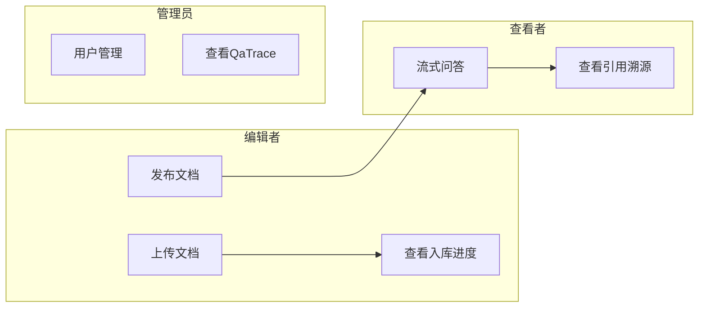

#### 3.1.3 用户故事

| ID | 故事 | 验收标准 |
|----|------|----------|
| US-01 | 作为编辑者，我上传制度 PDF 后可查看入库进度 | 任务状态从 PENDING 到 READY（**解析完成，未向量化**） |
| US-02 | 作为编辑者，我发布文档且索引 SYNCED 后查看者才能问答命中 | 草稿/索引中不可检索；`index_status=SYNCED` 后可命中 |
| US-03 | 作为查看者，我问「年假几天」得到带引用的答案 | sources 含页码与原文片段 |
| US-04 | 作为查看者，我问库外问题系统拒答 | 不编造，明确提示未找到 |
| US-05 | 作为查看者，我多轮追问「它的流程」仍正确 | CompressionQuery 改写正确 |
| US-06 | 作为管理员，我通过 qaTraceId 复盘错误答案 | QaTrace 含 query/召回/耗时 |

### 3.2 功能性需求

| ID | 需求描述 | 优先级 |
|----|----------|--------|
| FR-01 | 注册、登录、JWT 签发与校验 | P0 |
| FR-02 | 知识库 CRUD、成员管理 | P0 |
| FR-03 | 文档上传、OSS 存储、入库任务查询 | P0 |
| FR-04 | 文档状态 DRAFT / PUBLISHED / ARCHIVED；发布触发 Outbox 向量化；下架删除向量 | P0 |
| FR-05 | SSE 流式问答、会话管理、多轮对话、RAG auto 路由 | P0 |
| FR-11 | 发布索引 Outbox + `index_status` 状态机 + 启动时任务恢复 | P0 |
| FR-12 | 检索 Filter 服务端绑定 `kbId`（禁止信任客户端透传） | P0 |
| FR-06 | 响应 `sources[]`、OSS 预签名 URL | P0 |
| FR-07 | 空上下文拒答（`allowEmptyContext=false`） | P0 |
| FR-08 | QaTrace 记录与管理员查询 | P1 |
| FR-09 | Modular RAG（MultiQuery + CompressionQuery） | P1 |
| FR-10 | EvalRunner 批量评测 | P1 |

### 3.3 非功能性需求

| 类别 | 要求 |
|------|------|
| 性能 | 入库解析异步不阻塞上传；单轮问答 P95 < 5s、首 token < 2.5s；多轮 Modular P95 < 10s |
| 安全 | JWT + RBAC + refreshToken；**草稿不向量化**；检索 `(doc_id, doc_version)` 精确匹配；上传/MIME/大小限制（§8.6）；密钥环境变量注入；生产 HTTPS |
| 可用性 | 入库/索引失败可重试；**僵死任务超时回收**；JDBC ChatMemory 重启不丢会话 |
| 可观测 | Actuator + Micrometer + QaTrace 表 |
| 可扩展 | `VectorStore`、`DocumentRetriever`、`DocumentPostProcessor` 可替换 |
| 可部署 | Docker Compose 15 分钟内可启动完整环境 |

### 3.4 约束与假设

- 依赖 DashScope 云端 API，需稳定网络与有效 API Key；
- MVP 单实例部署，不使用 Redis；
- 业务表与向量数据存储于**同一 PostgreSQL 实例**；
- 文档以中文企业制度/流程类为主，电子文档为主（非扫描件为主）；
- 单人开发，周期 2–3 个月（12 周计划）。

---

## 4. 总体架构设计

### 4.1 架构设计原则

1. **分层解耦：** 交互、业务、检索、模型、数据五层职责清晰；
2. **入库与问答解耦：** 上传异步入库，问答只读向量库；
3. **检索与生成解耦：** 检索层输出上下文，生成层只负责 LLM 调用；
4. **接口可替换：** 向量库、检索器、后处理器通过 Spring AI 接口抽象；
5. **配置外部化：** RAG 参数、模型名称、阈值均可通过 yaml / 环境变量调整；
6. **Defense in Depth：** API 层 RBAC + 知识库成员校验 + 检索层 `kbId`/`published`/`docId+docVersion` 过滤；
7. **延迟向量化：** 草稿仅 OSS + 切块落库，**发布时才写入 PGVector**，消灭草稿向量泄露面；
8. **最终一致：** 发布/下架通过 **Transactional Outbox** 驱动索引副作用，检索只认 `index_status=SYNCED`。

### 4.2 逻辑分层架构

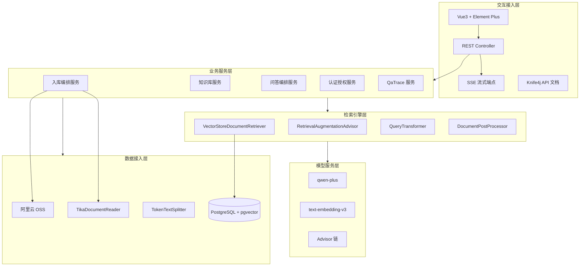

#### 各层职责

| 层级 | 核心职责 | 主要组件 |
|------|----------|----------|
| 数据接入层 | 文件存储、解析、切块、向量化、持久化 | OSS、Tika、Splitter、PgVectorStore、JdbcClient、Flyway |
| 模型服务层 | 统一封装 LLM / Embedding / Advisor 链 | DashScope ChatModel、EmbeddingModel、ChatClient |
| 检索引擎层 | Query 增强、向量检索、过滤、后处理、Prompt 组装 | RetrievalAugmentationAdvisor、FilterExpression |
| 业务服务层 | 领域逻辑、权限、状态机、审计 | KnowledgeBaseService、IngestionService、RagChatService |
| 交互接入层 | API、流式协议、前端、文档 | Controller、Knife4j、Vue3 |

**层间依赖规则：**

- Controller 只调用 Service，不直接调用 `ChatModel` 或 `VectorStore`；
- Service 通过 `ChatClient` + Advisor 链调用 AI 能力；
- 入库流水线与问答流水线独立，通过 `docId` / `version` / `index_status` 关联；
- `RagChatService` 中 `kbId` **必须从已校验的 `ChatSession` 或成员权限上下文取得**，不得直接采用请求体中的 `kbId` 做检索（请求体 `kbId` 仅用于一致性校验）。

### 4.3 技术架构

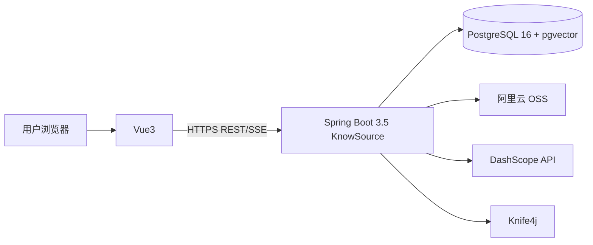

| 组件 | 技术选型 |
|------|----------|
| 后端框架 | Spring Boot 3.5、Java 21 |
| AI 框架 | Spring AI 1.1.2、spring-ai-alibaba-starter-dashscope |
| 业务持久化 | SQL-first JdbcClient + Flyway |
| 向量持久化 | 同库 pgvector + PgVectorStore |
| 文件存储 | 阿里云 OSS |
| 前端 | Vue 3 + Element Plus + Vite |
| API 文档 | Knife4j（OpenAPI 3） |
| 部署 | Docker Compose |

### 4.4 核心数据流

#### 4.4.1 文档入库链路（解析与向量化分离）

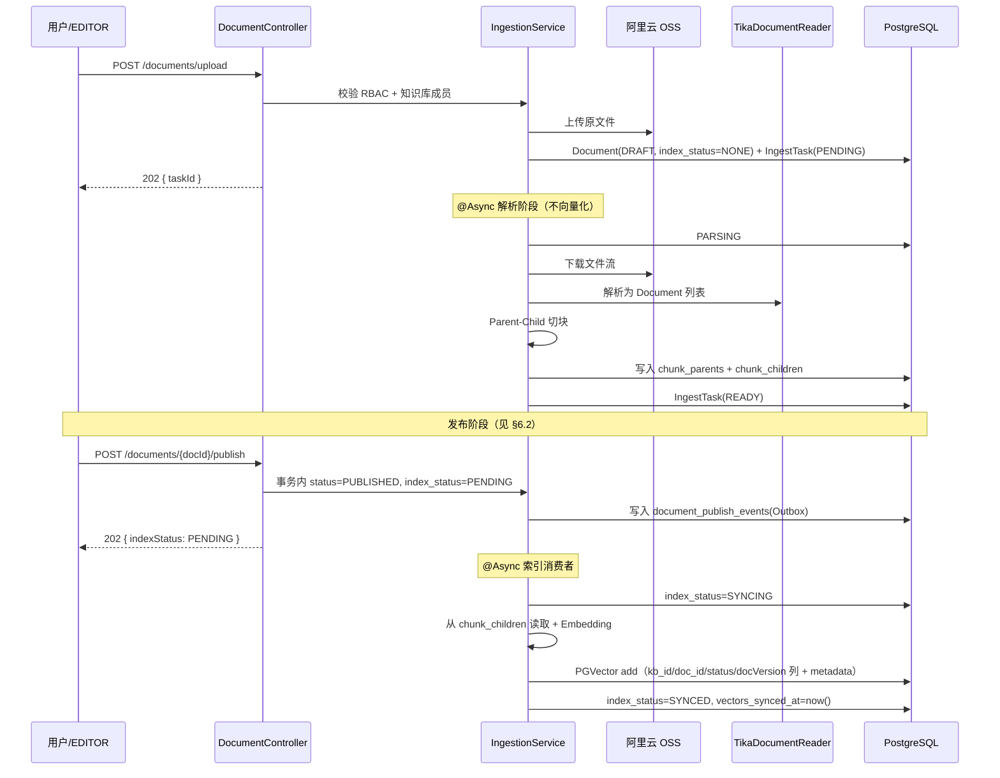

**逐步逻辑：**

1. 校验 EDITOR+ 权限及知识库成员身份；
2. 原文件上传 OSS，路径 `{kbId}/{docId}/{version}/{filename}`；
3. 创建 `Document`（`status=DRAFT`, `index_status=NONE`）与 `IngestTask`（PENDING）；
4. **解析阶段（异步）：** Tika 解析 → Parent(1200 token) / Child(400 token, overlap 80) 切块；
5. Parent 写入 `chunk_parents`，Child 写入 `chunk_children`（含 `doc_version`，见 §7.3.1；**不写 PGVector**）；
6. `IngestTask` 置为 READY，表示「可预览切块、可发布」，**不代表可检索**；
7. **发布阶段：** 见 §6.2 Outbox 流程；仅 `index_status=SYNCED` 后向量可被问答召回；
8. **下架：** `vectorStore.delete(docId)` + `index_status=NONE`，不保留 archived 向量。

#### 4.4.2 问答检索链路

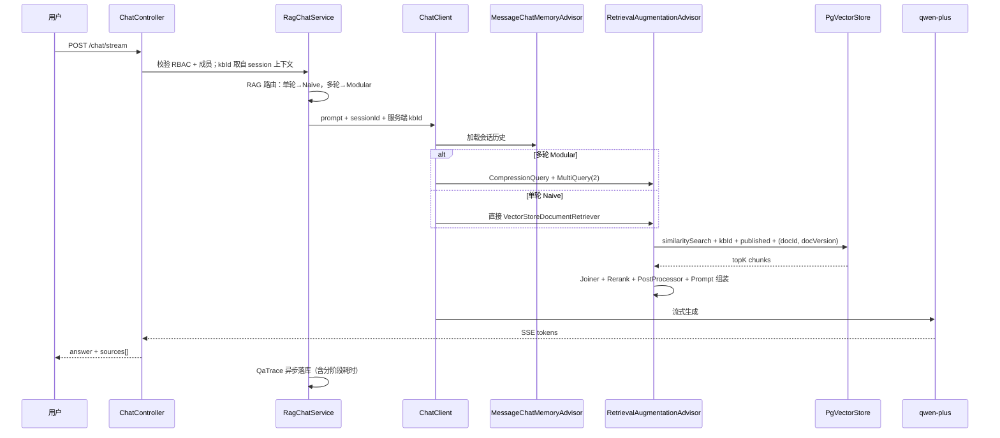

### 4.5 部署架构（MVP）

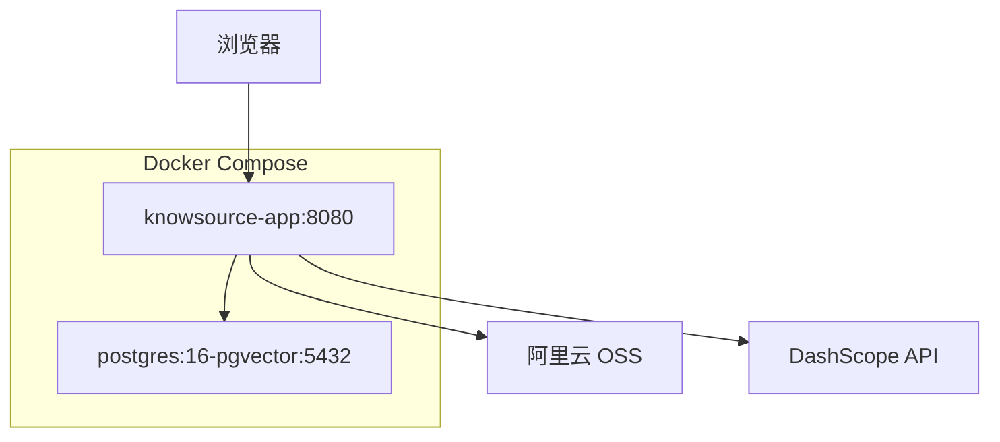

| 服务 | 镜像/构建 | 端口 | 说明 |
|------|-----------|------|------|
| knowsource-app | 多阶段 Dockerfile | 8080 | Spring Boot 应用 |
| postgres | pgvector/pgvector:pg16 | 5432 | 业务表 + 向量表 |

**环境变量（`.env.example`）：**

```properties
AI_DASHSCOPE_API_KEY=
SPRING_DATASOURCE_URL=jdbc:postgresql://postgres:5432/knowsource
SPRING_DATASOURCE_USERNAME=knowsource
SPRING_DATASOURCE_PASSWORD=
JWT_SECRET=
OSS_ENDPOINT=
OSS_ACCESS_KEY_ID=
OSS_ACCESS_KEY_SECRET=
OSS_BUCKET=
```

---

## 5. 技术选型

### 5.1 选型总表

| 组件类别 | 我的选型 | 备选方案 | 选型理由 | 面试回答要点 |
|----------|----------|----------|----------|--------------|
| 业务开发框架 | Spring Boot 3.5 + Spring AI 1.1.2 + Java 21 | LangChain4j、裸 HTTP | RAG 全链路统一抽象；`RetrievalAugmentationAdvisor` 落地 Modular RAG；Java 后端零切换 | 换向量库/模型不改业务代码；生态比 Python 晚 1–2 年 |
| 业务持久化 | SQL-first JdbcClient + Flyway | JPA、MyBatis-Plus | RAG 核心依赖精确 SQL、Outbox claim、批量向量写入和版本过滤；迁移版本化且行为透明 | 普通后台 CRUD 变多时，MVP 后可局部引入 JPA |
| 嵌入模型 | DashScope `text-embedding-v3` | OpenAI embedding、本地 bge | 中文效果好；Spring AI Alibaba 原生 starter | query/document 区分 text-type；MVP 用云 API |
| 向量数据库 | PostgreSQL + pgvector（同库） | Milvus、Qdrant、ES Vector | 业务与向量一库；运维简单；官方 starter | 百万级 chunk 够用；接口 `VectorStore` 可迁移 |
| 重排模型 | MVP：`qwen3-rerank` 轻量精排 | 分数截断 only | 粗排 15 → 精排 5，抑制「自信答错」 | P0 即接入，成本可控 |
| 基座大模型 | DashScope `qwen-plus` | GPT-4o、DeepSeek、本地 Ollama | 中文制度文档理解好、国内稳定 | `ChatModel` 抽象 + 配置切换 |
| 文档解析 | Spring AI `TikaDocumentReader` | POI 自研、pdfbox | 20+ 格式统一 `Document` 输出 | 扫描件/复杂表格 v2 走 OCR |
| 文件存储 | 阿里云 OSS | 本地磁盘、MinIO | 原文件与向量分离；预签名预览 | 路径规范 `{kbId}/{docId}/{version}/` |
| 前端 | Vue 3 + Element Plus | React、Ant Design Vue | 企业后台成熟方案；组件丰富 | Vite 构建、SSE 流式渲染 |
| API 文档 | Knife4j | SpringDoc 裸 Swagger | 增强 UI、适合 Demo 与面试展示 | OpenAPI 3 标准 |

### 5.2 核心 Maven 依赖

```xml
<dependencyManagement>
    <dependencies>
        <dependency>
            <groupId>org.springframework.ai</groupId>
            <artifactId>spring-ai-bom</artifactId>
            <version>1.1.2</version>
            <type>pom</type>
            <scope>import</scope>
        </dependency>
    </dependencies>
</dependencyManagement>

<!-- DashScope -->
<dependency>
    <groupId>com.alibaba.cloud.ai</groupId>
    <artifactId>spring-ai-alibaba-starter-dashscope</artifactId>
</dependency>
<!-- 向量库 -->
<dependency>
    <groupId>org.springframework.ai</groupId>
    <artifactId>spring-ai-starter-vector-store-pgvector</artifactId>
</dependency>
<!-- Modular RAG -->
<dependency>
    <groupId>org.springframework.ai</groupId>
    <artifactId>spring-ai-rag</artifactId>
</dependency>
<!-- 文档解析 -->
<dependency>
    <groupId>org.springframework.ai</groupId>
    <artifactId>spring-ai-tika-document-reader</artifactId>
</dependency>
```

### 5.3 AI 模型配置要点

```yaml
spring:
  ai:
    dashscope:
      api-key: ${AI_DASHSCOPE_API_KEY}
      chat:
        options:
          model: qwen-plus
      embedding:
        options:
          model: text-embedding-v3
          text-type: document   # 入库默认；检索 query 单独设 query
    vectorstore:
      pgvector:
        index-type: HNSW
        distance-type: COSINE_DISTANCE
        initialize-schema: false  # DDL 全部由 Flyway V2__vector_store.sql 掌控（§13.3）

knowsource:
  rag:
    profile: auto           # naive | modular | auto（MVP 默认 auto）
    top-k: 15
    top-n: 5
    similarity-threshold: 0.65
    multi-query-count: 2    # Modular 下扩展 query 数（原 3 降为 2）
    rerank-enabled: true
    rerank-top-n: 5
```

### 5.4 架构决策记录（ADR）

#### ADR-001：选用 PGVector 而非独立向量库

- **背景：** 需要存储文档向量与业务元数据。
- **决策：** 业务表与向量表同一 PostgreSQL，pgvector HNSW 索引。
- **理由：** 百万级 chunk、低 QPS；运维一库；业务表与向量表同库，`JdbcClient` 可在同一事务上下文中显式控制 SQL。
- **代价：** 极限 ANN QPS 不如 Milvus；十亿级需迁移；metadata 纯 JSON 过滤性能差 → **P0 增加冗余列**（§6.4），并**自定义 `KnowSourceVectorStore extends PgVectorStore`** 重写 `doAdd()` / `doSearch()` 让冗余列真正被写入并被 B-tree 索引命中（默认 `PgVectorStore.add()` 不感知自定义列，否则 B-tree 索引失效）。
- **迁移：** 保留 `VectorStore` 接口，换 Bean 即可（升级 Spring AI 时需 review `KnowSourceVectorStore` 的两处重写）。

#### ADR-002：选用 Spring AI 而非裸调 API

- **决策：** 全链路 Spring AI Advisor + Modular RAG。
- **理由：** Boot 一体配置、官方 RAG 模块、Advisor 链符合 Spring 思维。
- **代价：** 版本迭代需锁定 BOM。

#### ADR-003：MVP 不做部门级向量隔离

- **决策：** RBAC 管 API；检索 Filter `kbId`（服务端绑定）+ `status=published` + `(docId, docVersion)` 精确匹配。
- **理由：** 单人 MVP 聚焦 RAG 核心；**延迟向量化**已消除草稿泄露；权限模型简单可演示。
- **演进：** metadata 预留 `deptId`、`visibility`（第 15.4 节）。

#### ADR-005：延迟向量化 + Transactional Outbox（P0）

- **背景：** 草稿与发布向量同表时，metadata 更新存在竞态与泄露窗口。
- **决策：** 上传仅解析切块至 `chunk_children`；**发布时**使用已解析完成的 `documents.version` 写 `document_publish_events`，异步消费者完成 Embedding 后设 `index_status=SYNCED`。
- **理由：** 草稿物理不可检索；发布语义唯一（全量 re-index）；为 v1.1 接入 MQ 预留 Outbox 表。
- **代价：** MVP 不做无中断版本切换；发布到 `SYNCED` 期间该文档不可检索，需 UI 展示 `index_status`。
- **检索约束：** 仅 `index_status=SYNCED` 的 `(docId, docVersion)` 可被检索；Filter 同时匹配 `kb_id / doc_id / doc_version` 列与 metadata，避免不同文档相同版本号串召回。

#### ADR-006：RAG auto 路由（P0）

- **决策：** `profile=auto` 时，单轮（无历史用户消息）走 Naive；多轮走 Modular（仅启用 CompressionQuery + MultiQuery(2)）。
- **理由：** 拆分 SLA，避免所有请求承受 2+ 次 LLM 改写；EvalRunner 可强制 `naive`/`modular` 做 A/B。
- **代价：** 路由逻辑需单测覆盖；QaTrace 须记录实际 `rag_profile`。

#### ADR-004：SQL-first JdbcClient + Flyway

- **决策：** MVP 统一使用 `JdbcClient` 编写业务 SQL；结构变更全部通过 Flyway 版本脚本管理。
- **理由：** RAG 核心链路需要精确控制 SQL：`doc_id + doc_version` 过滤、Outbox claim/lock、批量 chunk/vector 写入、发布状态机和 QaTrace 记录都不适合被 ORM 隐式行为遮蔽。
- **代价：** 普通 CRUD 代码比 JPA Repository 更显式；如果 MVP 后出现大量后台管理 CRUD，可在非 RAG 核心模块局部引入 JPA，但不迁移检索、Outbox、向量写入链路。

---

## 6. 领域模型与数据设计

### 6.1 核心领域实体

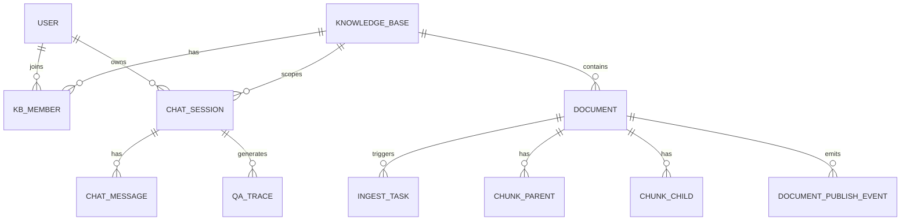

| 实体 | 说明 |
|------|------|
| `User` | 注册用户，全局角色 ADMIN/EDITOR/VIEWER |
| `KnowledgeBase` | 知识库 |
| `KbMember` | 知识库成员及库内角色 |
| `Document` | 文档元数据，含 `status`、`index_status`、OSS 路径、版本号 |
| `IngestTask` | **解析**任务状态机（不含向量化） |
| `ChunkParent` | Parent 块全文（不向量化） |
| `ChunkChild` | Child 块全文（解析落库，发布时向量化） |
| `DocumentPublishEvent` | 发布/下架 Outbox 事件 |
| `ChatSession` | 对话会话，绑定 `kbId` |
| `ChatMessage` | 会话消息（亦用于 JDBC ChatMemory） |
| `QaTrace` | 问答全链路追踪 |

### 6.2 文档生命周期

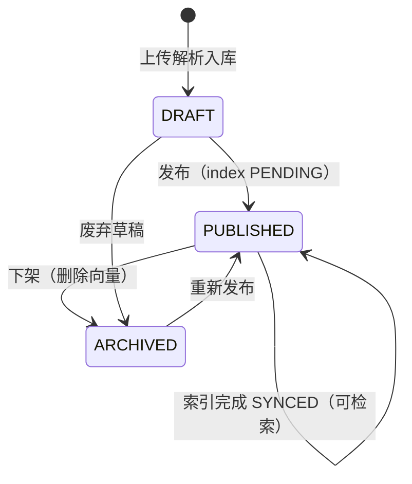

| 状态 | 可编辑 | 可检索 | PGVector | index_status |
|------|--------|--------|----------|--------------|
| DRAFT | ✓ | ✗ | **无向量** | NONE |
| PUBLISHED | ✗（需先下架） | ✓（仅 SYNCED） | 有向量 | PENDING → SYNCING → SYNCED |
| ARCHIVED | ✗ | ✗ | **已删除** | NONE |

#### 6.2.1 发布流程（Transactional Outbox，唯一语义）

**原则：** 发布 = `status=PUBLISHED` + `index_status=PENDING` + 异步全量 re-index；发布使用当前已解析完成的 `documents.version`，**发布动作本身不再额外递增版本**。禁止「仅改 metadata status」或「草稿预写向量」两种并存方案。

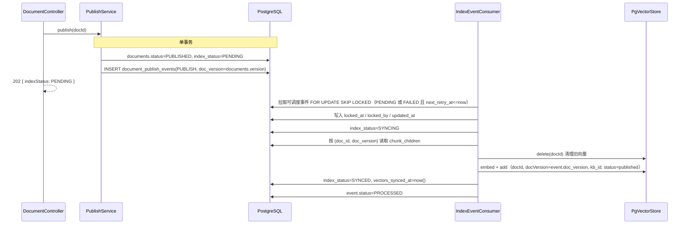

| 步骤 | 说明 |
|------|------|
| 1 | 事务内更新 `documents` 并写入 Outbox，**不调用 Embedding** |
| 2 | `IndexEventConsumer`（`@Scheduled` + `@Async`）按 §11.3.2 调度规则消费 Outbox |
| 3 | 从 `chunk_children` 按 `(doc_id, doc_version)` 读取切块，批量 Embedding 后写入 PGVector |
| 4 | 向量 metadata / 冗余列写入 `docId`、`docVersion`、`kbId`、`status=published` |
| 5 | 成功后 `index_status=SYNCED`；失败则 `index_status=FAILED`，事件可重试 |
| 6 | 重新发布（ARCHIVED→PUBLISHED）与首次发布走**同一路径** |

**下架流程：** 事务内 `status=ARCHIVED`、`index_status=NONE` → Outbox `ARCHIVE` → 消费者 `vectorStore.delete(docId)`。

**问答可见性：** 仅当 `status=PUBLISHED` **且** `index_status=SYNCED` 时检索可命中；`PENDING/SYNCING/FAILED` 期间该文档不可检索，前端展示「索引同步中」或「索引失败，可重试」。MVP 接受发布窗口内短暂不可检索；无中断发布通过 `published_version / indexing_version` 双版本字段列入目标架构。

### 6.3 数据库表设计

#### 6.3.1 `users`

| 字段 | 类型 | 说明 |
|------|------|------|
| id | BIGINT PK | 主键 |
| username | VARCHAR(64) UNIQUE | 用户名 |
| password_hash | VARCHAR(128) | BCrypt |
| email | VARCHAR(128) | 邮箱 |
| global_role | VARCHAR(16) | ADMIN / EDITOR / VIEWER |
| token_version | INT | JWT 失效版本号，改密/禁用时递增（§8.6.2） |
| created_at | TIMESTAMP | 创建时间 |

#### 6.3.2 `refresh_tokens`

| 字段 | 类型 | 说明 |
|------|------|------|
| id | VARCHAR(36) PK | tokenId |
| user_id | BIGINT FK | 用户 |
| token_hash | VARCHAR(128) UNIQUE | Refresh Token 哈希，数据库不保存明文 |
| expires_at | TIMESTAMP | 过期时间 |
| revoked_at | TIMESTAMP | 登出/改密/禁用时置空或删除 |
| created_at | TIMESTAMP | 创建时间 |

#### 6.3.3 `knowledge_bases`

| 字段 | 类型 | 说明 |
|------|------|------|
| id | VARCHAR(36) PK | UUID |
| name | VARCHAR(128) | 名称 |
| description | TEXT | 描述 |
| owner_id | BIGINT FK | 创建人 |
| created_at | TIMESTAMP | |

#### 6.3.4 `kb_members`

| 字段 | 类型 | 说明 |
|------|------|------|
| id | BIGINT PK | |
| kb_id | VARCHAR(36) FK | 知识库 |
| user_id | BIGINT FK | 用户 |
| role | VARCHAR(16) | OWNER / EDITOR / VIEWER |

#### 6.3.5 `documents`

| 字段 | 类型 | 说明 |
|------|------|------|
| id | VARCHAR(36) PK | docId |
| kb_id | VARCHAR(36) FK | |
| title | VARCHAR(256) | 文件名/标题 |
| status | VARCHAR(16) | DRAFT/PUBLISHED/ARCHIVED |
| index_status | VARCHAR(16) | NONE/PENDING/SYNCING/SYNCED/FAILED |
| oss_key | VARCHAR(512) | OSS 路径 |
| version | INT | 已解析内容版本号；新上传/重传解析成功后递增，发布时不额外递增；向量 `docVersion` 与此对齐 |
| file_type | VARCHAR(16) | pdf/docx/md |
| created_by | BIGINT FK | |
| published_at | TIMESTAMP | 发布时间 |
| vectors_synced_at | TIMESTAMP | 向量索引完成时间（可检索起点） |

#### 6.3.6 `ingest_tasks`

| 字段 | 类型 | 说明 |
|------|------|------|
| id | VARCHAR(36) PK | taskId |
| doc_id | VARCHAR(36) FK | |
| status | VARCHAR(16) | PENDING/PARSING/READY/FAILED（**仅解析阶段**） |
| error_message | TEXT | 失败原因 |
| started_at / finished_at | TIMESTAMP | |

#### 6.3.7 `chunk_children`

| 字段 | 类型 | 说明 |
|------|------|------|
| id | VARCHAR(64) PK | childChunkId |
| doc_id | VARCHAR(36) FK | |
| doc_version | INT | 切块所属文档版本，与 Outbox / 向量 `doc_version` 对齐 |
| parent_chunk_id | VARCHAR(64) FK | 关联 parent |
| content | TEXT | 子块全文（向量化源） |
| chunk_index | INT | 序号 |
| page_number | INT | 页码 |
| chunk_type | VARCHAR(16) | TEXT / TABLE |

#### 6.3.8 `document_publish_events`（Outbox）

| 字段 | 类型 | 说明 |
|------|------|------|
| id | VARCHAR(36) PK | eventId |
| doc_id | VARCHAR(36) FK | |
| kb_id | VARCHAR(36) | 冗余，消费时校验 |
| doc_version | INT | 目标版本 |
| event_type | VARCHAR(16) | PUBLISH / ARCHIVE / REINDEX |
| status | VARCHAR(16) | PENDING / PROCESSED / FAILED |
| error_message | TEXT | 消费失败原因 |
| attempt_count | INT | 消费尝试次数，默认 0 |
| next_retry_at | TIMESTAMP | 失败后可重试时间；PENDING 时为 NULL |
| locked_at | TIMESTAMP | 被 Worker 锁定时间（`FOR UPDATE SKIP LOCKED` 拉取时写入） |
| locked_by | VARCHAR(64) | 锁定实例标识（hostname + pid 或 UUID） |
| created_at | TIMESTAMP | |
| updated_at | TIMESTAMP | 最后状态变更时间 |
| processed_at | TIMESTAMP | |

> **调度索引：** `CREATE INDEX idx_publish_events_sched ON document_publish_events (status, next_retry_at, created_at) WHERE status IN ('PENDING', 'FAILED');` —— 支持 PENDING 首次消费与 FAILED 到期重试联合调度。

#### 6.3.9 `chunk_parents`

| 字段 | 类型 | 说明 |
|------|------|------|
| id | VARCHAR(64) PK | parentChunkId |
| doc_id | VARCHAR(36) FK | |
| doc_version | INT | 切块所属文档版本 |
| content | TEXT | 父块全文 |
| page_number | INT | 页码 |

#### 6.3.10 `chat_sessions` / `chat_messages`

| 表 | 关键字段 |
|----|----------|
| chat_sessions | id, user_id, kb_id, title, created_at |
| chat_messages | id, session_id, role, content, token_count, created_at |

#### 6.3.11 `qa_traces`

| 字段 | 类型 | 说明 |
|------|------|------|
| id | VARCHAR(36) PK | qaTraceId |
| session_id | VARCHAR(36) | |
| user_id | BIGINT | |
| kb_id | VARCHAR(36) | |
| query | TEXT | 原始问题 |
| rewritten_query | TEXT | 压缩/改写后 |
| retrieved_chunks | JSONB | 召回列表 |
| answer | TEXT | 最终答案 |
| retrieval_ms / llm_ms / total_ms | INT | 耗时 |
| rewrite_llm_ms | INT | Compression/MultiQuery 耗时（P0 分阶段） |
| generation_first_token_ms | INT | 首 token 延迟 |
| token_usage | JSONB | token 统计 |
| rag_profile | VARCHAR(16) | naive/modular |
| created_at | TIMESTAMP | |

### 6.4 向量存储设计（pgvector）

Spring AI `PgVectorStore` 默认表经 Flyway **扩展冗余列**（`V2__vector_columns.sql`）：

| 列 | 说明 |
|----|------|
| id | 向量记录 ID |
| content | chunk 文本 |
| metadata | JSON：见下表 |
| embedding | vector(1024) 或模型维度 |
| **kb_id** | **冗余列**，检索预过滤（B-tree） |
| **doc_id** | **冗余列**，与 `documents.id` 对齐，用于 `(doc_id, doc_version)` 精确匹配 |
| **status** | **冗余列**，固定 `published` |
| **doc_version** | **冗余列**，与 `documents.version` 对齐 |

> **⚠️ 实现说明（重要）：** Spring AI 的 `PgVectorStore.add()` 默认**只写** `id / content / metadata / embedding` 四列，框架不感知 `V2` 新增的 `kb_id / doc_id / status / doc_version`；若沿用默认实现，`Filter.eq("kbId", ...)` 会退化为 metadata 的 jsonpath 过滤，B-tree 复合索引**完全失效**。因此本项目**必须自定义 `KnowSourceVectorStore extends PgVectorStore`**：
>
> - **重写 `doAdd(...)`：** 用 `JdbcClient` 批量 insert，从 `Document.metadata` 取 `kbId / docId / status / docVersion` 一并写入冗余列；
> - **重写 `doSearch(...)` 的过滤 SQL：** 让 `kb_id / status / doc_id / doc_version` 走 WHERE 子句命中 B-tree 索引，而非仅 jsonpath；
> - **配置替换：** `@Primary @Bean VectorStore vectorStore()` 返回 `KnowSourceVectorStore`，覆盖 starter 默认 Bean。
>
> 集中改动在一个类，架构边界清晰；升级 Spring AI 时需 review 这两处重写。

**Chunk metadata 字段：**

| 字段 | 示例 | 说明 |
|------|------|------|
| docId | `doc-uuid` | 文档 ID |
| kbId | `kb-hr` | 知识库 ID（与 `kb_id` 列同步） |
| status | `published` | 与 `status` 列同步 |
| docVersion | `2` | **检索 Filter 核心之一**，需与 `docId` 组合匹配 `documents.version` |
| chunkId | `doc_p0_c1` | 块 ID |
| parentChunkId | `doc_p0` | 父块 ID |
| chunkLevel | `child` | child / parent |
| chunkIndex | `1` | 序号 |
| pageNumber | `3` | 页码 |
| sourceFilename | `请假制度.pdf` | 文件名 |
| ossKey | `kb/doc/v1/file.pdf` | OSS 键 |
| chunkType | `TEXT` / `TABLE` | 块类型 |

**索引配置：**

- 距离：COSINE_DISTANCE
- 索引：HNSW（`spring.ai.vectorstore.pgvector.index-type=HNSW`）
- **B-tree 复合索引：** `CREATE INDEX idx_vector_kb_status_doc_ver ON vector_store (kb_id, status, doc_id, doc_version);` —— 配合 `KnowSourceVectorStore.doSearch()` 的 WHERE 子句生效
- **可选 partial index：** `WHERE status = 'published'`（chunk 量 > 10 万时启用）

> **说明：** 仅已发布且索引同步完成的文档会写入向量表；草稿阶段 `chunk_children` 有数据但向量表无对应行。

### 6.5 OSS 对象设计

**路径规范：**

```
{bucket}/{kbId}/{docId}/{version}/{originalFilename}
```

**预签名 URL：**

- 有效期：15 分钟（可配置）；
- 用途：前端「查看原文」、引用侧栏预览；
- 权限：仅知识库成员可获取。

---

## 7. RAG 流水线设计（核心）

### 7.1 RAG 架构总览

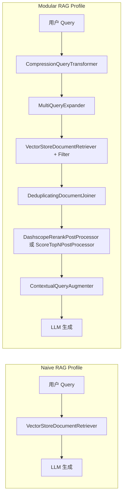

| 模式 | 适用 | MVP 默认 |
|------|------|----------|
| auto | **生产默认**：单轮 Naive、多轮 Modular | ✓ |
| Naive | 基线对比、低延迟单轮 | ✓ |
| Modular | 多轮追问、评测 A/B | ✓ |

### 7.2 文档解析与切块策略

#### 7.2.1 解析

- 使用 `TikaDocumentReader` 读取 PDF、DOCX、Markdown；
- 保留 `pageNumber`、`sourceFilename` metadata；
- Markdown 优先 `MarkdownDocumentReader` 按标题层级切分。

#### 7.2.2 Parent-Child 双层切块

| 参数 | 值 | 说明 |
|------|-----|------|
| parent chunkSize | 1200 token | overlap 200 token |
| child chunkSize | 400 token | overlap 80 token（约 20%） |
| 向量化对象 | 仅 child | 解析存 `chunk_children`；**发布时** embed 写入 PGVector |
| parent 存储 | `chunk_parents` | 引用 snippet 回填来源 |

> **⚠️ 实现说明：** Spring AI 的 `TokenTextSplitter`（含 1.1.2）**不支持 overlap**——其构造签名 `(chunkSize, minChunkSizeChars, minChunkLengthToEmbed, maxNumChunks, keepSeparator)` 中第二个参数是「最小块字符数」，并非 overlap（社区 feature request issue #2123 至今开放）。本项目**自研 `OverlapTokenSplitter`** 实现 token 级滑动窗口重叠，避免因语义断裂导致召回质量下降。

```java
// 自研 OverlapTokenSplitter：在 TokenTextSplitter 基础上叠加 token 级滑动窗口
public class OverlapTokenSplitter extends TokenTextSplitter {
    private final int overlapTokens; // 滑动窗口重叠量

    public OverlapTokenSplitter(int chunkSize, int overlapTokens) {
        super(chunkSize, /* minChunkSizeChars */ 350, /* minChunkLengthToEmbed */ 5,
              /* maxNumChunks */ 10000, /* keepSeparator */ true);
        this.overlapTokens = overlapTokens;
    }

    @Override
    public List<Document> apply(List<Document> docs) {
        List<Document> base = super.apply(docs);          // 先按 chunkSize 切（无重叠）
        return mergeWithOverlap(base, overlapTokens);     // 相邻 chunk 末尾 overlapTokens 重叠，保留 metadata
    }
}

// 配置（RagProperties 或 SplitterConfig）
OverlapTokenSplitter parentSplitter = new OverlapTokenSplitter(1200, 200);
OverlapTokenSplitter childSplitter  = new OverlapTokenSplitter(400,  80);
```

**校验机制：** W2 入库完成后，抽样 10 篇文档人工检查相邻 chunk 的 token 级重叠是否符合预期；W5 用 golden set 对比「无 overlap」与「overlap=80」的 Recall@5，差距应 ≥ 3 个百分点。

#### 7.2.3 表格处理（MVP）

- 检测 Tika 输出中 `\t` 连续出现 → `chunkType=TABLE`；
- 表格块 overlap=0，chunkSize 放宽至 600 token；
- 进阶：Tabula-java 结构化、OCR 预处理。

#### 7.2.4 参数调优方法

1. 从真实制度文档抽样 50 篇入库；
2. 准备 golden set，对比 chunkSize 256/400/512/1024；
3. 以 Context Recall@5 为指标选最优；
4. 记录于 `docs/eval/report.md`。

### 7.3 向量化与入库

#### 7.3.1 解析阶段（上传触发，不向量化）

| 环节 | 实现 |
|------|------|
| 解析 | Tika → Parent-Child 切块 |
| 持久化 | `chunk_parents` + `chunk_children`（含 `doc_version`） |
| `doc_version` 写入 | 首次上传写 `documents.version=1`；MVP 默认不开放已发布文档同 `docId` 直接重传。若需重传，必须先下架或走单独“替换文件”接口：解析成功后事务内 `documents.version + 1`，并让 `chunk_*` 的 `doc_version` 与新值一致 |
| 状态机 | PENDING → PARSING → READY / FAILED |
| 重试 | FAILED 可手动 `retry`；`@Retryable`（需 `@EnableRetry`）解析超时最多 3 次，指数退避 1s→2s→4s；超时由 Resilience4j `@Timeout(60s)` 触发 |
| 并发 | `@Async("ingestExecutor")`；`ingestExecutor` 与 `chatExecutor` **线程池隔离** |
| 僵死回收 | `PARSING` 超过 30min → FAILED；应用启动时 `SELECT ... FOR UPDATE SKIP LOCKED` 恢复 PENDING 事件 |

**W2 第一阶段落地边界：**

为了尽快验证“知识库 → 文档 → ingest task → parent/child chunks”的业务闭环，当前工程允许先提供 JSON 入库接口：

```http
POST /api/kbs/{kbId}/documents
Content-Type: application/json

{
  "title": "Engineering Handbook",
  "content": "已经提取好的正文文本"
}
```

该阶段把 `content` 视为已完成解析的文本，`oss_key` 使用 `inline://{docId}` 占位，`file_type=TEXT`。这不改变最终架构：真实文件上传、OSS 原文保存、Tika/Markdown 解析和异步 ingest 仍是后续 W2 增强项。

#### 7.3.2 索引阶段（发布 Outbox 触发，向量化）

| 环节 | 实现 |
|------|------|
| 触发 | `document_publish_events` 消费（PUBLISH / REINDEX） |
| 数据源 | 从 `chunk_children` 按 `(doc_id, doc_version)` 读取，**不重新 Tika 解析**（除非 `REINDEX` 显式触发） |
| Embedding | `DashScopeEmbeddingModel`，`text-type=document` |
| 批处理 | `TokenCountBatchingStrategy` |
| 幂等 | `docId + docVersion`；MVP 索引前 `delete(docId)` 清理该文档旧向量，索引期间该文档不可检索 |
| 写入实现 | **`KnowSourceVectorStore.add()`**（自定义）：除默认四列外，把 `kbId / docId / status / docVersion` 同步写入冗余列，使 B-tree 索引生效（§6.4） |
| 完成标记 | `index_status=SYNCED`，`vectors_synced_at=now()` |
| 重试 | 消费失败 `index_status=FAILED`；事件保持 PENDING/FAILED 可重投 |

```java
// IndexEventConsumer：发布索引（唯一路径）
void onPublishEvent() {
    // 1) 短事务：领取事件并把文档标记为 SYNCING
    DocumentPublishEvent event = eventService.claimNextEvent();
    if (event == null) {
        return;
    }

    try {
        // 2) 事务外：远程 Embedding + 向量写入，避免长事务持有 DB 锁
        List<ChunkChild> chunks = chunkChildRepository.findByDocIdAndDocVersion(
            event.docId(), event.docVersion());
        List<Document> docs = embeddingService.embed(chunks, event.docId(), event.docVersion(), event.kbId());
        vectorStore.delete(filterByDocId(event.docId())); // MVP：发布窗口内该文档不可检索
        vectorStore.add(docs); // KnowSourceVectorStore：kb_id/doc_id/status/doc_version 列 + metadata 同步写入（§6.4）

        // 3) 短事务：标记成功
        eventService.markSynced(event.id(), event.docId(), Instant.now());
    } catch (Exception ex) {
        // 4) 短事务：记录失败并按退避策略重试
        eventService.markFailed(event.id(), event.docId(), ex);
    }
}
```

**重新上传（同 docId 新版本文件）：** MVP 面试 Demo 不实现无中断替换。默认流程是「下架旧文档 → 上传/解析新版本 → 发布 → 等待 SYNCED」；如保留同 `docId` 替换文件接口，必须在解析成功时递增 `documents.version` 并重写新 `doc_version` 的 `chunk_children` / `chunk_parents`，发布时直接使用该版本号。

> **MVP 版本管理边界：** `chunk_*` 表通过 `doc_version` 与 Outbox / 向量对齐；MVP **不支持旧版本回滚 reindex**，也不承诺新版本发布期间旧版本持续可检索。如需无中断发布与回滚能力，需引入 `published_version / indexing_version` 双版本字段或 `chunk_version_history` 表（目标架构）。

### 7.4 检索策略

#### 7.4.1 MVP 配置（Modular 路径）

```
[仅多轮] CompressionQueryTransformer
→ [Modular] MultiQueryExpander(2)
→ VectorStoreDocumentRetriever(topK=15, threshold=0.65)
→ Filter: kbId == ? AND status == 'published' AND (docId, docVersion) 匹配已 SYNCED 文档
→ ConcatenationDocumentJoiner（按 chunkId 去重）
→ DashScopeRerankPostProcessor(topN=5)   // P0 轻量精排
→ ContextualQueryAugmenter(allowEmptyContext=false)
```

**auto 路由规则：**

| 条件 | 实际 Profile |
|------|----------------|
| `profile=naive` 或 `modular` | 强制指定 |
| `profile=auto` 且会话无 prior user 消息 | Naive（单次检索 + 生成） |
| `profile=auto` 且存在 prior user 消息 | Modular（Compression + MultiQuery(2)） |

#### 7.4.2 检索 Filter（检索层安全核心）

> **⚠️ 为什么必须按 `(docId, docVersion)` 过滤：** `doc_version` 是**文档内版本号**，不是知识库全局版本号；如果只用 `doc_version IN (...)`，A 文档旧版 v1 可能因 B 文档当前同步版本也是 v1 而被误召回。因此必须用 `(doc_id, doc_version)` 把已同步文档版本精确限定，避免旧版或跨文档同版本向量串召回。MVP 索引前会删除同 `docId` 旧向量，但过滤仍保留 `(doc_id, doc_version)` 约束，作为数据残留、重试异常和未来无中断版本切换的防线。

```java
// kbId 来自 ChatSession.kbId（已通过 KbPermissionService 校验），非请求体裸值
String kbId = chatSession.getKbId();
kbPermissionService.assertCanRead(userId, kbId);

// 1) 查询前注入：取该 kb 下所有 index_status=SYNCED 的 (docId, version) 列表（带缓存）
List<SyncedDocVersion> syncedDocVersions = indexQueryService.getSyncedDocVersions(kbId);

// 2) 构造 Filter：kb_id + status=published + (doc_id, doc_version) IN syncedDocVersions
Filter.Expression retrievalFilter = new FilterExpressionBuilder()
    .and(
        new FilterExpressionBuilder().eq("kb_id", kbId).build(),
        new FilterExpressionBuilder().eq("status", "published").build(),
        indexQueryService.toDocVersionFilter(syncedDocVersions)
    )
    .build();
// KnowSourceVectorStore.doSearch 将 (doc_id, doc_version) 对展开为 SQL：
// WHERE kb_id=:kbId AND status='published'
//   AND ((doc_id=:doc1 AND doc_version=:ver1) OR (doc_id=:doc2 AND doc_version=:ver2) ...)
// 命中 §6.4 的 B-tree 复合索引；禁止退化为单独的 doc_version IN (...)

chatClient.prompt(question)
    .advisors(a -> a.param(SearchRequest.FILTER_EXPRESSION, retrievalFilter))
    .stream().content();
```

**`IndexQueryService` 实现（带 Caffeine 缓存）：**

```java
@Service
public class IndexQueryService {
    // key=kbId，TTL 30s，最大 1000 条；发布不是高频操作，30s 滞后可接受
    private final Cache<String, List<SyncedDocVersion>> cache = Caffeine.newBuilder()
            .expireAfterWrite(Duration.ofSeconds(30))
            .maximumSize(1000)
            .build();

    public List<SyncedDocVersion> getSyncedDocVersions(String kbId) {
        return cache.get(kbId, this::loadFromDb);
    }

    private List<SyncedDocVersion> loadFromDb(String kbId) {
        // SELECT id AS doc_id, version AS doc_version FROM documents
        //  WHERE kb_id=:kbId AND status='PUBLISHED' AND index_status='SYNCED'
        return documentRepository.findSyncedDocVersions(kbId);
    }
}
```

| 指标 | 目标 |
|------|------|
| `findSyncedDocVersions` SQL 耗时 | < 5ms（命中 `idx_documents_kb_status_index` 索引） |
| 缓存命中率 | > 95%（30s TTL，单 kb 内多次问答命中） |
| 缓存滞后影响 | 发布后 ≤30s 内可能仍召回旧版本——可接受（发布非高频） |

**发布事件主动失效缓存（可选增强）：** `IndexEventConsumer` 在 `markSynced` 后 `cache.invalidate(kbId)`，把滞后窗口从 30s 压到秒级。

#### 7.4.3 Query Embedding

检索时对用户 query 单独 embed，设置 `DashScopeEmbeddingOptions.textType("query")`。

**Embedding 缓存（MVP）：** Caffeine `LoadingCache<String, float[]>`，key=`hash(normalizedQuery)`，TTL 10min，最大 1000 条；避免 MultiQuery 子 query 重复 embed。

#### 7.4.4 轻量 Rerank（P0）

| 参数 | 值 |
|------|-----|
| 模型 | DashScope `qwen3-rerank` |
| 输入 | Joiner 去重后 ≤15 chunks |
| 输出 | topN=5 送入 Prompt |
| 降级 | Rerank API 失败时回退 `ScoreTopNPostProcessor(5)` |

**PostProcessor 适配说明：**

Spring AI Alibaba 提供的是 `DashscopeReranker`（实现 `RerankModel` 契约，调用 DashScope Text Rerank API），而非直接的 `DocumentPostProcessor`。本项目**自研两个薄封装**：

```java
// 1) 主路径：封装 DashscopeReranker 为 DocumentPostProcessor
public class DashscopeRerankPostProcessor implements DocumentPostProcessor {
    private final DashscopeReranker reranker;   // spring-ai-alibaba 提供
    private final int topN;
    @Override
    public List<Document> process(Query query, List<Document> docs) {
        return reranker.call(RerankRequest.builder()
                .query(query.text()).documents(docs).topN(topN).build())
            .results().stream().map(RerankResult::document).toList();
    }
}

// 2) 降级路径：按向量检索 metadata.score 截 topN（不调外部 API）
public class ScoreTopNPostProcessor implements DocumentPostProcessor {
    private final int topN;
    @Override
    public List<Document> process(Query query, List<Document> docs) {
        return docs.stream()
            .sorted(Comparator.comparing(this::scoreOf).reversed())
            .limit(topN).toList();
    }
}

// 组装（§7.7）
.documentPostProcessors(
    props.rerankEnabled()
        ? new DashscopeRerankPostProcessor(dashscopeReranker, props.rerankTopN())
        : List.of(new ScoreTopNPostProcessor(props.rerankTopN()))
)
```

> **降级触发：** `DashscopeRerankPostProcessor` 内部 try-catch `RerankException`，失败时记录 Micrometer counter `knowsource.rag.rerank.failure` 并回退 `ScoreTopNPostProcessor`，保证问答可用性。

#### 7.4.5 进阶检索（v1.1）

| 能力 | 实现 |
|------|------|
| 混合检索 | 自定义 `HybridDocumentRetriever`：pgvector + PG `tsvector` + RRF(k=60) |
| MultiQuery 并行 | `CompletableFuture` 并行 embed+search（3 路时） |

### 7.5 生成与幻觉抑制

#### 7.5.1 四层防护

| 层级 | 措施 |
|------|------|
| 检索层 | `similarityThreshold` + **Rerank 精排** 过滤低相关 chunk |
| 空上下文 | `allowEmptyContext(false)` → 拒答 Prompt |
| Prompt 层 | 强制仅基于上下文、标注 [n]、不知道就说不知道 |
| 响应层 | `sources[]` 来自检索结果，非 LLM 生成 |

#### 7.5.2 Citation Prompt 模板（附录 C）

#### 7.5.3 响应结构

```java
public record ChatResponse(
    String answer,
    List<SourceCitation> sources,
    String qaTraceId
) {}

public record SourceCitation(
    int citationId,
    String docId,
    String docName,
    Integer pageNumber,
    String snippet,      // parent 回填后的段落
    Double score,
    String previewUrl    // OSS 预签名
) {}
```

**`sources[]` 数据流（用 Spring AI 原生扩展点，不抄一份、不用 ThreadLocal）：**

```
RetrievalAugmentationAdvisor 内部流水线：
  queryTransformers → retriever → documentPostProcessors → queryAugmenter → chatModel
                                          ▲
                                          │ PostProcessor 在 queryAugmenter 和 chatModel 之前执行
                                          │ = 检索完成、LLM 首 token 之前的黄金位置
  SourceCapturePostProcessor.process(query, docs):
       · docs 即检索后最终 List<Document>（入参，无需读框架内部 context key）
       · context.put("knowsource.retrieved_docs", docs)   // 写一次，sources 和 QaTrace 共用
       · SourceCitation[] sources = sourceMapper.map(docs) // parent 回填 + OSS 预签名 + score
       · sseSink.tryEmitNext(sources)                      // 早推 SSE `sources` 事件，前端边渲染答案边出引用
       · return docs                                       // 原样返回给 queryAugmenter
  → LLM 流式生成 token ...
  → RagChatService 流结束后：
       · 从 AdvisorContext 取 "knowsource.retrieved_docs" → 序列化为 QaTrace.retrieved_chunks
       · 从 sseSink 缓冲取已早推的 sources → 组装 SSE `done` 事件
```

| 组件 | 职责 | 关键点 |
|------|------|--------|
| `SourceCapturePostProcessor` | 实现 `DocumentPostProcessor`，在检索后钩子里组装 + 早推 sources | docs 是 PostProcessor 入参，**不依赖框架内部 context key**；早推发生在 LLM 调用前，时序天然保证；避免流式 + `@Async` 下 ThreadLocal 串扰 |
| `SourceCitationMapper` | `Document → SourceCitation` 单一职责转换 | 见 §7.5.4 |
| `RagChatService` | 流结束后从 context 取 docs（→QaTrace）+ 从 sink 取 sources（→done） | sources 来自检索而非 LLM 生成，从源头杜绝幻觉引用 |

> **为何选 PostProcessor 而非薄 Advisor：** `DocumentPostProcessor` 是 Spring AI 为「检索后钩子」设计的扩展点，入参即最终 `List<Document>`，无需新建 Advisor 抄一份检索结果、也无需耦合框架内部 context key（非公开契约，升级可能改名）。面试可强调「用了正确的扩展点而非绕开框架」。
>
> **Advisor 作用域：** `sseSink` 是每次问答独立的 Reactor sink，**不能注入单例 Advisor**。`RagChatService` 每次问答通过工厂方法 `advisorFactory.create(sseSink)` 获取 Advisor 实例（`@Scope("prototype")` 或显式工厂），保证 sink 隔离。

#### 7.5.4 引用溯源组装（§7.5.3 细节展开）

`SourceCapturePostProcessor` 内部依赖 `SourceCitationMapper`，后者负责 `Document → SourceCitation` 的完整组装。本节固化三个易被忽略的实现细节。

**① Parent 回填（避免 N+1 查询）**

检索召回的是 child chunk（`chunkType=child`），snippet 应展示 parent 全文段落以提供完整上下文。

| 策略 | 实现 | 说明 |
|------|------|------|
| 批量回填 | `Map<String,ChunkParent> parents = chunkParentRepository.findByDocIdIn(parentChunkIds)` | 一次 SQL 拿回所有 parent，避免逐 chunk 查询 |
| 去重 | `parentChunkIds = docs.stream().map(d -> d.metadata("parentChunkId")).distinct()` | 同一 parent 的多个 child 只查一次 |
| 缺失容忍 | parent 不存在时 snippet 退化为 child content | 容忍脏数据，不阻断问答 |

**② OSS 预签名 URL 缓存**

每次 sources 组装都为每个 chunk 生成 OSS 预签名 URL 会产生签名计算开销 + OSS 调用。

| 策略 | 实现 | 说明 |
|------|------|------|
| Caffeine 缓存 | `Cache<String,String>`，key=`ossKey`，TTL 10min，最大 500 条 | 预签名 URL 有效期 15min（§6.5），缓存 10min 留 5min 安全余量 |
| key 维度 | 按 `ossKey`（含 docId+version）而非 docId | 不同文档/版本隔离；同文档同版本多 chunk 复用同一 URL |
| 失效 | 文档下架（ARCHIVE）时 `cache.invalidate(ossKey)` | 服务端停止新签发 + 缓存失效；**已签发的预签名 URL 在 OSS TTL 内仍有效**，无法服务端立即撤销，依赖短 TTL（§6.5、§8.6） |

**③ sources 与 QaTrace 的复用**

`SourceCitation[]` 与 `qa_traces.retrieved_chunks`（JSONB）源于同一份 `List<Document>`，避免组装两次。

| 字段 | sources[]（给前端） | retrieved_chunks（给运维） |
|------|---------------------|---------------------------|
| 数据来源 | `SourceCitationMapper.map(docs)` | `docs` 原始结构序列化 |
| 内容 | citationId/docName/snippet/previewUrl/score | docId/chunkId/score/rawContent（完整文本，用于复盘） |
| 生成时机 | PostProcessor 内（早推 SSE） | 流结束后 `RagChatService` 异步写 QaTrace |

> **复用实现：** PostProcessor 把 `docs` 写入一次 `AdvisorContext`（用项目自定义 key `knowsource.retrieved_docs`），`RagChatService` 流结束后从 context 取出做 QaTrace 序列化；sources 则在 PostProcessor 内即时组装。两者读同一份 `docs`，零重复检索。

### 7.6 多轮对话设计

| 组件 | 职责 |
|------|------|
| `MessageChatMemoryAdvisor` | 加载最近 20 条消息给 LLM |
| `CompressionQueryTransformer` | **仅 Modular 路径**；多轮历史 + 当前问题 → 独立检索 query |
| 检索 | **不使用**对话历史，避免噪声污染召回 |
| 生成 | 历史 + 检索上下文 + 当前问题 |

### 7.7 Advisor 链组装

**RagProfileRouter：** 在 `RagChatService` 根据 `RagProperties.profile` 与会话历史选择 naive 或 modular，调用 `RagAdvisorFactory.create(modular)` 获取本次问答的 Advisor 实例（含独立 SSE sink）。

> **Advisor 作用域：** `MessageChatMemoryAdvisor` / `FirstTokenStreamAroundAdvisor` / `SimpleLoggerAdvisor` 是无状态单例 `@Bean`，可全局复用；`RetrievalAugmentationAdvisor` 因携带每次问答独立的 `Sinks.Many`，由 `RagAdvisorFactory` 工厂方法创建（见下方代码），**不注册为单例 Bean**。组装时 `ChatClient.builder().defaultAdvisors(memoryAdvisor, ragAdvisor, firstTokenAdvisor, loggerAdvisor)` 传入。

**顺序（由外到内执行）：**

| 顺序 | Advisor | 职责 |
|------|---------|------|
| 1 | `MessageChatMemoryAdvisor` | 会话记忆 |
| 2 | `RetrievalAugmentationAdvisor`（Naive 或 Modular） | RAG 检索增强；其内 `documentPostProcessors` 链含 `SourceCapturePostProcessor`（§7.5.3，非独立 Advisor） |
| 3 | `FirstTokenStreamAroundAdvisor` | 首 token 耗时采集（§11.1.1） |
| 4 | `SimpleLoggerAdvisor` | 日志 |

> **说明：** `SourceCapturePostProcessor` 不是 Advisor 链节点，而是 `RetrievalAugmentationAdvisor.documentPostProcessors(...)` 的配置项，在检索后、`queryAugmenter` 和 `chatModel` 之前执行（§7.5.3）。因此 Advisor 链只列 4 个节点。

**`documentPostProcessors` 链内顺序（`RetrievalAugmentationAdvisor` 内部）：**

| 顺序 | PostProcessor | 职责 |
|------|---------------|------|
| 1 | `DashscopeRerankPostProcessor`（或降级 `ScoreTopNPostProcessor`） | 粗排 → 精排 topN |
| 2 | `SourceCapturePostProcessor` | sources 组装 + 早推 SSE `sources` 事件 + 写 `knowsource.retrieved_docs`（§7.5.4） |

> **顺序理由：** Rerank 必须在 SourceCapture 之前——sources 应反映精排后的最终 topN，而非粗排的 15 条。

```java
// RagAdvisorFactory：每次问答创建独立 Advisor + 独立 SSE sink（非单例，避免跨请求串扰）
@Component
public class RagAdvisorFactory {
    private final VectorStore vectorStore;
    private final ChatModel chatModel;
    private final RagProperties props;
    private final DashscopeReranker reranker;
    private final SourceCitationMapper sourceMapper;

    /** 由 RagChatService 调用：返回 Advisor + 本次问答专属的 sink（用于组装 done） */
    public AdvisorSession create(boolean modular) {
        Sinks.Many<SourceCitation[]> sseSink = Sinks.many().unicast().onBackpressureBuffer();
        RetrievalAugmentationAdvisor advisor = modular
            ? buildModular(sseSink) : buildNaive(sseSink);
        return new AdvisorSession(advisor, sseSink);
    }

    private List<DocumentPostProcessor> buildPostProcessors(Sinks.Many<SourceCitation[]> sseSink) {
        DocumentPostProcessor rerank = props.rerankEnabled()
            ? new DashscopeRerankPostProcessor(reranker, props.rerankTopN())
            : new ScoreTopNPostProcessor(props.rerankTopN());
        // 顺序：rerank 先（精排 topN），source capture 后（组装最终 sources）
        return List.of(rerank, new SourceCapturePostProcessor(sourceMapper, sseSink));
    }

    private RetrievalAugmentationAdvisor buildNaive(Sinks.Many<SourceCitation[]> sseSink) {
        var retriever = VectorStoreDocumentRetriever.builder()
            .vectorStore(vectorStore).topK(10).similarityThreshold(0.65).build();
        return RetrievalAugmentationAdvisor.builder()
            .documentRetriever(retriever)
            .documentPostProcessors(buildPostProcessors(sseSink))
            .queryAugmenter(ContextualQueryAugmenter.builder().allowEmptyContext(false).build())
            .build();
    }

    private RetrievalAugmentationAdvisor buildModular(Sinks.Many<SourceCitation[]> sseSink) {
        var transformers = List.<QueryTransformer>of(
            CompressionQueryTransformer.builder()
                .chatClientBuilder(ChatClient.builder(chatModel)).build(),
            MultiQueryExpander.builder()
                .chatClientBuilder(ChatClient.builder(chatModel))
                .numberOfQueries(props.multiQueryCount()).build()); // 默认 2
        var retriever = VectorStoreDocumentRetriever.builder()
            .vectorStore(vectorStore).topK(15).similarityThreshold(0.65).build();
        return RetrievalAugmentationAdvisor.builder()
            .queryTransformers(transformers)
            .documentRetriever(retriever)
            .documentJoiner(new DeduplicatingDocumentJoiner()) // 多路 MultiQuery 按 chunkId 去重
            .documentPostProcessors(buildPostProcessors(sseSink))
            .queryAugmenter(ContextualQueryAugmenter.builder().allowEmptyContext(false).build())
            .build();
    }

    public record AdvisorSession(
        RetrievalAugmentationAdvisor advisor,
        Sinks.Many<SourceCitation[]> sourcesSink   // RagChatService 流结束后取 sources 组装 done
    ) {}
}
```

> **为何用工厂而非 `@Bean`：** `@Bean` 是单例，但 `Sinks.Many` 必须每次问答独立（否则不同请求的 sources 会串扰）。`RagChatService` 每次调用 `factory.create(modular)` 拿到独立的 Advisor + sink。VectorStore / ChatModel / Reranker 等无状态依赖仍由工厂持有（单例）。

---

## 8. 安全设计

### 8.1 认证设计（JWT）

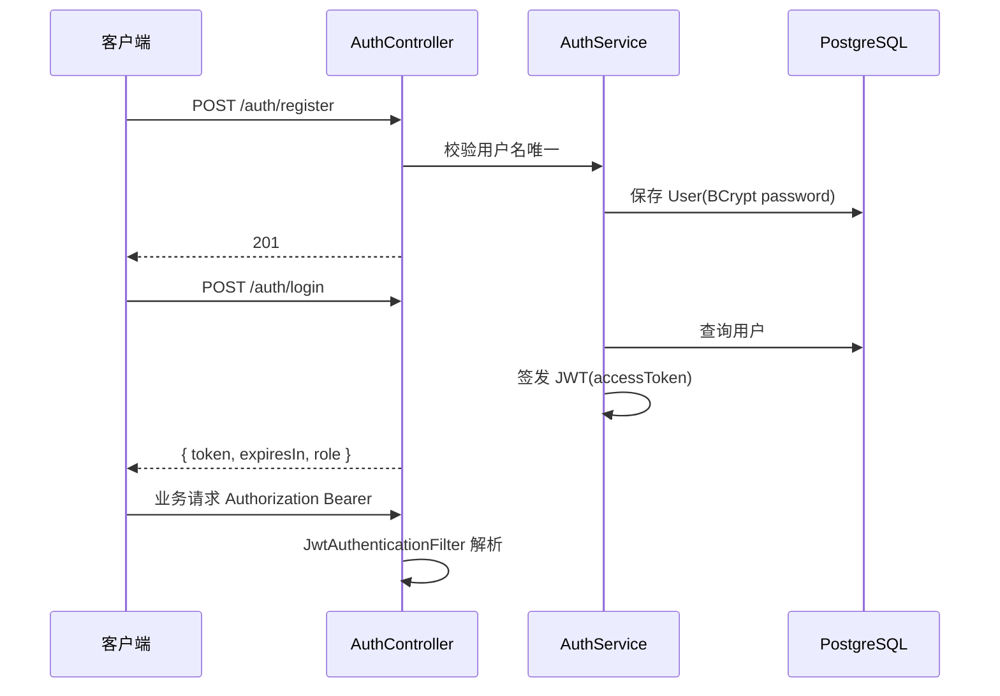

**JWT Payload：**

```json
{
  "sub": "userId",
  "username": "editor01",
  "roles": ["ROLE_EDITOR"],
  "tv": 1,
  "exp": 1735689600
}
```

> `tv` = `users.token_version`，改密/禁用时递增，用于 JWT 失效（§8.6.2）。

### 8.2 授权设计（RBAC）

#### 8.2.1 全局角色权限矩阵

| 资源 / 操作 | ADMIN | EDITOR | VIEWER |
|-------------|-------|--------|--------|
| 用户管理 / 角色变更 | ✓ | ✗ | ✗ |
| 创建知识库 | ✓ | ✓ | ✗ |
| 上传文档 | ✓ | ✓ | ✗ |
| 发布 / 下架文档 | ✓ | ✓ | ✗ |
| 查看草稿 | ✓ | ✓（成员） | ✗ |
| 问答（已发布库） | ✓ | ✓ | ✓ |
| 查看 QaTrace | ✓ | ✗ | ✗ |

#### 8.2.2 知识库成员校验

- 除 ADMIN 外，用户必须是 `kb_members` 成员才能访问该知识库 API；
- 实现：`KbPermissionService.canRead(kbId)` / `canWrite(kbId)`；
- Controller 使用 `@PreAuthorize` 或方法级校验。

### 8.3 检索层安全（与 RBAC 分工）

| 层次 | 职责 | 实现 |
|------|------|------|
| API 层 RBAC | 谁能调哪个接口、访问哪个知识库 | Spring Security + KbMember |
| Service 层 kbId 绑定 | 检索作用域不可被客户端篡改 | `kbId` 取自 `ChatSession`；请求体 `kbId` 仅做一致性断言 |
| 检索层 Filter | 只召回已发布且索引已同步的版本向量 | `kb_id` + `status=published` + **`(doc_id, doc_version) IN syncedDocVersions`**；`syncedDocVersions` 由 `IndexQueryService` 查询 `documents` 表中 `index_status=SYNCED` 的 `(id, version)` 列表注入（带 Caffeine 缓存，详见 §7.4.2） |
| 物理隔离 | 草稿永不写入向量表 | 延迟向量化（§6.2、ADR-005） |

**未发布文档问答：** VIEWER 问草稿相关内容 → 向量表无记录 → 检索无结果 → 拒答（**非** metadata 过滤，而是物理不存在）。

**索引同步窗口：** `PUBLISHED` 但 `index_status!=SYNCED` 时，行为同未发布——检索无结果，前端提示「索引同步中」。

### 8.4 目标架构：部门 / 密级扩展（MVP 不实现）

metadata 预留字段：

- `deptId`、`allowedDeptIds`
- `visibility`：PUBLIC / DEPT / PRIVATE
- `classification`：INTERNAL / CONFIDENTIAL

演进：动态 `FilterExpressionBuilder` 根据 `UserContext` 构建 ACL 表达式。

### 8.5 数据安全

| 项 | 措施 |
|----|------|
| API Key | 环境变量 `AI_DASHSCOPE_API_KEY`，禁止提交 Git |
| OSS 密钥 | 环境变量，`.env` 不入库 |
| JWT Secret | 环境变量，长度 ≥ 256 bit |
| 日志脱敏 | 不打印 token、密码、完整 API Key |
| 生产 | HTTPS、OSS 私有桶 + 预签名 |

### 8.6 上传与令牌治理（P0）

#### 8.6.1 管理员初始化

| 项 | 措施 |
|----|------|
| 首个 ADMIN | Flyway `V1__seed_admin.sql` 或环境变量 `BOOTSTRAP_ADMIN_USERNAME` / `BOOTSTRAP_ADMIN_PASSWORD`（**仅首次启动**、生产必改密码） |
| 后续 ADMIN | 已有 ADMIN 通过 `/admin/users/{id}/role` 提升；禁止开放注册即 ADMIN |
| Demo 环境 | `application-dev.yml` 可预置 `admin/admin`（文档与 compose 注释说明，**禁止用于生产**） |

#### 8.6.2 Token 策略

| 项 | 措施 |
|----|------|
| Access Token | JWT，`expiresIn` 默认 **86400s（24h）**，可配置 `knowsource.auth.access-token-ttl` |
| Refresh Token | MVP 提供 `POST /auth/refresh`：校验 refreshToken（存 `refresh_tokens.token_hash`，与 userId 绑定），签发新 accessToken |
| 失效策略 | 用户改密 / ADMIN 禁用账号时，递增 `users.token_version` 并拒绝旧 JWT（payload 含 `tv` 字段）；删除或置 `revoked_at` 使 refreshToken 同步作废 |
| 登出 | `POST /auth/logout` 删除当前 refreshToken 记录或置 `revoked_at=now()`；accessToken 自然过期（MVP 不做 access 黑名单） |

#### 8.6.3 上传限制

| 项 | 措施 |
|----|------|
| 文件大小 | `spring.servlet.multipart.max-file-size=50MB`（可配置）；业务层二次校验，超限返回 `413` |
| 扩展名白名单 | `.pdf`、`.docx`、`.doc`、`.md`、`.txt`（与 F-03 一致） |
| MIME 校验 | 扩展名 + Tika `detect()` 双重校验；不匹配拒绝并记审计日志 |
| 单库并发上传 | `ingestExecutor` 队列 + CallerRunsPolicy（§11.5），防止解析打满内存 |

#### 8.6.4 Tika 解析防护

| 项 | 措施 |
|----|------|
| 解析超时 | Resilience4j `@Timeout(60s)`（§7.3.1） |
| 流大小上限 | `TikaInputStream` + 最大读取字节（如 50MB），超限 FAILED |
| 压缩包 | MVP **不接受** `.zip` / `.rar` 等压缩包上传；v1.1 若支持需限制解压深度与嵌套层数 |
| 内存 | 解析在 `ingestExecutor` 隔离线程池，单任务异常不影响问答线程池 |

#### 8.6.5 OSS 预签名语义

| 项 | 说明 |
|----|------|
| 签发 | 仅知识库成员调用预览 / sources 组装时按需签发，TTL **15min**（§6.5） |
| 缓存 | Caffeine 缓存 10min（§7.5.4），下架时 `invalidate` |
| **限制** | OSS 预签名 URL **一旦签发，在 TTL 过期前无法服务端撤销**；下架后只能停止新签发 + 失效缓存，已发出链接需等待 TTL 自然失效 |
| 敏感文档 | 可缩短 TTL 至 5min；预览 API 在下架后返回 403，即使旧 URL 未过期也不应再暴露新业务入口 |

---

## 9. 接口设计

### 9.1 API 规范

**Base URL：** `http://localhost:8080/api`

**统一响应：**

```json
{
  "code": 0,
  "message": "success",
  "data": { },
  "timestamp": 1735689600
}
```

**错误码：**

| code | 含义 |
|------|------|
| 0 | 成功 |
| 40001 | 参数错误 |
| 40100 | 未认证 |
| 40300 | 无权限 |
| 40400 | 资源不存在 |
| 50001 | 入库失败 |
| 50002 | AI 服务超时 |
| 50003 | 向量检索失败 |

**认证 Header：** `Authorization: Bearer <accessToken>`

**API 文档：** Knife4j UI → `http://localhost:8080/doc.html`

### 9.2 接口清单

#### 认证模块

| 方法 | 路径 | 说明 | 权限 |
|------|------|------|------|
| POST | `/auth/register` | 注册 | 公开 |
| POST | `/auth/login` | 登录，返回 accessToken + refreshToken | 公开 |
| POST | `/auth/refresh` | 用 refreshToken 换取新 accessToken | 公开（需有效 refreshToken） |
| POST | `/auth/logout` | 作废 refreshToken | 登录 |

**注册请求：**

```json
{ "username": "editor01", "password": "xxx", "email": "a@b.com" }
```

**登录响应：**

```json
{
  "accessToken": "eyJ...",
  "refreshToken": "rt_...",
  "expiresIn": 86400,
  "role": "EDITOR",
  "userId": 1
}
```

> 前端 Axios 拦截器注入 `Authorization: Bearer ${accessToken}`；access 过期时调 `/auth/refresh`（§8.6.2）。

#### 知识库模块

| 方法 | 路径 | 说明 | 权限 |
|------|------|------|------|
| POST | `/kb` | 创建知识库 | EDITOR+ |
| GET | `/kb` | 列表（成员可见） | 登录 |
| GET | `/kb/{kbId}` | 详情 | 成员 |
| PUT | `/kb/{kbId}` | 更新 | OWNER/ADMIN |
| DELETE | `/kb/{kbId}` | 删除 | OWNER/ADMIN |
| POST | `/kb/{kbId}/members` | 添加成员 | OWNER/ADMIN |

#### 文档模块

| 方法 | 路径 | 说明 | 权限 |
|------|------|------|------|
| POST | `/kb/{kbId}/documents/upload` | 上传（multipart，§8.6.3 限制） | EDITOR+ 成员 |
| GET | `/kb/{kbId}/documents` | 文档列表 | 成员 |
| GET | `/documents/{docId}` | 文档详情 | 成员 |
| POST | `/documents/{docId}/publish` | 发布（触发 Outbox 索引） | EDITOR+ 成员 |
| POST | `/documents/{docId}/archive` | 下架（删除向量） | EDITOR+ 成员 |
| GET | `/documents/{docId}/index-status` | 查询 `index_status` / `vectors_synced_at` | 成员 |
| GET | `/ingest/tasks/{taskId}` | 入库任务状态 | 成员 |
| POST | `/ingest/tasks/{taskId}/retry` | 失败重试 | EDITOR+ |

**入库任务响应：**

```json
{
  "taskId": "task-uuid",
  "docId": "doc-uuid",
  "status": "READY",
  "errorMessage": null,
  "startedAt": "...",
  "finishedAt": null,
  "note": "READY=解析完成；向量化在发布后 index_status 流转"
}
```

**发布响应：**

```json
{
  "docId": "doc-uuid",
  "status": "PUBLISHED",
  "version": 2,
  "indexStatus": "PENDING",
  "message": "发布成功，检索索引同步中"
}
```

#### 问答模块

| 方法 | 路径 | 说明 | 权限 |
|------|------|------|------|
| POST | `/chat/stream` | SSE 流式问答 | VIEWER+ 成员 |
| GET | `/chat/sessions` | 会话列表 | 登录 |
| GET | `/chat/sessions/{id}/messages` | 历史消息 | 会话所有者 |

**问答请求：**

```json
{
  "sessionId": "session-uuid",
  "kbId": "kb-uuid",
  "question": "员工年假有多少天？"
}
```

**ChatResponse（SSE `done` 事件携带）：**

```json
{
  "answer": "根据规定，工作满1年享有5天年假[1]。",
  "sources": [
    {
      "citationId": 1,
      "docId": "doc-uuid",
      "docName": "请假制度.pdf",
      "pageNumber": 3,
      "snippet": "工作满1年...",
      "score": 0.89,
      "previewUrl": "https://oss...?sign=..."
    }
  ],
  "qaTraceId": "trace-uuid"
}
```

#### 追踪模块

| 方法 | 路径 | 说明 | 权限 |
|------|------|------|------|
| GET | `/traces/{qaTraceId}` | 问答全链路 | ADMIN |
| GET | `/traces` | 分页列表 | ADMIN |

### 9.3 SSE 流式协议

**Content-Type：** `text/event-stream`

| 事件 event | data 内容 | 说明 |
|------------|-----------|------|
| `token` | `{"content":"根据"}` | LLM 增量 token |
| `sources` | `SourceCitation[]` | 检索完成后的引用列表 |
| `done` | `ChatResponse` | 流结束，含 qaTraceId |
| `error` | `{"code":50002,"message":"..."}` | 错误 |

**前端消费（fetch + ReadableStream 或 EventSource 封装）：**

```javascript
const res = await fetch('/api/chat/stream', {
  method: 'POST',
  headers: { Authorization: `Bearer ${token}`, 'Content-Type': 'application/json' },
  body: JSON.stringify({ sessionId, kbId, question })
});
const reader = res.body.getReader();
// 解析 SSE 帧，按 event 类型更新 UI
```

---

## 10. 前端设计（Vue 3 + Element Plus）

### 10.1 页面结构

| 路由 | 页面 | 角色 |
|------|------|------|
| `/login` | 登录 | 公开 |
| `/register` | 注册 | 公开 |
| `/kb` | 知识库列表 | 登录 |
| `/kb/:id` | 知识库详情（文档列表 + 上传） | 成员 |
| `/kb/:id/chat` | 对话窗口 + 引用侧栏 | VIEWER+ |
| `/admin/users` | 用户管理 | ADMIN |
| `/admin/traces` | QaTrace 查询 | ADMIN |

### 10.2 布局与组件

- **布局：** Element Plus `el-container` 侧边栏 + 主内容；
- **上传：** `el-upload` + 轮询 `ingest/tasks/{taskId}` 进度（READY=可发布）；
- **发布：** 点击发布后轮询 `index-status`，`SYNCED` 后提示「可被问答检索」；
- **对话：** 左侧消息列表，右侧 `el-card` 展示 sources；
- **流式：** 逐字渲染 answer，`sources` 事件到达后渲染引用卡片；
- **发布：** 文档列表 `el-tag` 显示状态，EDITOR 显示「发布」按钮。

### 10.3 前后端交互要点

| 项 | 实现 |
|----|------|
| JWT | `localStorage` 存 `accessToken` / `refreshToken`；Axios 拦截器注入 Header；401 时先调 `/auth/refresh`（§8.6.2） |
| 401 | refresh 失败则跳转登录页 |
| SSE | 独立 fetch 流式，不用 Axios |
| 原文预览 | 点击 source 打开 `previewUrl` 新标签 |
| 路由守卫 | 未登录 → `/login`；ADMIN 页校验角色 |

### 10.4 技术栈

- Vue 3 + Composition API
- Element Plus
- Pinia（用户状态、token）
- Vue Router
- Axios + 原生 fetch（SSE）
- Vite

---

## 11. 工程化与可观测性

### 11.1 QaTrace 全链路追踪

**写入时机：** 问答完成后 `@Async` 写入，不阻塞 SSE。

**记录内容：**

| 字段 | 用途 |
|------|------|
| query | 用户原始问题 |
| rewrittenQuery | CompressionQuery 输出 |
| retrievedChunks | JSON：docId、chunkId、score、snippet |
| answer | 最终答案 |
| retrievalMs / llmMs / totalMs | 分阶段耗时 |
| rewriteLlmMs / generationFirstTokenMs | 改写与首 token（P0 SLA 拆分） |
| tokenUsage | prompt/completion tokens |
| ragProfile | naive / modular / auto→实际值 |

**面试价值：** 用户反馈「答案不对」→ 用 `qaTraceId` 定位是改写、召回还是生成问题。

#### 11.1.1 首 Token 耗时采集

**实现方式：** 自定义 `FirstTokenStreamAroundAdvisor`（`StreamAroundAdvisor`），插入 Advisor 链末尾（LLM 之后）：

```java
public class FirstTokenStreamAroundAdvisor implements StreamAroundAdvisor {
    @Override
    public StreamResponse aroundStream(StreamAroundAdvisorChain chain, StreamRequest request) {
        long startTime = System.currentTimeMillis();
        AtomicInteger firstTokenMs = new AtomicInteger(-1);
        return chain.nextAroundStream(request)
            .doOnNext(token -> {
                if (firstTokenMs.get() < 0) {
                    firstTokenMs.set((int)(System.currentTimeMillis() - startTime));
                }
            })
            .doOnComplete(() -> {
                // 将 firstTokenMs 写入 AdvisorContext
                request.context().put("generation_first_token_ms", firstTokenMs.get());
            });
    }
}
```

**数据流：** `FirstTokenStreamAroundAdvisor` → 写入 `AdvisorContext` → `RagChatService` 流结束后从 context 取出 → 连同其他耗时写入 `QaTrace`。

### 11.2 Micrometer 指标

| 指标名 | 类型 | 说明 |
|--------|------|------|
| `knowsource.rag.retrieval` | Timer | 检索耗时 |
| `knowsource.rag.rewrite` | Timer | Compression/MultiQuery 耗时 |
| `knowsource.rag.generation_first_token` | Timer | 首 token 延迟 |
| `knowsource.rag.llm` | Timer | LLM 生成耗时 |
| `knowsource.rag.chunks.count` | DistributionSummary | 召回 chunk 数 |
| `knowsource.ingest.parse.success` | Counter | 解析成功数 |
| `knowsource.ingest.index.success` | Counter | 发布索引成功数 |
| `knowsource.ingest.failure` | Counter | 解析/索引失败数 |

**暴露：** Spring Boot Actuator `/actuator/metrics`、`/actuator/prometheus`。

### 11.3 任务状态机

#### 11.3.1 解析任务（`ingest_tasks`）

```java
public enum IngestStatus {
    PENDING, PARSING, READY, FAILED  // 无 EMBEDDING：向量化不在解析阶段
}
```

| 规则 | 说明 |
|------|------|
| 幂等键 | `docId` + `doc_version`（首次上传为 1；替换文件接口解析成功后递增） |
| 并发 | 同一 docId 乐观锁，防止重复解析 |
| 僵死回收 | `PARSING` > 30min → FAILED；启动时扫描恢复 |
| 重试 | FAILED 可手动 `retry` |

#### 11.3.2 索引任务（`documents.index_status` + Outbox）

```java
public enum IndexStatus {
    NONE, PENDING, SYNCING, SYNCED, FAILED
}
```

| 规则 | 说明 |
|------|------|
| 触发 | 仅 `document_publish_events` 消费 |
| 调度 | `status=PENDING` **或** `(status=FAILED AND next_retry_at <= now())`；`ORDER BY created_at`；`FOR UPDATE SKIP LOCKED` |
| 锁定 | 拉取时写 `locked_at=now()`、`locked_by=instanceId`、`updated_at=now()` |
| 成功 | `status=PROCESSED`、`processed_at=now()`、清空 `locked_*` |
| 失败 | `status=FAILED`、`attempt_count++`、`next_retry_at=now()+backoff(attempt_count)`（指数退避，上限 1h）、`error_message` |
| 僵死回收 | `locked_at < now()-10min` 且仍为 PENDING/FAILED → 清空 `locked_*`，`attempt_count++`，重置 `next_retry_at` |
| 幂等 | `docId + docVersion` |
| 僵死索引 | `SYNCING` > 30min → `index_status=FAILED`，对应 Outbox 事件重置为 FAILED 并设置 `next_retry_at` |
| 启动恢复 | `IndexEventRecoveryRunner` 执行僵死回收 + 重新调度 |
| 清理 | 索引前 `vectorStore.delete(docId)`；下架 Outbox `ARCHIVE` 删除向量 |

### 11.4 配置外部化

```java
@ConfigurationProperties(prefix = "knowsource.rag")
public record RagProperties(
    String profile,           // auto | naive | modular
    int topK,
    int topN,
    double similarityThreshold,
    int multiQueryCount,      // 默认 2
    int maxMemoryMessages,
    boolean rerankEnabled,
    int rerankTopN
) {}
```

**配置分层：**

- `application.yml`：默认值；
- `application-{profile}.yaml`：naive/modular；
- 环境变量：覆盖密钥与连接串。

### 11.5 日志规范

- 使用 SLF4J 结构化日志：`log.info("ingest complete docId={} chunks={}", docId, count)`；
- 禁止记录：完整 JWT、密码、API Key、用户问答敏感内容（生产可采样）；
- QaTrace 存 DB，日志只记 `qaTraceId` 关联。

### 11.6 并发与限流配置

#### 11.6.1 线程池隔离

| 线程池 Bean | 用途 | 核心数 | 最大数 | 队列容量 | 拒绝策略 |
|-------------|------|--------|--------|----------|----------|
| `ingestExecutor` | 文档解析（Tika + 切块） | 2 | 4 | 10 | CallerRunsPolicy（上传限流） |
| `indexExecutor` | 发布索引（Embedding + 写向量） | 2 | 4 | 5 | CallerRunsPolicy |
| `chatExecutor` | 问答（LLM 流式） | 4 | 8 | 20 | CallerRunsPolicy（排队等待） |
| `traceExecutor` | QaTrace 异步写入 | 1 | 2 | 50 | CallerRunsPolicy |

> **配置方式：** `AsyncConfigurer` 或 `ThreadPoolTaskExecutor` Bean，容量通过 `application.yml` 外部化（`knowsource.executor.ingest.core-size=2` 等）。

#### 11.6.2 DashScope API 限流

MVP 依赖 DashScope 云端 API（chat / embedding / rerank），需在应用层做限流保护：

| 调用链 | Resilience4j 注解 | 超时 | 重试 | 并发信号量 | 降级策略 |
|--------|-------------------|------|------|------------|----------|
| LLM Chat（流式） | `@RateLimiter` | 60s | 不重试（流式） | 10 permits | 返回 50002「AI 服务繁忙」 |
| Embedding（批量） | `@Retry` + `@RateLimiter` | 30s | 2 次，指数退避 | 5 permits | 标记 index_status=FAILED |
| Rerank | `@Retry` + `@RateLimiter` | 10s | 2 次 | 5 permits | 回退 ScoreTopNPostProcessor(5) |

**YAML 配置示例：**

```yaml
resilience4j:
  ratelimiter:
    instances:
      dashscopeChat:
        limitForPeriod: 10
        limitRefreshPeriod: 1s
        timeoutDuration: 60s
      dashscopeEmbedding:
        limitForPeriod: 20
        limitRefreshPeriod: 1s
        timeoutDuration: 30s
  retry:
    instances:
      dashscopeEmbedding:
        maxAttempts: 3
        waitDuration: 1s
        retryOnException: com.alibaba.dashscope.exception.ApiException
```

> **面试要点：** 线程池隔离防止入库阻塞问答；`@RateLimiter` 防止 DashScope QPS 限流导致级联失败；Rerank 降级为 ScoreTopN 是优雅降级而非失败中断。

---

## 12. RAG 效果评估方案

### 12.1 评估目标与指标

| 层级 | 指标 | 目标 | 自动化 |
|------|------|------|--------|
| 检索 | Context Recall@5 | ≥ 75% | ✓ EvalRunner |
| 检索 | MRR | ≥ 0.6 | ✓ |
| 检索 | Context Precision@5 | ≥ 60% | ✓ |
| 安全 | 拒答率（库外） | 100% | ✓ |
| 安全 | 未发布文档不可检索 | 100% | ✓ |
| 生成 | Faithfulness | ≥ 80% | 人工抽检 |
| 生成 | Citation Accuracy | ≥ 85% | 人工抽检 |
| 性能 | P95 Latency（Naive） | < 5s | QaTrace |
| 性能 | P95 Latency（Modular） | < 10s | QaTrace |
| 性能 | 首 token（Naive） | < 2.5s | `generation_first_token_ms` |

### 12.2 Golden Set 设计

**文件路径：** `docs/eval/golden-set.json`

**30 条分布：**

| 类别 | 数量 | 说明 |
|------|------|------|
| FACTUAL | 15 | 事实型问答 |
| OUT_OF_SCOPE | 5 | 库外问题，应拒答 |
| MULTI_TURN | 5 | 多轮 + preMessages |
| UNPUBLISHED | 5 | 仅草稿中有，发布后应能答 / 未发布应检索不到 |

**用例示例：**

```json
{
  "id": "KB-001",
  "kbId": "kb-hr",
  "question": "员工年假有多少天？",
  "expectedDocIds": ["doc-leave-v2"],
  "expectedKeywords": ["年假", "5天"],
  "category": "FACTUAL",
  "shouldAnswer": true
},
{
  "id": "KB-OUT-01",
  "kbId": "kb-hr",
  "question": "公司股票代码是多少？",
  "expectedDocIds": [],
  "category": "OUT_OF_SCOPE",
  "shouldAnswer": false
},
{
  "id": "KB-UNPUB-01",
  "kbId": "kb-hr",
  "question": "试运行考勤制度几点上班？",
  "expectedDocIds": ["doc-attendance-draft"],
  "category": "UNPUBLISHED",
  "shouldAnswer": false,
  "note": "文档为 DRAFT 时向量表无记录；PUBLISHED 但 index_status!=SYNCED 时同样不可检索"
}
```

### 12.3 EvalRunner 自动化

**测试类：** `EvalRunnerTest`（`@SpringBootTest`）

**输出：**

- Console 表格；
- `docs/eval/report.md` 自动生成（可选）；
- CI 中 `mvn test -Dtest=EvalRunnerTest`。

**核心逻辑：** 见附录或第 7 章伪代码；对 FACTUAL 统计 Recall@5；对 OUT_OF_SCOPE / UNPUBLISHED 统计拒答率。

### 12.4 A/B 对比实验

| 实验组 | 配置 |
|--------|------|
| A Naive | 单次检索 topK=10 + Rerank topN=5 |
| B Modular | MultiQuery(2) + topK=15 + Rerank + published Filter |
| C Modular+Compression | B + 多轮子集（auto 路由多轮） |
| D auto（生产默认） | 单轮=A 路径，多轮=B+C 路径 |

**报告模板：**

```markdown
| Profile | Recall@5 | Reject Rate | Faithfulness | P95 (单轮) | P95 (多轮) |
|---------|----------|-------------|--------------|------------|------------|
| Naive   | 62%      | 100%        | 72%          | 3.8s       | — |
| auto    | 76%      | 100%        | 84%          | 4.0s       | 7.5s |
| Modular | 78%      | 100%        | 85%          | —          | 8.2s |
```

### 12.5 人工抽检流程

1. 从 golden set 随机抽 10 条 FACTUAL；
2. 人工判断 Faithfulness：答案中每个事实是否出现在 sources 中；
3. 检查 Citation：`[n]` 是否与 sources 编号一致；
4. 填写评分表（附录），计入报告。

### 12.6 持续评测流程

| 阶段 | 动作 |
|------|------|
| 开发期 | 改 RAG 参数后跑 EvalRunner，指标下降则回滚 |
| 发版前 | 全量 30 条 + 人工 10 条 |
| 线上（设计） | 抽样 5% QaTrace 人工标注 |
| v2 CI 门禁 | Recall@5 不得低于 70% |

---

## 13. 部署与运维

### 13.1 Docker Compose

```yaml
# docker-compose.yml 结构摘要
services:
  postgres:
    image: pgvector/pgvector:pg16
    environment:
      POSTGRES_DB: knowsource
      POSTGRES_USER: knowsource
      POSTGRES_PASSWORD: ${DB_PASSWORD}
    volumes:
      - pgdata:/var/lib/postgresql/data
    healthcheck:
      test: ["CMD-SHELL", "pg_isready -U knowsource"]

  app:
    build: ./KnowSource
    ports:
      - "8080:8080"
    env_file: .env
    depends_on:
      postgres:
        condition: service_healthy

volumes:
  pgdata:
```

### 13.2 启动步骤

```bash
cp .env.example .env
# 填写 AI_DASHSCOPE_API_KEY、OSS、JWT_SECRET
docker compose up -d --build
# 访问 http://localhost:8080/doc.html
```

### 13.3 Flyway 与 pgvector 初始化

**当前工程迁移顺序：**

- `V1__vector_store.sql`：完整建表 `vector_store`（含冗余列、HNSW 索引、B-tree 索引）。
- `V2__business_tables.sql`：业务表（见附录 D 的字段草案，当前工程已按实际落地脚本调整）。

> 说明：早期草案中曾写作 `V1__init_business.sql` + `V2__vector_store.sql`。当前工程先落 `vector_store`、再落业务表，功能上不影响外键关系，因为两组表没有互相引用；后续新增迁移应基于现有 V1/V2 顺序继续追加 V3+，不要重命名已执行迁移。

> **⚠️ 时序说明（重要）：** 必须关闭 PgVectorStore 的 `initialize-schema`（`spring.ai.vectorstore.pgvector.initialize-schema=false`）。原因：Flyway 在 Spring context refresh 早期执行，而 `initialize-schema=true` 的建表发生在 PgVectorStore bean 初始化阶段，**晚于 Flyway**——若 V2 用 `ALTER TABLE`，会在表不存在时报错启动失败。因此把 `vector_store` 的完整 DDL 收归 Flyway，由 `KnowSourceVectorStore`（§6.4）直接使用。

```sql
-- V1__vector_store.sql：完整建表（不依赖 initialize-schema）
CREATE EXTENSION IF NOT EXISTS vector;

CREATE TABLE IF NOT EXISTS vector_store (
    id          UUID PRIMARY KEY,
    content     TEXT,
    metadata    JSONB,
    embedding   vector(1024),                       -- text-embedding-v3 维度
    kb_id       VARCHAR(36),                        -- 冗余列：检索预过滤
    doc_id      VARCHAR(36),                        -- 冗余列：文档 ID，用于版本精确匹配
    status      VARCHAR(16),                        -- 冗余列：固定 'published'
    doc_version INT                                 -- 冗余列：与 documents.version 对齐
);

-- B-tree 复合索引：kb_id / status / doc_id / doc_version 预过滤
CREATE INDEX IF NOT EXISTS idx_vector_kb_status_doc_ver
    ON vector_store (kb_id, status, doc_id, doc_version);

-- HNSW 向量索引：COSINE 距离
CREATE INDEX IF NOT EXISTS idx_vector_embedding_hnsw
    ON vector_store USING hnsw (embedding vector_cosine_ops);

-- 可选 partial index（chunk 量 > 10 万时启用）
-- CREATE INDEX IF NOT EXISTS idx_vector_published
--     ON vector_store (kb_id, doc_id, doc_version) WHERE status = 'published';
```

**配套配置：**

```yaml
spring:
  flyway:
    enabled: true
  ai:
    vectorstore:
      pgvector:
        initialize-schema: false   # 关闭！DDL 全部由 Flyway 掌控
        index-type: HNSW
        distance-type: COSINE_DISTANCE
```

> **升级提示：** Spring AI 版本升级时，需对照官方 `PgVectorStore` 的建表语句，检查 `V1__vector_store.sql` 以及后续追加迁移是否需要同步更新（如新增默认列、字段类型变更）。

### 13.4 运维手册摘要

| 场景 | 操作 |
|------|------|
| 查看日志 | `docker compose logs -f app` |
| 入库失败 | 查 `ingest_tasks.error_message`；OSS 是否可访问 |
| 发布不可检索 | 查 `index_status` 是否 SYNCED；`document_publish_events` 是否 FAILED |
| 问答超时 | 查 QaTrace `rewrite_llm_ms` vs `retrieval_ms`；单轮应走 auto→Naive |
| DashScope 限流 | Resilience4j 熔断 + 前端友好提示 |
| 数据备份 | `pg_dump` 备份 PostgreSQL（含向量） |

---

## 14. 开发计划与里程碑

### 14.1 12 周计划摘要

| 周 | 主题 | 核心交付 | 验收 |
|----|------|----------|------|
| W1 | 基础设施 + **技术 Spike** | 最小 Spring Boot 工程验证 Spring AI **1.1.2** BOM；Docker + PGVector | **Spike 门禁**（见 §14.1.1）通过后再大规模编码 |
| W2 | 入库流水线 | OSS + Tika + 解析状态机 + chunk_children（含 `doc_version`） | 3 PDF READY（未向量化） |
| W3 | 问答 + 流式 | Naive RAG + SSE + auto 路由骨架 | **端到端 Demo** |
| W4 | 切块 + 溯源 + 发布 | Parent-Child + Outbox 索引 + sources | 发布 SYNCED 后可引用 |
| W5 | Modular RAG | MultiQuery(2) + Rerank + Profile auto | 10 条 golden 优于 Naive |
| W6 | RBAC + JWT | 注册登录 + kbId 绑定 + 延迟向量化 | 草稿物理不可检索 |
| W7 | 多轮对话 | JDBC Memory + CompressionQuery | 多轮 Demo |
| W8 | 可观测 + 评测 | QaTrace + EvalRunner | 指标可查询 |
| W9 | 前端 + 部署 | Vue3 + compose 交付 | 15 分钟跑起来 |
| W10 | 评测报告 | report.md 数据 | Recall@5≥75% |
| W11 | 面试材料 | 架构图 + 叙事稿 | 2 分钟 Demo 流畅 |
| W12 | 缓冲打磨 | v1.0.0 | 连续 3 次 Demo 无故障 |

#### 14.1.1 W1 技术 Spike（编码门禁）

> **目的：** Spring AI 版本与 Advisor API 历史上有破坏性变更（如 2.0 中 `StreamAroundAdvisor` → `StreamAdvisor`）。W1 **第一件事**是建最小工程，**锁定依赖版本并编译跑通**后再进入 W2+ 业务开发。

**锁定版本：** `spring-ai-bom` **1.1.2**（与 §4 BOM 一致；升级 2.x 需另开 ADR，不在 MVP 范围）。

**Spike 验收清单（全部通过方可进入 W2）：**

| # | 验证项 | 说明 |
|---|--------|------|
| 1 | BOM 解析 | `spring-ai-bom:1.1.2` + `spring-ai-alibaba` 版本兼容 |
| 2 | PgVectorStore | Flyway 建表 + `initialize-schema=false`；embed + search 单测 |
| 3 | KnowSourceVectorStore 占位 | `doAdd` / `doSearch` 重写签名与 1.1.2 父类一致 |
| 4 | FilterExpression | `FilterExpressionBuilder` 可表达 `(doc_id, doc_version)` OR 组合（§7.4.2） |
| 5 | RetrievalAugmentationAdvisor | Naive 路径：`VectorStoreDocumentRetriever` + `DocumentPostProcessor` 链接 |
| 6 | ChatClient + SSE | `ChatClient.stream().content()` → `SseEmitter` / WebFlux 控制器返回 token 流 |
| 7 | StreamAroundAdvisor | `FirstTokenStreamAroundAdvisor` 可插入 Advisor 链（1.1.2 接口） |
| 8 | DashScope | Embedding 维度与 `vector(1024)` DDL 一致 |

**产出：** 独立 `spike/` 模块或分支 + `docs/spike/SPIKE.md`（记录锁定版本、已验证类名/方法签名、已知坑）。

### 14.2 里程碑

| 时间 | 里程碑 |
|------|--------|
| 第 1 周末 | W1 Spike 通过（§14.1.1） |
| 第 3 周末 | 首次端到端 Demo |
| 第 6 周末 | RBAC + 未发布不可检索可演示 |
| 第 8 周末 | EvalRunner 可跑 |
| 第 10 周末 | 评测报告有数据 |
| 第 12 周末 | 可投递状态 |

### 14.3 风险与应对

| 风险 | 应对 |
|------|------|
| DashScope API 不稳定 | `@Retryable`、超时配置、友好错误码 |
| Tika 解析质量差 | `chunkType` 标记、golden set 排除差文档 |
| 进度延误 | 砍前端动效，保 W3/W6/W10 里程碑 |
| 发布索引慢 | 展示 index_status；DashScope 批处理调优 |
| Outbox 消费失败 | 启动恢复 + 管理端重投事件 |
| Spring AI API 变更 | W1 Spike 锁定 BOM **1.1.2** 并验证 Advisor/Filter 签名；升级前跑全量测试 + 对照 [Upgrade Notes](https://docs.spring.io/spring-ai/reference/upgrade-notes.html) |

---

## 15. 未来演进规划

### 15.1 Graph RAG

- **场景：** 跨文档实体关系推理；
- **路径：** 入库 LLM 抽实体 → Neo4j → `GraphAugmentedDocumentRetriever` 插拔进 Advisor；
- **工作量：** 2–3 周。

### 15.2 多模态支持

- **场景：** 扫描件 PDF、盖章合同；
- **路径：** OCR 预处理路由 → 统一 `Document` 管道；VL Embedding + `qwen3-vl-rerank`；
- **工作量：** OCR 1 周 + 多模态 1–2 周。

### 15.3 Agent 工具调用

- **场景：** 查制度 + 生成审批单、对比两文档；
- **路径：** `@Tool` 封装 `searchKnowledgeBase`；RAG 作为 Tool 而非强制每轮检索；
- **工作量：** 1–2 周。

### 15.4 部门 / 密级 ACL 升级

- **场景：** 多部门制度隔离、密级文档；
- **路径：** metadata 增加 `deptId`、`visibility`；动态 `FilterExpression`；与 LDAP 同步；
- **前提：** 当前 MVP 已预留 metadata 字段。

### 15.5 高可用集群

- **场景：** 数百人并发；
- **路径：** K8s 多副本、RocketMQ 入库、PG 读写分离、Resilience4j 限流熔断；
- **MVP：** 单实例 + `@Async` 足够。

---

## 16. 附录

### 附录 A：RAG 故障排查表

| 现象 | 可能原因 | 对策 |
|------|----------|------|
| 答案无关 | 召回差 / chunk 过大 | MultiQuery、缩小 chunk、调 threshold |
| 答案编造 | 空上下文未拦截 | `allowEmptyContext(false)`、提高 threshold |
| 找不到新制度 | index 未 SYNCED / Outbox 失败 / 向量写入失败 | 查 `index_status`、`docVersion`、`document_publish_events.error_message`；重投 Outbox |
| 多轮对话退化 | 单轮误走 Modular 或改写失败 | 确认 `profile=auto`；查 `rewrite_llm_ms` |
| 草稿被搜到 | 不应发生（延迟向量化） | 查向量表是否误写入；确认无 draft 行 |
| 专有名词搜不到 | 纯向量弱于关键词 | v1.1 混合检索 |
| 表格内容错误 | Tika 表格解析差 | chunkType=TABLE、OCR/Tabula |

### 附录 B：高频面试追问（精选）

**Q：为什么 PGVector 不选 Milvus？**  
百万级 chunk、低 QPS；向量与业务同库；`VectorStore` 接口可迁移。

**Q：怎么保证不胡说？**  
四层：threshold + 拒答 + Prompt + sources 来自检索；Faithfulness 评测。

**Q：怎么保证草稿不泄露？**  
草稿只存 `chunk_children`，**不写向量表**；发布走 Outbox 全量索引；下架物理删除向量。

**Q：MVP 为什么不做部门隔离？**  
聚焦 RAG 核心；kbId 服务端绑定 + 延迟向量化已覆盖 MVP 安全演示；metadata 已预留扩展。

**Q：Modular 会不会太慢？**  
`profile=auto` 单轮走 Naive；多轮才启用 Compression+MultiQuery(2)；SLA 分档统计。

**Q：怎么评估效果？**  
golden set + EvalRunner 自动化 Recall@5；人工抽检 Faithfulness。

### 附录 C：Prompt 模板

#### C.1 Citation 问答模板

```
你是一个企业知识库问答助手。请严格基于以下上下文回答问题。

规则：
1. 仅使用上下文中出现的信息，不要编造。
2. 若上下文不足以回答，请明确说：「知识库中未找到相关信息」。
3. 每个事实后标注引用编号，格式为 [1]、[2]。
4. 不要引用上下文中不存在的内容。

上下文：
{context}

用户问题：{query}
```

#### C.2 空上下文拒答模板（allowEmptyContext=false 时由框架注入）

```
知识库中未检索到与用户问题相关的内容。请礼貌告知用户当前知识库中没有相关信息，不要编造答案。
```

#### C.3 CompressionQuery（框架内置，可自定义 system prompt）

```
Given the following conversation history and a follow-up question, rephrase the follow-up question to be a standalone question.
```

### 附录 D：Flyway DDL 草案（V1__init_business.sql）

```sql
-- 扩展由单独脚本或 compose 初始化
-- CREATE EXTENSION IF NOT EXISTS vector;

CREATE TABLE users (
    id BIGSERIAL PRIMARY KEY,
    username VARCHAR(64) NOT NULL UNIQUE,
    password_hash VARCHAR(128) NOT NULL,
    email VARCHAR(128),
    global_role VARCHAR(16) NOT NULL DEFAULT 'VIEWER',
    token_version INT NOT NULL DEFAULT 1,
    created_at TIMESTAMP NOT NULL DEFAULT NOW()
);

CREATE TABLE refresh_tokens (
    id VARCHAR(36) PRIMARY KEY,
    user_id BIGINT NOT NULL REFERENCES users(id),
    token_hash VARCHAR(128) NOT NULL UNIQUE,
    expires_at TIMESTAMP NOT NULL,
    revoked_at TIMESTAMP,
    created_at TIMESTAMP NOT NULL DEFAULT NOW()
);

CREATE INDEX idx_refresh_tokens_user ON refresh_tokens(user_id);

CREATE TABLE knowledge_bases (
    id VARCHAR(36) PRIMARY KEY,
    name VARCHAR(128) NOT NULL,
    description TEXT,
    owner_id BIGINT NOT NULL REFERENCES users(id),
    created_at TIMESTAMP NOT NULL DEFAULT NOW()
);

CREATE TABLE kb_members (
    id BIGSERIAL PRIMARY KEY,
    kb_id VARCHAR(36) NOT NULL REFERENCES knowledge_bases(id),
    user_id BIGINT NOT NULL REFERENCES users(id),
    role VARCHAR(16) NOT NULL,
    UNIQUE(kb_id, user_id)
);

CREATE TABLE documents (
    id VARCHAR(36) PRIMARY KEY,
    kb_id VARCHAR(36) NOT NULL REFERENCES knowledge_bases(id),
    title VARCHAR(256) NOT NULL,
    status VARCHAR(16) NOT NULL DEFAULT 'DRAFT',
    index_status VARCHAR(16) NOT NULL DEFAULT 'NONE',
    oss_key VARCHAR(512) NOT NULL,
    version INT NOT NULL DEFAULT 1,
    file_type VARCHAR(16),
    created_by BIGINT NOT NULL REFERENCES users(id),
    published_at TIMESTAMP,
    vectors_synced_at TIMESTAMP,
    created_at TIMESTAMP NOT NULL DEFAULT NOW()
);

CREATE INDEX idx_documents_kb_status_index ON documents(kb_id, status, index_status);

CREATE TABLE ingest_tasks (
    id VARCHAR(36) PRIMARY KEY,
    doc_id VARCHAR(36) NOT NULL REFERENCES documents(id),
    status VARCHAR(16) NOT NULL,
    error_message TEXT,
    started_at TIMESTAMP,
    finished_at TIMESTAMP,
    created_at TIMESTAMP NOT NULL DEFAULT NOW()
);

CREATE TABLE chunk_children (
    id VARCHAR(64) PRIMARY KEY,
    doc_id VARCHAR(36) NOT NULL REFERENCES documents(id),
    doc_version INT NOT NULL DEFAULT 1,
    parent_chunk_id VARCHAR(64) NOT NULL,
    content TEXT NOT NULL,
    chunk_index INT NOT NULL,
    page_number INT,
    chunk_type VARCHAR(16) NOT NULL DEFAULT 'TEXT'
);

CREATE INDEX idx_chunk_children_doc_ver ON chunk_children(doc_id, doc_version);

CREATE TABLE document_publish_events (
    id VARCHAR(36) PRIMARY KEY,
    doc_id VARCHAR(36) NOT NULL REFERENCES documents(id),
    kb_id VARCHAR(36) NOT NULL,
    doc_version INT NOT NULL,
    event_type VARCHAR(16) NOT NULL,
    status VARCHAR(16) NOT NULL DEFAULT 'PENDING',
    error_message TEXT,
    attempt_count INT NOT NULL DEFAULT 0,
    next_retry_at TIMESTAMP,
    locked_at TIMESTAMP,
    locked_by VARCHAR(64),
    created_at TIMESTAMP NOT NULL DEFAULT NOW(),
    updated_at TIMESTAMP NOT NULL DEFAULT NOW(),
    processed_at TIMESTAMP
);

CREATE INDEX idx_publish_events_sched ON document_publish_events(status, next_retry_at, created_at)
    WHERE status IN ('PENDING', 'FAILED');

CREATE TABLE chunk_parents (
    id VARCHAR(64) PRIMARY KEY,
    doc_id VARCHAR(36) NOT NULL REFERENCES documents(id),
    doc_version INT NOT NULL DEFAULT 1,
    content TEXT NOT NULL,
    page_number INT
);

CREATE INDEX idx_chunk_parents_doc_ver ON chunk_parents(doc_id, doc_version);

CREATE TABLE chat_sessions (
    id VARCHAR(36) PRIMARY KEY,
    user_id BIGINT NOT NULL REFERENCES users(id),
    kb_id VARCHAR(36) NOT NULL REFERENCES knowledge_bases(id),
    title VARCHAR(256),
    created_at TIMESTAMP NOT NULL DEFAULT NOW()
);

CREATE TABLE chat_messages (
    id BIGSERIAL PRIMARY KEY,
    session_id VARCHAR(36) NOT NULL REFERENCES chat_sessions(id),
    role VARCHAR(16) NOT NULL,
    content TEXT NOT NULL,
    token_count INT,
    created_at TIMESTAMP NOT NULL DEFAULT NOW()
);

CREATE TABLE qa_traces (
    id VARCHAR(36) PRIMARY KEY,
    session_id VARCHAR(36),
    user_id BIGINT NOT NULL REFERENCES users(id),
    kb_id VARCHAR(36) NOT NULL,
    query TEXT NOT NULL,
    rewritten_query TEXT,
    retrieved_chunks JSONB,
    answer TEXT,
    retrieval_ms INT,
    llm_ms INT,
    rewrite_llm_ms INT,
    generation_first_token_ms INT,
    total_ms INT,
    token_usage JSONB,
    rag_profile VARCHAR(16),
    created_at TIMESTAMP NOT NULL DEFAULT NOW()
);

CREATE INDEX idx_documents_kb_status ON documents(kb_id, status);
CREATE INDEX idx_qa_traces_kb_created ON qa_traces(kb_id, created_at);
```

### 附录 E：3 分钟 Demo 操作脚本

| 步骤 | 操作 | 讲解要点 |
|------|------|----------|
| 1 | 打开系统；使用 bootstrap ADMIN 登录或注册 EDITOR 并登录 | JWT + RBAC + 管理员初始化（§8.6.1） |
| 2 | 创建知识库「HR 制度库」 | 知识库成员模型 |
| 3 | 上传《请假制度.pdf》，观察解析进度 READY | 异步解析状态机（未向量化） |
| 4 | 说明：草稿 + 未发布；VIEWER 问答 → 拒答 | 向量表无记录 |
| 5 | EDITOR 发布，轮询 index_status → SYNCED | Outbox 索引 + 生命周期 |
| 6 | VIEWER 问「年假有多少天」→ 流式答案 + 侧栏引用 | auto 单轮 Naive + Rerank + 溯源 |
| 7 | 问「公司股票代码」→ 明确拒答 | 幻觉抑制 |
| 8 | 多轮：「请假制度是什么」→「它的审批流程」 | auto 多轮 → Modular + CompressionQuery |
| 9 | （可选）ADMIN 打开 qaTraceId 复盘 | 工程化 QaTrace |

---

**文档结束**

*KnowSource — 企业知识，有据可查。*


