# KnowSource 企业智能知识库问答系统

## RAG 系统架构设计文档

| 属性 | 内容 |
|------|------|
| 文档版本 | V1.1-现实化修订 |
| 编制 | 个人（面试项目） |
| 编制日期 | 2026-06-21 |
| 项目名称 | KnowSource |
| 代码仓库 | 当前目录（Spring Boot 应用） |

### 修订历史

| 版本 | 日期 | 修订人 | 变更说明 |
|------|------|--------|----------|
| V1.0-MVP | 2026-06-21 | 个人 | 初版：MVP 架构设计全文 |
| V1.0-MVP-P0 | 2026-06-21 | 个人 | P0 修订：延迟向量化、发布 Outbox、检索列化、RAG 路由、轻量 Rerank |
| V1.0-MVP-P0-rev1 | 2026-06-22 | 个人 | 架构审查修订：检索 `(doc_id, doc_version)` 精确匹配、Outbox 生产字段、chunk 版本化、W1 Spike、上传与令牌治理 |
| V1.0-MVP-P0-rev2 | 2026-06-22 | 个人 | 面试项目落地修订：MVP 不做无中断版本切换；发布使用已解析 `doc_version`；索引消费者短事务领取/完成 |
| V1.0-MVP-P0-rev3 | 2026-06-22 | 个人 | 工程落地口径修订：MVP 统一采用 SQL-first `JdbcClient + Flyway`，不强制 JPA；当前迁移顺序为 `V1__vector_store.sql`、`V2__business_tables.sql`；W2 第一阶段允许 JSON 文本入库替代真实文件上传 |
| V1.1-现实化修订 | 2026-07-02 | 个人 | **架构文档现实化修订**：以实际代码为准全面对齐。核心更正——(1) 向量写入是 `VectorIndexService` 手写 `JdbcClient` SQL，不存在 `KnowSourceVectorStore extends PgVectorStore`；(2) 依赖是 `spring-ai-starter-model-openai` + DashScope OpenAI 兼容端点，非 `spring-ai-alibaba-starter-dashscope`；(3) 生产 RAG 是 `ChatService + RetrievalService` 手写编排，非 Spring AI Advisor 链；(4) 混合检索（Hybrid FTS + RRF）已是默认生产路径，从 Out of Scope 上移为已实现；(5) API 路由统一为 `/api/kbs/{kbId}/...`；(6) 补 V3–V9 迁移说明；(7) Access TTL=15min、datasource 端口 15432 等配置对齐。未落地设计（token overlap 切块、`@Retryable` 解析重试、下架 Outbox、一键 compose）标注为「后续增强」 |

### P0 修订摘要（V1.0-MVP-P0）

| # | 修订项 | 核心变更 |
|---|--------|----------|
| 1 | 延迟向量化 | 上传仅解析至 `chunk_children`；发布 Outbox 触发 embed |
| 2 | 发布 Outbox | `document_publish_events` + `index_status`；检索只认 SYNCED |
| 3 | 向量表列化 | `kb_id` / `doc_id` / `status` / `doc_version` 冗余列 + B-tree 索引 |
| 4 | RAG auto 路由 | 单轮 Naive、多轮 Modular；MultiQuery 降为 2 |
| 5 | 轻量 Rerank | 粗排 15 → `qwen3-rerank` → top 5 |
| 6 | kbId 服务端绑定 | 检索 Filter 使用 `ChatSession.kbId`，不信任请求体 |
| 7 | SLA 分档 | 单轮/多轮 latency 与首 token 分开度量 |
| 8 | 检索 Filter 修正 | `(doc_id, doc_version)` 精确匹配，禁止 `doc_version IN (...)` 跨文档误召回 |
| 9 | Outbox 生产字段 | `attempt_count` / `next_retry_at` / `locked_at` / `locked_by` / `updated_at` |
| 10 | chunk 版本化 | `chunk_parents` / `chunk_children` 增加 `doc_version` |
| 11 | W1 技术 Spike | 锁定 Spring AI 1.1.2，跑通 ChatClient + PgVector + RAG Advisor + SSE |
| 12 | 上传与令牌治理 | 管理员初始化、Token 策略、文件/MIME 限制、Tika 防护、预签名语义 |
| 13 | 发布一致性简化 | MVP 发布期间文档不可检索；索引成功后恢复；双版本无中断切换列入目标架构 |
| 14 | SQL-first 落地 | MVP 业务持久化统一使用 `JdbcClient + Flyway`；RAG 核心 SQL、Outbox、向量检索保持手写 SQL 可控性；JPA 仅作为 MVP 后普通 CRUD 增强选项 |
| 15 | W2 分阶段入库 | 第一阶段使用 JSON `title + content` 验证业务闭环；真实 multipart 上传、OSS、Tika/Markdown 解析作为后续入库增强 |

---

## 1. 引言

### 1.1 编写目的

本文档是 **KnowSource** 企业智能知识库问答系统的架构设计说明书（Architecture Design Specification），用于：

- 指导单人 2–3 个月 MVP 开发实施；
- 作为 AI 应用开发岗面试时的技术叙事与深挖依据；
- 为后续版本演进提供架构基线。

**读者对象：** 项目开发者、面试官、后续维护者。

**适用范围：**

- **V1.0-MVP：** 本文档描述的功能、架构与数据模型以 MVP 边界为准；
- **目标架构：** 部门/密级 ACL、Graph RAG、多模态等列入第 15 章演进规划，MVP 不实现。

### 1.2 项目背景

企业内部制度、流程、技术文档分散在 Word/PDF/共享盘中，存在三类痛点：

1. **检索难：** 关键词搜索无法理解语义，找不到正确条款；
2. **问答不可信：** 通用大模型直接回答易编造，无法核对原文；
3. **运维不可见：** 文档更新后旧知识残留，问答过程无法复盘。

KnowSource 定位为 **企业智能知识库问答平台**，核心能力链路为：

**上传文档 → 异步入库解析切块 → 发布触发向量化 → 流式智能问答 → 引用溯源 → 全链路追踪**。

### 1.3 术语与缩写

| 术语 | 说明 |
|------|------|
| RAG | Retrieval-Augmented Generation，检索增强生成 |
| Chunk | 文档切块后的文本片段，检索与向量化最小单元 |
| Embedding | 将文本映射为稠密向量，用于语义相似度检索 |
| Advisor | Spring AI 中对 Chat 请求/响应进行拦截增强的组件 |
| Modular RAG | 将 RAG 拆分为 Query 变换、检索、合并、后处理、Prompt 组装等可配置阶段 |
| Naive RAG | 单次向量检索 + 直接生成的简单 RAG 模式 |
| Golden Set | 人工标注的评测问答集，用于量化 RAG 效果 |
| QaTrace | 单次问答全链路追踪记录（query、召回、耗时、token） |
| PGVector | PostgreSQL 向量扩展，支持 HNSW 等 ANN 索引 |
| DashScope | 阿里云百炼大模型服务平台 |
| SSE | Server-Sent Events，服务端推送流式响应 |
| RBAC | Role-Based Access Control，基于角色的访问控制 |
| OSS | Object Storage Service，阿里云对象存储 |
| Outbox | 事务性发件箱模式，业务状态与副作用（向量化）最终一致 |
| index_status | 文档检索索引同步状态（NONE / PENDING / SYNCING / SYNCED / FAILED） |

### 1.4 参考资料

- [Spring AI Reference](https://docs.spring.io/spring-ai/reference/)
- [Spring AI Alibaba / DashScope](https://java2ai.com/)
- [pgvector 文档](https://github.com/pgvector/pgvector)
- [DashScope Embedding / Rerank API](https://help.aliyun.com/zh/model-studio/)
- 本项目：`docs/architecture/`、`docs/eval/`、`src/`

---

## 2. 系统目标与范围

### 2.1 业务目标

| 目标 | 说明 |
|------|------|
| 统一知识入口 | 知识库维度的文档管理与智能问答 |
| 可信可溯源 | 答案附带原文引用，库外问题明确拒答 |
| 可运维可复盘 | 入库任务状态可查，问答全链路 QaTrace 可追溯 |
| 可演示可面试 | 3 分钟内完成注册→上传→发布→问答→溯源 Demo |

### 2.2 技术目标

- 全链路 **Java + Spring AI 1.1.2**，无 Python 运行时依赖；
- **RAG Profile 可配置**，`profile=auto` 按场景路由，保留 Naive 作低延迟路径；**检索模式** `vector / lexical / hybrid` 可切换（默认 hybrid）；
- **Docker Compose** 提供 PostgreSQL，应用与前端本地启动（§13.1），配置外部化；
- 检索、写入、模型调用分层解耦，通过配置与手写 service 支持替换向量库与模型。

### 2.3 MVP 功能范围（In Scope）

| 编号 | 功能 |
|------|------|
| F-01 | 用户注册、登录（JWT） |
| F-02 | 知识库 CRUD、成员管理 |
| F-03 | 文档上传（PDF / Word / Markdown）→ OSS 原文件 + 异步入库解析切块（**草稿不向量化**） |
| F-04 | 异步入库流水线（解析状态机 + 发布索引 Outbox + 失败重试） |
| F-05 | 文档生命周期：草稿 → 已发布（触发向量化）→ 已下架（删除向量） |
| F-06 | 流式问答（SSE）+ 多轮对话 + **RAG 场景路由**（单轮 Naive / 多轮 Modular） |
| F-07 | 引用溯源（`sources[]` + OSS 预签名预览） |
| F-08 | RBAC（全局 ADMIN / VIEWER + 知识库 OWNER / EDITOR / VIEWER）+ 检索层 **kbId 服务端绑定** |
| F-09 | 检索层仅召回 `published` 且 `index_status=SYNCED` 的文档向量 |
| F-10 | Naive / Modular RAG Profile 配置切换 + **auto 路由**（MVP 默认） |
| F-11 | Golden Set + EvalRunner 评测基线 |
| F-12 | QaTrace 全链路追踪 + Micrometer 指标（含分阶段耗时） |
| F-13 | 轻量 Rerank（粗排 15 → 精排 topK，`qwen3-rerank`）+ 失败降级 | 
| F-14 | 发布索引 Outbox + `index_status` 状态机 |
| F-15 | **混合检索**（向量 + PG 全文检索 FTS + RRF 融合，默认 `mode=hybrid`）+ 词法证据门拒答 |
| F-16 | 入库质量报告（页数/空页/表格/OCR 统计，`ingest_tasks.quality_report`） |
| F-17 | 本地 OCR 预处理（tesseract，默认关闭，可配置开启） |
| F-18 | EvalRunner 评测 API + 前端 Evaluation 面板（管理员） |

> **说明（V1.1 现实化）：** F-15/F-16/F-17 在早期设计中列为 Out of Scope 或 v1.1，实际代码已落地。混合检索为默认生产检索模式；OCR 能力存在但默认 `enabled=false`；质量报告随入库自动生成。

### 2.4 MVP 范围外（Out of Scope）

| 项目 | 说明 |
|------|------|
| 部门 / 租户级向量隔离 | 列入目标架构（第 15.4 节） |
| 文档密级、知识空间细粒度 ACL | 同上 |
| Graph RAG、多模态、Agent 工具调用 | 第 15 章演进 |
| Redis 缓存、独立向量数据库（Milvus 等） | MVP 使用同库 PGVector |
| Kafka / RocketMQ 异步入库 | MVP 使用 `@Async` + DB 状态机 |
| K8s 集群部署 | MVP 使用 Docker Compose |
| 自动化 RAGAS CI 门禁 | MVP 使用 JUnit + golden set |

> **⚠️ 边界更正（V1.1 现实化）：** 早期文档（§7.4.5、§15.2）曾把**混合检索**与 **OCR** 列为 v1.1 / 未来演进。实际代码这两项均已落地——混合检索是默认生产路径（§7.4），OCR 为可选能力（默认关闭，§7.2.3）。因此它们**不再属于 Out of Scope**，已上移至 §2.3 F-15/F-17。仍属 Out of Scope 的是：**多模态向量检索**（VL Embedding）、**Graph RAG**、**Agent 工具调用**（§15）。

### 2.5 关键成功指标（KSI）

| 指标 | 目标值 | 测量方式 |
|------|--------|----------|
| Context Recall@5 | Modular ≥ 75% | EvalRunner 自动化 |
| 库外问题拒答率 | 100% | Golden Set OUT_OF_SCOPE |
| Faithfulness | ≥ 80% | 人工抽检 10 条 |
| Citation Accuracy | ≥ 85% | 人工抽检 |
| 问答 P95 延迟（Naive / auto 单轮） | < 5s | QaTrace `rag_profile=naive` |
| 问答 P95 延迟（Modular / 多轮） | < 10s | QaTrace `rag_profile=modular` |
| 流式首 token（Naive / auto 单轮） | < 2.5s | QaTrace `generation_first_token_ms` |
| 流式首 token（Modular / 多轮） | < 5s | QaTrace 分阶段指标 |
| 发布索引同步 P95 | < 60s | `documents.vectors_synced_at - published_at` |

---

## 3. 需求分析

### 3.1 用户角色与用例

#### 3.1.1 角色定义

| 全局角色 | Spring Security 标识 | 职责 |
|------|---------------------|------|
| 管理员 ADMIN | `ROLE_ADMIN` | 用户管理、全局运维入口、全部知识库兜底管理、查看 QaTrace |
| 内容贡献者 EDITOR | `ROLE_EDITOR` | 可创建知识库（创建后成为 OWNER）；管理自己作为 OWNER/EDITOR 的知识库 |
| 普通用户 VIEWER | `ROLE_VIEWER` | 进入已授权知识库；具体读写能力由知识库成员角色决定 |

> **MVP 全局角色（V1.1 现实化）：** 代码最终态为 **`ADMIN / EDITOR / VIEWER`** 三级（DB 约束经 V7 移除 EDITOR、V9 恢复，最终允许三种，见 §6.3.12）。全局 EDITOR 是**可信内容贡献者**：可创建知识库并成为 OWNER（`KnowledgeBaseService.requireKnowledgeBaseCreateAccess` 放行 ADMIN/EDITOR），VIEWER 不能建库。知识库成员角色 `OWNER / EDITOR / VIEWER` 决定特定知识库内的管理、写入与只读权限。
>
> 早期文档（原 §3.1.1）曾写「全局角色只区分 ADMIN 与 VIEWER」，与代码不符，已更正。

#### 3.1.2 核心用例

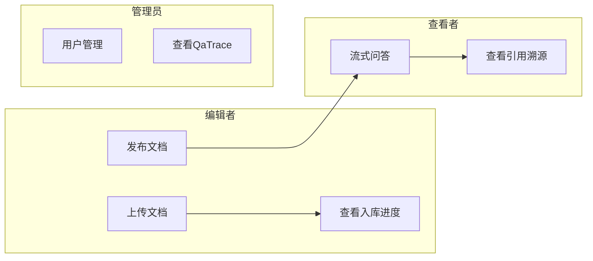
```mermaid
flowchart LR
    subgraph editor [编辑者]
        UC1[上传文档]
        UC2[发布文档]
        UC3[查看入库进度]
    end
    subgraph viewer [查看者]
        UC4[流式问答]
        UC5[查看引用溯源]
    end
    subgraph admin [管理员]
        UC6[用户管理]
        UC7[查看QaTrace]
    end
    UC1 --> UC3
    UC2 --> UC4
    UC4 --> UC5
```

#### 3.1.3 用户故事

| ID | 故事 | 验收标准 |
|----|------|----------|
| US-01 | 作为编辑者，我上传制度 PDF 后可查看入库进度 | 任务状态从 PENDING 到 READY（**解析完成，未向量化**） |
| US-02 | 作为编辑者，我发布文档且索引 SYNCED 后查看者才能问答命中 | 草稿/索引中不可检索；`index_status=SYNCED` 后可命中 |
| US-03 | 作为查看者，我问「年假几天」得到带引用的答案 | sources 含页码与原文片段 |
| US-04 | 作为查看者，我问库外问题系统拒答 | 不编造，明确提示未找到 |
| US-05 | 作为查看者，我多轮追问「它的流程」仍正确 | CompressionQuery 改写正确 |
| US-06 | 作为管理员，我通过 qaTraceId 复盘错误答案 | QaTrace 含 query/召回/耗时 |

### 3.2 功能性需求

| ID | 需求描述 | 优先级 |
|----|----------|--------|
| FR-01 | 注册、登录、JWT 签发与校验 | P0 |
| FR-02 | 知识库 CRUD、成员管理 | P0 |
| FR-03 | 文档上传、OSS 存储、入库任务查询 | P0 |
| FR-04 | 文档状态 DRAFT / PUBLISHED / ARCHIVED；发布触发 Outbox 向量化；下架删除向量 | P0 |
| FR-05 | SSE 流式问答、会话管理、多轮对话、RAG auto 路由 | P0 |
| FR-11 | 发布索引 Outbox + `index_status` 状态机 + 启动时任务恢复 | P0 |
| FR-12 | 检索 Filter 服务端绑定 `kbId`（禁止信任客户端透传） | P0 |
| FR-06 | 响应 `sources[]`、OSS 预签名 URL | P0 |
| FR-07 | 空上下文拒答（`allowEmptyContext=false`） | P0 |
| FR-08 | QaTrace 记录与管理员查询 | P1 |
| FR-09 | Modular RAG（MultiQuery + CompressionQuery） | P1 |
| FR-10 | EvalRunner 批量评测 | P1 |

### 3.3 非功能性需求

| 类别 | 要求 |
|------|------|
| 性能 | 入库解析异步不阻塞上传；单轮问答 P95 < 5s、首 token < 2.5s；多轮 Modular P95 < 10s |
| 安全 | JWT + RBAC + refreshToken；**草稿不向量化**；检索 `(doc_id, doc_version)` 精确匹配；上传/MIME/大小限制（§8.6）；密钥环境变量注入；生产 HTTPS |
| 可用性 | 入库/索引失败可重试（解析仅手动重试，Outbox 索引自动退避重试）；索引侧僵死回收已实现，解析侧僵死回收未实现（§7.3.1）；ChatMemory 存 DB 重启不丢会话 |
| 可观测 | Actuator + Micrometer + QaTrace 表 |
| 可扩展 | 检索/写入/模型调用分层解耦，通过手写 service + 配置替换向量库与模型 |
| 可部署 | Docker Compose 提供 PostgreSQL；应用（Maven）与前端（Vite）本地启动（§13.1） |

### 3.4 约束与假设

- 依赖 DashScope 云端 API，需稳定网络与有效 API Key；
- MVP 单实例部署，不使用 Redis；
- 业务表与向量数据存储于**同一 PostgreSQL 实例**；
- 文档以中文企业制度/流程类为主，电子文档为主（非扫描件为主）；
- 单人开发，周期 2–3 个月（12 周计划）。

---

## 4. 总体架构设计

### 4.1 架构设计原则

1. **分层解耦：** 交互、业务、检索、模型、数据五层职责清晰；
2. **入库与问答解耦：** 上传异步入库，问答只读向量库；
3. **检索与生成解耦：** 检索层输出上下文，生成层只负责 LLM 调用；
4. **接口可替换：** 向量库、检索器、后处理器通过 Spring AI 接口抽象；
5. **配置外部化：** RAG 参数、模型名称、阈值均可通过 yaml / 环境变量调整；
6. **Defense in Depth：** API 层 RBAC + 知识库成员校验 + 检索层 `kbId`/`published`/`docId+docVersion` 过滤；
7. **延迟向量化：** 草稿仅 OSS + 切块落库，**发布时才写入 PGVector**，消灭草稿向量泄露面；
8. **最终一致：** 发布/下架通过 **Transactional Outbox** 驱动索引副作用，检索只认 `index_status=SYNCED`。

### 4.2 逻辑分层架构

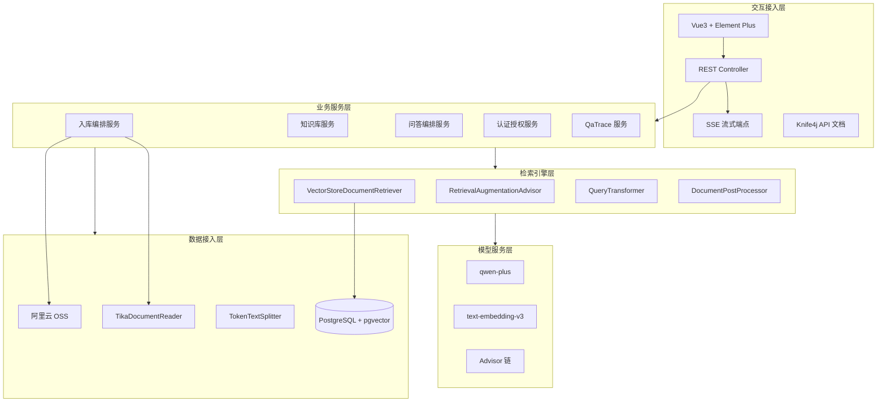
```mermaid
flowchart TB
    subgraph L5 [交互接入层]
        Vue3[Vue3 + Element Plus]
        REST[REST Controller]
        SSE[SSE 流式端点]
        Knife4j[Knife4j API 文档]
    end
    subgraph L4 [业务服务层]
        KbSvc[知识库服务]
        IngestSvc[入库编排服务]
        ChatSvc[问答编排服务]
        AuthSvc[认证授权服务]
        TraceSvc[QaTrace 服务]
    end
    subgraph L3 [检索引擎层]
        RAGAdv[RetrievalAugmentationAdvisor]
        Retriever[VectorStoreDocumentRetriever]
        QueryT[QueryTransformer]
        PostP[DocumentPostProcessor]
    end
    subgraph L2 [模型服务层]
        ChatModel[qwen-plus]
        EmbedModel[text-embedding-v3]
        Advisors[Advisor 链]
    end
    subgraph L1 [数据接入层]
        OSS[阿里云 OSS]
        Tika[TikaDocumentReader]
        Splitter[TokenTextSplitter]
        PG[(PostgreSQL + pgvector)]
    end
    Vue3 --> REST
    REST --> SSE
    REST --> L4
    L4 --> L3
    L3 --> L2
    L4 --> L1
    Retriever --> PG
    IngestSvc --> OSS
    IngestSvc --> Tika
```

#### 各层职责

| 层级 | 核心职责 | 主要组件 |
|------|----------|----------|
| 数据接入层 | 文件存储、解析、切块、向量化、持久化 | OSS/本地存储、Tika、`SimpleTextChunker`、`VectorIndexService`（JdbcClient 直写向量）、Flyway |
| 模型服务层 | 统一封装 LLM / Embedding / Rerank 调用 | DashScope（OpenAI 兼容）ChatModel、`DashScopeEmbeddingGateway`、`DashScopeDocumentReranker` |
| 检索引擎层 | Query 改写、向量检索、词法检索、RRF 融合、Rerank | `RetrievalService`、`VectorSearchService`、`LexicalRetriever`、`RetrievalFusionService` |
| 业务服务层 | 领域逻辑、权限、状态机、审计 | `KnowledgeBaseService`、`DocumentService`、`ChatService` |
| 交互接入层 | API、流式协议、前端、文档 | Controller、Knife4j、Vue3 |

> **⚠️ 实现说明（V1.1 现实化）：** 上方逻辑分层图沿用了早期基于 Spring AI Advisor 的设计叙事（`RetrievalAugmentationAdvisor` / `VectorStoreDocumentRetriever` / `DocumentPostProcessor`）。这些 Advisor 组件在 W1 技术 Spike 中验证过，但**生产问答链路最终采用手写 service 编排**，不走 Advisor 链。真实调用链为：
>
> `ChatService` → `QueryRewriteService`（多轮改写）→ `RetrievalService` → `VectorSearchService` / `LexicalRetriever` → `RetrievalFusionService`（RRF）→ `DashScopeDocumentReranker` → `SpringAiAnswerGenerator`
>
> 选择手写编排的原因：检索层需要精确控制 SQL（`published + SYNCED + (doc_id, doc_version)` JOIN 过滤）、混合检索的 RRF 融合、以及 provider 降级路径，service 编排比 Advisor 链更可控、更易排障。§7.4–7.7 的组件描述以此为准。

**层间依赖规则：**

- Controller 只调用 Service，不直接调用 `ChatModel` 或向量检索层；
- Service 通过手写编排调用检索层与模型层（`ChatService` → `RetrievalService` → provider gateway），不经 Advisor 链；
- 入库流水线与问答流水线独立，通过 `docId` / `version` / `index_status` 关联；
- `ChatService` 中 `kbId` **从 URL 路径参数取得并经 `ChatSession` 归属校验**：请求体 `ChatRequest` 不含 `kbId`；新会话用路径 `kbId` 创建，已有会话要求 `session_id + user_id + kb_id` 三者匹配（详见 §8.3）。

### 4.3 技术架构

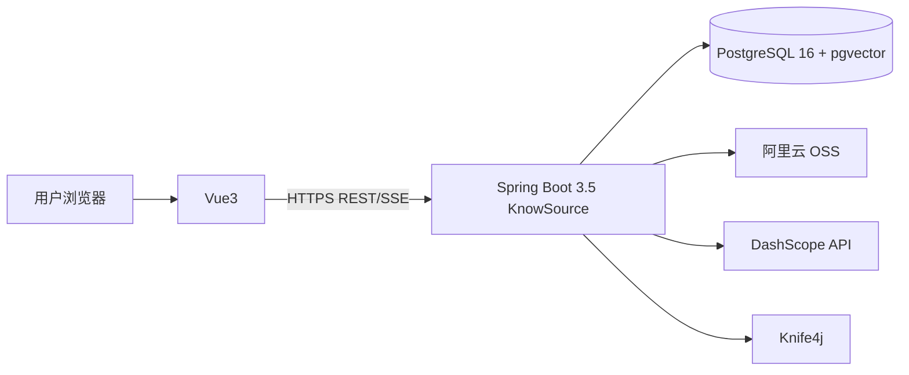
```mermaid
flowchart LR
    User[用户浏览器] --> Vue3
    Vue3 -->|HTTPS REST/SSE| App[Spring Boot 3.5 KnowSource]
    App --> PG[(PostgreSQL 16 + pgvector)]
    App --> OSS[阿里云 OSS]
    App --> DS[DashScope API]
    App --> Knife4j
```

| 组件 | 技术选型 |
|------|----------|
| 后端框架 | Spring Boot 3.5、Java 21 |
| AI 框架 | Spring AI 1.1.2、`spring-ai-starter-model-openai`（OpenAI 兼容模式接入 DashScope） |
| 业务持久化 | SQL-first JdbcClient + Flyway |
| 向量持久化 | 同库 pgvector；由 `VectorIndexService` 手写 SQL 直写（非 PgVectorStore Bean） |
| 文件存储 | 阿里云 OSS / 本地存储（可配置） |
| 前端 | Vue 3 + Element Plus + Vite |
| API 文档 | Knife4j（OpenAPI 3） |
| 部署 | Docker Compose（PostgreSQL）+ 应用本地启动（§13.1） |

### 4.4 核心数据流

#### 4.4.1 文档入库链路（解析与向量化分离）

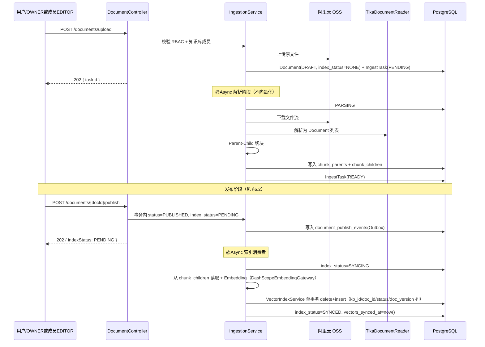
```mermaid
sequenceDiagram
    participant U as 用户/OWNER或成员EDITOR
    participant API as DocumentController
    participant Svc as IngestionService
    participant OSS as 阿里云 OSS
    participant Tika as TikaDocumentReader
    participant DB as PostgreSQL

    U->>API: POST /documents/upload
    API->>Svc: 校验 RBAC + 知识库成员
    Svc->>OSS: 上传原文件
    Svc->>DB: Document(DRAFT, index_status=NONE) + IngestTask(PENDING)
    API-->>U: 202 { taskId }

    Note over Svc: @Async 解析阶段（不向量化）
    Svc->>DB: PARSING
    Svc->>OSS: 下载文件流
    Svc->>Tika: 解析为 Document 列表
    Svc->>Svc: Parent-Child 切块
    Svc->>DB: 写入 chunk_parents + chunk_children
    Svc->>DB: IngestTask(READY)

    Note over U,DB: 发布阶段（见 §6.2）
    U->>API: POST /documents/{docId}/publish
    API->>Svc: 事务内 status=PUBLISHED, index_status=PENDING
    Svc->>DB: 写入 document_publish_events(Outbox)
    API-->>U: 202 { indexStatus: PENDING }

    Note over Svc: @Async 索引消费者
    Svc->>DB: index_status=SYNCING
    Svc->>Svc: 从 chunk_children 读取 + Embedding（DashScopeEmbeddingGateway）
    Svc->>DB: VectorIndexService 单事务 delete+insert（kb_id/doc_id/status/doc_version 列）
    Svc->>DB: index_status=SYNCED, vectors_synced_at=now()
```

**逐步逻辑：**

1. 校验知识库 OWNER/EDITOR 写权限，或全局 ADMIN 兜底权限；
2. 原文件上传 OSS，路径 `{kbId}/{docId}/{version}/{filename}`；
3. 创建 `Document`（`status=DRAFT`, `index_status=NONE`）与 `IngestTask`（PENDING）；
4. **解析阶段（异步）：** Tika 解析 → Parent(1200 token) / Child(400 token, overlap 80) 切块；
5. Parent 写入 `chunk_parents`，Child 写入 `chunk_children`（含 `doc_version`，见 §7.3.1；**不写 PGVector**）；
6. `IngestTask` 置为 READY，表示「可预览切块、可发布」，**不代表可检索**；
7. **发布阶段：** 见 §6.2 Outbox 流程；仅 `index_status=SYNCED` 后向量可被问答召回；
8. **下架：** `VectorIndexService.deleteDocumentVectors(docId)` + `index_status=NONE`（事务内同步删除，§6.2.1），不保留 archived 向量。

#### 4.4.2 问答检索链路

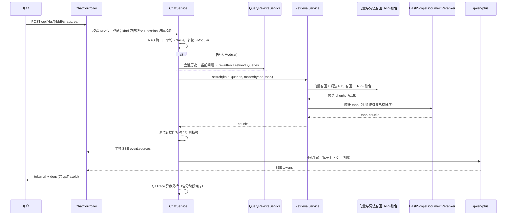
```mermaid
sequenceDiagram
    participant U as 用户
    participant API as ChatController
    participant Svc as ChatService
    participant QR as QueryRewriteService
    participant Ret as RetrievalService
    participant SR as 向量与词法召回+RRF融合
    participant RK as DashScopeDocumentReranker
    participant LLM as qwen-plus

    U->>API: POST /api/kbs/{kbId}/chat/stream
    API->>Svc: 校验 RBAC + 成员；kbId 取自路径 + session 归属校验
    Svc->>Svc: RAG 路由：单轮→Naive，多轮→Modular
    alt 多轮 Modular
        Svc->>QR: 会话历史 + 当前问题 → rewritten + retrievalQueries
    end
    Svc->>Ret: search(kbId, queries, mode=hybrid, topK)
    Ret->>SR: 向量召回 + 词法 FTS 召回 → RRF 融合
    SR-->>Ret: 候选 chunks（≤15）
    Ret->>RK: 精排 topK（失败降级按已有排序）
    RK-->>Ret: topK chunks
    Ret-->>Svc: chunks
    Svc->>Svc: 词法证据门校验；空则拒答
    Svc-->>API: 早推 SSE event:sources
    Svc->>LLM: 流式生成（基于上下文 + 问题）
    LLM-->>API: SSE tokens
    API-->>U: token 流 + done(含 qaTraceId)
    Svc->>Svc: QaTrace 异步落库（含分阶段耗时）
```

> **说明（V1.1 现实化）：** 上图反映实际 `ChatService` 手写编排链路（无 Spring AI Advisor / ChatClient / PgVectorStore Bean），详见 §4.2、§7.4。

### 4.5 部署架构（MVP）

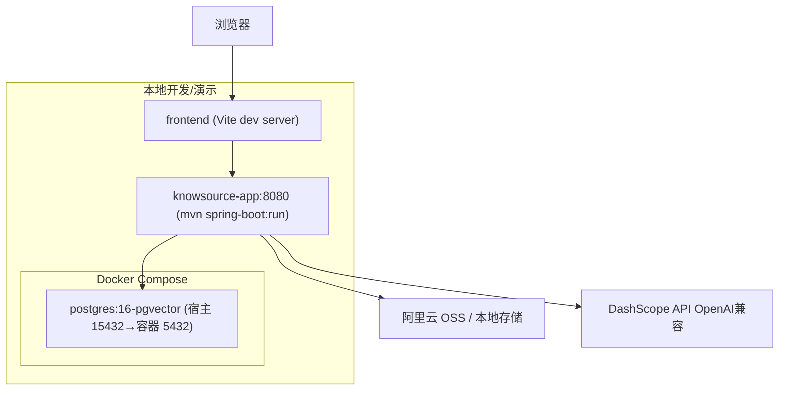
```mermaid
flowchart TB
    subgraph local [本地开发/演示]
        App["knowsource-app:8080 (mvn spring-boot:run)"]
        FE["frontend (Vite dev server)"]
        subgraph compose [Docker Compose]
            PG["postgres:16-pgvector (宿主 15432→容器 5432)"]
        end
    end
    FE --> App
    App --> PG
    App --> OSS_EXT[阿里云 OSS / 本地存储]
    App --> DS_EXT[DashScope API OpenAI兼容]
    Browser[浏览器] --> FE
```

| 服务 | 构建/启动 | 端口 | 说明 |
|------|-----------|------|------|
| postgres | `docker compose up -d`（pgvector/pgvector:pg16） | 宿主 15432 | 业务表 + 向量表 |
| knowsource-app | `mvn spring-boot:run` | 8080 | Spring Boot 应用（本地启动） |
| frontend | `npm run dev`（Vite） | Vite 端口 | 前端（本地启动） |

> **说明（V1.1 现实化）：** compose 仅提供 PostgreSQL，应用与前端本地启动（§13.1）。

**环境变量（`.env.example`）：**

```properties
AI_DASHSCOPE_API_KEY=
# 本地 compose 将容器 5432 映射到宿主 15432
KNOWSOURCE_DATASOURCE_URL=jdbc:postgresql://localhost:15432/knowsource
KNOWSOURCE_DATASOURCE_USERNAME=knowsource
KNOWSOURCE_DATASOURCE_PASSWORD=knowsource
JWT_SECRET=
OSS_ENDPOINT=
OSS_ACCESS_KEY_ID=
OSS_ACCESS_KEY_SECRET=
OSS_BUCKET=
```

---

## 5. 技术选型

### 5.1 选型总表

| 组件类别 | 我的选型 | 备选方案 | 选型理由 | 面试回答要点 |
|----------|----------|----------|----------|--------------|
| 业务开发框架 | Spring Boot 3.5 + Spring AI 1.1.2 + Java 21 | LangChain4j、裸 HTTP | Java 后端零切换；Spring AI 提供 ChatModel/EmbeddingModel 抽象 | 生产 RAG 采用手写 service 编排而非 Advisor 链，换向量库/模型只改检索/写入层 |
| 业务持久化 | SQL-first JdbcClient + Flyway | JPA、MyBatis-Plus | RAG 核心依赖精确 SQL、Outbox claim、批量向量写入和版本过滤；迁移版本化且行为透明 | 普通后台 CRUD 变多时，MVP 后可局部引入 JPA |
| 嵌入模型 | DashScope `text-embedding-v3`（OpenAI 兼容端点） | OpenAI embedding、本地 bge | 中文效果好；经 `DashScopeEmbeddingGateway` 自研 HTTP 网关调用 | query/document 区分 text-type；MVP 用云 API |
| 向量数据库 | PostgreSQL + pgvector（同库） | Milvus、Qdrant、ES Vector | 业务与向量一库；运维简单；`VectorIndexService` 手写 SQL 直写冗余列 + B-tree 索引 | 百万级 chunk 够用；迁移需改写入层与检索层 SQL |
| 重排模型 | MVP：`qwen3-rerank` 轻量精排 | 分数截断 only | 粗排 15 → 精排 topK，抑制「自信答错」 | P0 即接入，失败降级为词法/向量排序 |
| 基座大模型 | DashScope `qwen-plus`（OpenAI 兼容端点） | GPT-4o、DeepSeek、本地 Ollama | 中文制度文档理解好、国内稳定 | `ChatModel` 抽象 + 配置切换 |
| 文档解析 | Spring AI `TikaDocumentReader` + Markdown 结构解析 | POI 自研、pdfbox | 20+ 格式统一输出；含可选本地 OCR（默认关闭） | 扫描件走本地 tesseract OCR（§7.2.3） |
| 文件存储 | 阿里云 OSS / 本地存储 | 本地磁盘、MinIO | 原文件与向量分离；预签名/本地预览 | 路径规范 `{kbId}/{docId}/{version}/` |
| 前端 | Vue 3 + Element Plus | React、Ant Design Vue | 企业后台成熟方案；组件丰富 | Vite 构建、SSE 流式渲染 |
| API 文档 | Knife4j | SpringDoc 裸 Swagger | 增强 UI、适合 Demo 与面试展示 | OpenAPI 3 标准 |

### 5.2 核心 Maven 依赖

```xml
<dependencyManagement>
    <dependencies>
        <dependency>
            <groupId>org.springframework.ai</groupId>
            <artifactId>spring-ai-bom</artifactId>
            <version>1.1.2</version>
            <type>pom</type>
            <scope>import</scope>
        </dependency>
    </dependencies>
</dependencyManagement>

<!-- 模型接入：OpenAI starter（OpenAI 兼容模式接入 DashScope，见 §5.3） -->
<dependency>
    <groupId>org.springframework.ai</groupId>
    <artifactId>spring-ai-starter-model-openai</artifactId>
</dependency>
<!-- 向量库 pgvector（仅用其 DDL/依赖；写入与检索由 VectorIndexService/VectorSearchService 手写 SQL） -->
<dependency>
    <groupId>org.springframework.ai</groupId>
    <artifactId>spring-ai-starter-vector-store-pgvector</artifactId>
</dependency>
<!-- 文档解析 -->
<dependency>
    <groupId>org.springframework.ai</groupId>
    <artifactId>spring-ai-tika-document-reader</artifactId>
</dependency>
```

> **⚠️ 选型说明（V1.1 现实化）：** 早期设计计划使用 `spring-ai-alibaba-starter-dashscope` 原生 starter。实际工程改用 **`spring-ai-starter-model-openai`**，通过配置 `base-url=https://dashscope.aliyuncs.com/compatible-mode`（§5.3）以 OpenAI 兼容模式访问 DashScope。原因：避免 spring-ai-alibaba 的版本耦合，chat / embedding 走统一的 OpenAI 协议。Embedding 与 Rerank 另有自研 HTTP 网关（`DashScopeEmbeddingGateway` / `DashScopeDocumentReranker`）直接调用 DashScope 原生 API。

### 5.3 AI 模型配置要点

```yaml
spring:
  ai:
    openai:                              # OpenAI 兼容模式接入 DashScope
      api-key: ${AI_DASHSCOPE_API_KEY:}
      base-url: ${AI_DASHSCOPE_BASE_URL:https://dashscope.aliyuncs.com/compatible-mode}
      chat:
        options:
          model: ${AI_DASHSCOPE_CHAT_MODEL:qwen-plus}
      embedding:
        options:
          model: ${AI_DASHSCOPE_EMBEDDING_MODEL:text-embedding-v3}
    vectorstore:
      pgvector:
        initialize-schema: false  # DDL 全部由 Flyway V1__vector_store.sql 掌控（§13.3）
        index-type: HNSW
        distance-type: COSINE_DISTANCE
        dimensions: 1024

knowsource:
  retrieval:
    mode: hybrid            # vector | lexical | hybrid（默认 hybrid，§7.4）
    candidate-top-k: 15     # 粗排候选数
    hybrid:
      rrf-k: 60             # RRF 融合常数
  modular-rag:
    multi-query:
      count: 2              # Modular 下扩展 query 数
  rerank:
    dashscope:
      model: qwen3-rerank   # 精排模型（自研网关调用）
```

> **说明：** `qwen-plus` / `text-embedding-v3` 通过 `spring.ai.openai.*` 命名空间的 OpenAI 兼容端点接入；`qwen3-rerank` 与 embedding 的批处理另由 `knowsource.rerank.dashscope.*` / `knowsource.embedding.dashscope.*` 下的自研网关处理。检索模式默认 `hybrid`（§7.4）。

### 5.4 架构决策记录（ADR）

#### ADR-001：选用 PGVector 而非独立向量库

- **背景：** 需要存储文档向量与业务元数据。
- **决策：** 业务表与向量表同一 PostgreSQL，pgvector HNSW 索引。
- **理由：** 百万级 chunk、低 QPS；运维一库；业务表与向量表同库，`JdbcClient` 可在同一事务上下文中显式控制 SQL。
- **代价：** 极限 ANN QPS 不如 Milvus；十亿级需迁移；metadata 纯 JSON 过滤性能差 → **P0 增加冗余列**（§6.4）。
- **实现口径（V1.1 现实化）：** 早期计划自定义 `KnowSourceVectorStore extends PgVectorStore` 重写 `doAdd()` / `doSearch()`。**实际代码未继承框架类**，而是由 `VectorIndexService` 用 `JdbcClient` 手写 `INSERT`（含 `kb_id / doc_id / status / doc_version` 冗余列），由 `VectorSearchService` 手写 `SELECT`（JOIN documents 过滤 + B-tree 命中）。这比继承框架类更直接、更可控，代价是迁移向量库需改写这两个 service 的 SQL，而非「换 Bean」。生产链路完全不经过 Spring AI `VectorStore` 接口（该接口仅 `SpikeController` 在 W1 验证时引用）。

#### ADR-002：选用 Spring AI 而非裸调 API

- **决策：** 使用 Spring AI 的 `ChatModel` / `EmbeddingModel` 抽象与 SSE 流式能力。
- **理由：** Boot 一体配置、模型可配置切换、流式生成开箱即用。
- **实现口径（V1.1 现实化）：** 早期计划全链路使用 Spring AI Advisor 链（`RetrievalAugmentationAdvisor` + Modular RAG 模块）。实际生产链路改为 **`ChatService` + `RetrievalService` 手写编排**（§4.2、§7.4–7.7），只保留 `ChatModel` / SSE 抽象。`spring-ai-rag` 的 Advisor/QueryTransformer/PostProcessor 组件在 W1 Spike 验证过，但未进入生产路径。
- **代价：** 版本迭代需锁定 BOM。

#### ADR-003：MVP 不做部门级向量隔离

- **决策：** RBAC 管 API；检索 Filter `kbId`（服务端绑定）+ `status=published` + `(docId, docVersion)` 精确匹配。
- **理由：** 单人 MVP 聚焦 RAG 核心；**延迟向量化**已消除草稿泄露；权限模型简单可演示。
- **演进：** metadata 预留 `deptId`、`visibility`（第 15.4 节）。

#### ADR-005：延迟向量化 + Transactional Outbox（P0）

- **背景：** 草稿与发布向量同表时，metadata 更新存在竞态与泄露窗口。
- **决策：** 上传仅解析切块至 `chunk_children`；**发布时**使用已解析完成的 `documents.version` 写 `document_publish_events`，异步消费者完成 Embedding 后设 `index_status=SYNCED`。
- **理由：** 草稿物理不可检索；发布语义唯一（全量 re-index）；为 v1.1 接入 MQ 预留 Outbox 表。
- **代价：** MVP 不做无中断版本切换；发布到 `SYNCED` 期间该文档不可检索，需 UI 展示 `index_status`。
- **检索约束：** 仅 `index_status=SYNCED` 的 `(docId, docVersion)` 可被检索；Filter 同时匹配 `kb_id / doc_id / doc_version` 列与 metadata，避免不同文档相同版本号串召回。

#### ADR-006：RAG auto 路由（P0）

- **决策：** `profile=auto` 时，单轮（无历史用户消息）走 Naive；多轮走 Modular（仅启用 CompressionQuery + MultiQuery(2)）。
- **理由：** 拆分 SLA，避免所有请求承受 2+ 次 LLM 改写；EvalRunner 可强制 `naive`/`modular` 做 A/B。
- **代价：** 路由逻辑需单测覆盖；QaTrace 须记录实际 `rag_profile`。

#### ADR-004：SQL-first JdbcClient + Flyway

- **决策：** MVP 统一使用 `JdbcClient` 编写业务 SQL；结构变更全部通过 Flyway 版本脚本管理。
- **理由：** RAG 核心链路需要精确控制 SQL：`doc_id + doc_version` 过滤、Outbox claim/lock、批量 chunk/vector 写入、发布状态机和 QaTrace 记录都不适合被 ORM 隐式行为遮蔽。
- **代价：** 普通 CRUD 代码比 JPA Repository 更显式；如果 MVP 后出现大量后台管理 CRUD，可在非 RAG 核心模块局部引入 JPA，但不迁移检索、Outbox、向量写入链路。

---

## 6. 领域模型与数据设计

### 6.1 核心领域实体

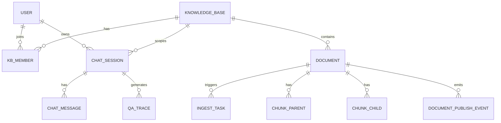
```mermaid
erDiagram
    USER ||--o{ KB_MEMBER : joins
    KNOWLEDGE_BASE ||--o{ KB_MEMBER : has
    KNOWLEDGE_BASE ||--o{ DOCUMENT : contains
    DOCUMENT ||--o{ INGEST_TASK : triggers
    DOCUMENT ||--o{ CHUNK_PARENT : has
    DOCUMENT ||--o{ CHUNK_CHILD : has
    DOCUMENT ||--o{ DOCUMENT_PUBLISH_EVENT : emits
    USER ||--o{ CHAT_SESSION : owns
    CHAT_SESSION ||--o{ CHAT_MESSAGE : has
    CHAT_SESSION ||--o{ QA_TRACE : generates
    KNOWLEDGE_BASE ||--o{ CHAT_SESSION : scopes
```

| 实体 | 说明 |
|------|------|
| `User` | 注册用户，全局角色 ADMIN/VIEWER |
| `KnowledgeBase` | 知识库 |
| `KbMember` | 知识库成员及库内角色 |
| `Document` | 文档元数据，含 `status`、`index_status`、OSS 路径、版本号 |
| `IngestTask` | **解析**任务状态机（不含向量化） |
| `ChunkParent` | Parent 块全文（不向量化） |
| `ChunkChild` | Child 块全文（解析落库，发布时向量化） |
| `DocumentPublishEvent` | 发布/下架 Outbox 事件 |
| `ChatSession` | 对话会话，绑定 `kbId` |
| `ChatMessage` | 会话消息（亦用于 JDBC ChatMemory） |
| `QaTrace` | 问答全链路追踪 |

### 6.2 文档生命周期

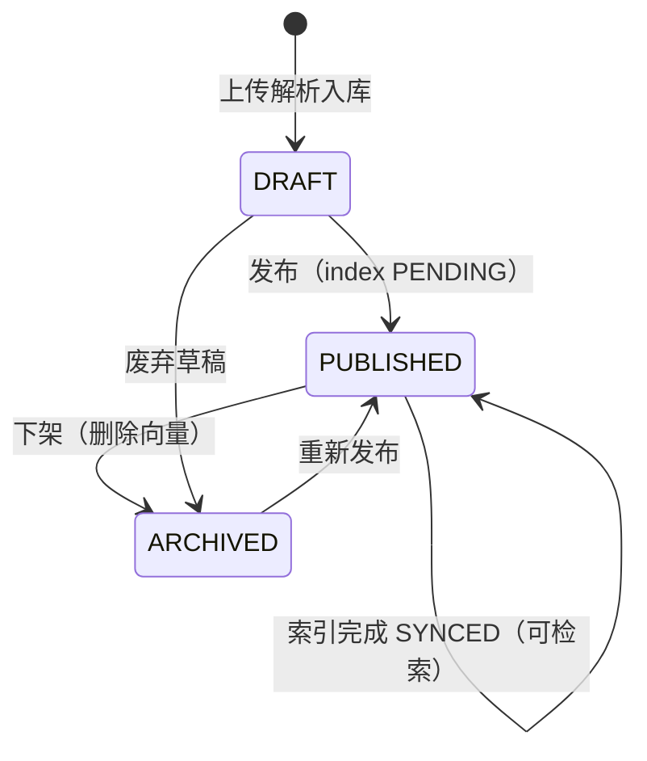
```mermaid
stateDiagram-v2
    [*] --> DRAFT: 上传解析入库
    DRAFT --> PUBLISHED: 发布（index PENDING）
    PUBLISHED --> PUBLISHED: 索引同步中 SYNCING
    PUBLISHED --> PUBLISHED: 索引完成 SYNCED（可检索）
    PUBLISHED --> ARCHIVED: 下架（删除向量）
    ARCHIVED --> PUBLISHED: 重新发布
    DRAFT --> ARCHIVED: 废弃草稿
```

| 状态 | 可编辑 | 可检索 | PGVector | index_status |
|------|--------|--------|----------|--------------|
| DRAFT | ✓ | ✗ | **无向量** | NONE |
| PUBLISHED | ✗（需先下架） | ✓（仅 SYNCED） | 有向量 | PENDING → SYNCING → SYNCED |
| ARCHIVED | ✗ | ✗ | **已删除** | NONE |

#### 6.2.1 发布流程（Transactional Outbox，唯一语义）

**原则：** 发布 = `status=PUBLISHED` + `index_status=PENDING` + 异步全量 re-index；发布使用当前已解析完成的 `documents.version`，**发布动作本身不再额外递增版本**。禁止「仅改 metadata status」或「草稿预写向量」两种并存方案。

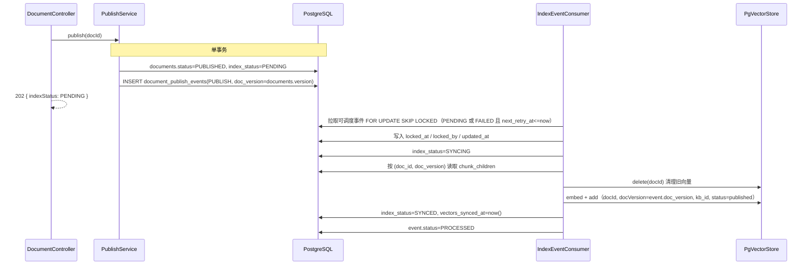
```mermaid
sequenceDiagram
    participant API as DocumentController
    participant Svc as PublishService
    participant DB as PostgreSQL
    participant Worker as IndexEventConsumer
    participant VS as PgVectorStore

    API->>Svc: publish(docId)
    Note over Svc,DB: 单事务
    Svc->>DB: documents.status=PUBLISHED, index_status=PENDING
    Svc->>DB: INSERT document_publish_events(PUBLISH, doc_version=documents.version)
    API-->>API: 202 { indexStatus: PENDING }

    Worker->>DB: 拉取可调度事件 FOR UPDATE SKIP LOCKED（PENDING 或 FAILED 且 next_retry_at<=now）
    Worker->>DB: 写入 locked_at / locked_by / updated_at
    Worker->>DB: index_status=SYNCING
    Worker->>DB: 按 (doc_id, doc_version) 读取 chunk_children
    Worker->>VS: delete(docId) 清理旧向量
    Worker->>VS: embed + add（docId, docVersion=event.doc_version, kb_id, status=published）
    Worker->>DB: index_status=SYNCED, vectors_synced_at=now()
    Worker->>DB: event.status=PROCESSED
```

| 步骤 | 说明 |
|------|------|
| 1 | 事务内更新 `documents` 并写入 Outbox，**不调用 Embedding** |
| 2 | `IndexEventConsumer`（`@Scheduled` + `@Async`）按 §11.3.2 调度规则消费 Outbox |
| 3 | 从 `chunk_children` 按 `(doc_id, doc_version)` 读取切块，批量 Embedding 后由 `VectorIndexService` 写入向量表 |
| 4 | 向量冗余列写入 `doc_id`、`doc_version`、`kb_id`、`status=published` |
| 5 | 成功后 `index_status=SYNCED`；失败则 `index_status=FAILED`，事件可重试 |
| 6 | 重新发布（ARCHIVED→PUBLISHED）与首次发布走**同一路径** |

> **⚠️ 已知缺口（publish 幂等）：** 当前 `publish` 未检查文档是否已是 PUBLISHED/SYNCED，连点两次会写多条 PENDING Outbox 事件，导致重复 embedding（浪费配额 + 向量表可能出现重复行，`vector_store` 无唯一约束）。建议补：publish 前状态前置检查 + `document_publish_events (doc_id, doc_version, event_type)` 唯一约束（后续增强）。

**下架流程：** 事务内 `status=ARCHIVED`、`index_status=NONE`，**同步调用 `VectorIndexService.deleteDocumentVectors(docId)` 删除向量**。

> **⚠️ 实现口径（V1.1 现实化）：** 早期设计要求下架也走 Outbox（写 `ARCHIVE` 事件 → 消费者删向量）。**实际代码是事务内同步删向量，不写 Outbox `ARCHIVE` 事件**。功能等价（都删了向量），取舍如下：
> - 优点：下架即时生效，无需等消费者；
> - 缺点：失去 Outbox 重试能力——若删向量时 DB 异常，整个 archive 事务回滚，文档停留在 PUBLISHED+SYNCED；
> - 发布（PUBLISH）仍走 Outbox；仅下架是同步路径。若要统一「发布/下架均 Outbox 驱动」，需补 `ARCHIVE` 事件消费（后续增强）。

**问答可见性：** 仅当 `status=PUBLISHED` **且** `index_status=SYNCED` 时检索可命中；`PENDING/SYNCING/FAILED` 期间该文档不可检索，前端展示「索引同步中」或「索引失败，可重试」。MVP 接受发布窗口内短暂不可检索；无中断发布通过 `published_version / indexing_version` 双版本字段列入目标架构。

### 6.3 数据库表设计

#### 6.3.1 `users`

| 字段 | 类型 | 说明 |
|------|------|------|
| id | BIGINT PK | 主键 |
| username | VARCHAR(64) UNIQUE | 用户名 |
| password_hash | VARCHAR(128) | BCrypt |
| email | VARCHAR(128) | 邮箱 |
| global_role | VARCHAR(16) | ADMIN / VIEWER |
| token_version | INT | JWT 失效版本号，改密/禁用时递增（§8.6.2） |
| created_at | TIMESTAMP | 创建时间 |

#### 6.3.2 `refresh_tokens`

| 字段 | 类型 | 说明 |
|------|------|------|
| id | VARCHAR(36) PK | tokenId |
| user_id | BIGINT FK | 用户 |
| token_hash | VARCHAR(128) UNIQUE | Refresh Token 哈希，数据库不保存明文 |
| expires_at | TIMESTAMP | 过期时间 |
| revoked_at | TIMESTAMP | 登出/改密/禁用时置空或删除 |
| created_at | TIMESTAMP | 创建时间 |

#### 6.3.3 `knowledge_bases`

| 字段 | 类型 | 说明 |
|------|------|------|
| id | VARCHAR(36) PK | UUID |
| name | VARCHAR(128) | 名称 |
| description | TEXT | 描述 |
| owner_id | BIGINT FK | 创建人 |
| created_at | TIMESTAMP | |

#### 6.3.4 `kb_members`

| 字段 | 类型 | 说明 |
|------|------|------|
| id | BIGINT PK | |
| kb_id | VARCHAR(36) FK | 知识库 |
| user_id | BIGINT FK | 用户 |
| role | VARCHAR(16) | OWNER / EDITOR / VIEWER |

#### 6.3.5 `documents`

| 字段 | 类型 | 说明 |
|------|------|------|
| id | VARCHAR(36) PK | docId |
| kb_id | VARCHAR(36) FK | |
| title | VARCHAR(256) | 文件名/标题 |
| status | VARCHAR(16) | DRAFT/PUBLISHED/ARCHIVED |
| index_status | VARCHAR(16) | NONE/PENDING/SYNCING/SYNCED/FAILED |
| oss_key | VARCHAR(512) | OSS 路径 |
| version | INT | 已解析内容版本号；新上传/重传解析成功后递增，发布时不额外递增；向量 `docVersion` 与此对齐 |
| file_type | VARCHAR(16) | pdf/docx/md |
| created_by | BIGINT FK | |
| published_at | TIMESTAMP | 发布时间 |
| vectors_synced_at | TIMESTAMP | 向量索引完成时间（可检索起点） |

#### 6.3.6 `ingest_tasks`

| 字段 | 类型 | 说明 |
|------|------|------|
| id | VARCHAR(36) PK | taskId |
| doc_id | VARCHAR(36) FK | |
| status | VARCHAR(16) | PENDING/PARSING/READY/FAILED（**仅解析阶段**） |
| error_message | TEXT | 失败原因 |
| started_at / finished_at | TIMESTAMP | |
| page_count / extracted_page_count / empty_page_count | INT | 页数统计（V6，默认 0） |
| table_count / structured_table_count / failed_page_count | INT | 表格与失败页统计（V6，默认 0） |
| ocr_required_page_count / ocr_applied_page_count | INT | OCR 统计（V6，默认 0） |
| quality_report | JSONB | 入库质量报告（V6，默认 `{}`） |

> **说明（V6 迁移）：** 质量报告列在 `V6__ingest_quality_report.sql` 加入，随入库自动填充，供前端/运维观测空页、失败页、OCR 应用情况。

#### 6.3.7 `chunk_children`

| 字段 | 类型 | 说明 |
|------|------|------|
| id | VARCHAR(64) PK | childChunkId |
| doc_id | VARCHAR(36) FK | |
| doc_version | INT | 切块所属文档版本，与 Outbox / 向量 `doc_version` 对齐 |
| parent_chunk_id | VARCHAR(64) FK | 关联 parent |
| content | TEXT | 子块全文（向量化源） |
| chunk_index | INT | 序号 |
| page_number | INT | 页码 |
| chunk_type | VARCHAR(16) | TEXT / TABLE |

#### 6.3.8 `document_publish_events`（Outbox）

| 字段 | 类型 | 说明 |
|------|------|------|
| id | VARCHAR(36) PK | eventId |
| doc_id | VARCHAR(36) FK | |
| kb_id | VARCHAR(36) | 冗余，消费时校验 |
| doc_version | INT | 目标版本 |
| event_type | VARCHAR(16) | PUBLISH / ARCHIVE / REINDEX |
| status | VARCHAR(16) | PENDING / PROCESSED / FAILED |
| error_message | TEXT | 消费失败原因 |
| attempt_count | INT | 消费尝试次数，默认 0 |
| next_retry_at | TIMESTAMP | 失败后可重试时间；PENDING 时为 NULL |
| locked_at | TIMESTAMP | 被 Worker 锁定时间（`FOR UPDATE SKIP LOCKED` 拉取时写入） |
| locked_by | VARCHAR(64) | 锁定实例标识（hostname + pid 或 UUID） |
| created_at | TIMESTAMP | |
| updated_at | TIMESTAMP | 最后状态变更时间 |
| processed_at | TIMESTAMP | |

> **调度索引：** `CREATE INDEX idx_publish_events_sched ON document_publish_events (status, next_retry_at, created_at) WHERE status IN ('PENDING', 'FAILED');` —— 支持 PENDING 首次消费与 FAILED 到期重试联合调度。

#### 6.3.9 `chunk_parents`

| 字段 | 类型 | 说明 |
|------|------|------|
| id | VARCHAR(64) PK | parentChunkId |
| doc_id | VARCHAR(36) FK | |
| doc_version | INT | 切块所属文档版本 |
| content | TEXT | 父块全文 |
| page_number | INT | 页码 |

#### 6.3.10 `chat_sessions` / `chat_messages`

| 表 | 关键字段 |
|----|----------|
| chat_sessions | id, user_id, kb_id, title, created_at（V3 迁移） |
| chat_messages | id, session_id, role, content, token_count, created_at；`qa_trace_id`（V5 迁移，关联该消息对应的问答追踪）（V3 建表） |

> **说明：** `chat_sessions` / `chat_messages` 由 `V3__chat_sessions.sql` 创建；`chat_messages.qa_trace_id` 由 `V5__chat_message_trace.sql` 追加，用于把助手回复与 `qa_traces` 记录关联。

#### 6.3.11 `qa_traces`

| 字段 | 类型 | 说明 |
|------|------|------|
| id | VARCHAR(36) PK | qaTraceId |
| session_id | VARCHAR(36) | |
| user_id | BIGINT | |
| kb_id | VARCHAR(36) | |
| query | TEXT | 原始问题 |
| rewritten_query | TEXT | 压缩/改写后 |
| retrieved_chunks | JSONB | 召回列表 |
| answer | TEXT | 最终答案 |
| retrieval_ms / llm_ms / total_ms | INT | 耗时 |
| rewrite_llm_ms | INT | Compression/MultiQuery 耗时（P0 分阶段） |
| generation_first_token_ms | INT | 首 token 延迟 |
| token_usage | JSONB | token 统计 |
| rag_profile | VARCHAR(16) | naive/modular |
| created_at | TIMESTAMP | |

> **注：** `qa_traces.session_id` 无外键约束（应用层保证关联）；`token_usage` 当前实际写入固定 `{}`（token 统计未接入，§11.1）。

#### 6.3.12 Flyway 迁移一览（V1–V9）

> **说明（V1.1 现实化）：** 早期文档仅描述 V1/V2，实际工程有 9 个迁移。下表为完整对照，后续新增迁移基于 V9 继续追加 V10+，不重命名已执行迁移。

| 迁移 | 内容 | 关联章节 |
|------|------|----------|
| `V1__vector_store.sql` | `vector` 扩展 + `vector_store` 表（含冗余列、HNSW 索引、B-tree 索引） | §6.4、§13.3 |
| `V2__business_tables.sql` | 全部核心业务表：users / refresh_tokens / knowledge_bases / kb_members / documents / ingest_tasks / chunk_parents / chunk_children / document_publish_events / qa_traces | §6.3 |
| `V3__chat_sessions.sql` | `chat_sessions` + `chat_messages` 及相关索引 | §6.3.10 |
| `V4__chunk_metadata.sql` | `chunk_parents` / `chunk_children` 增加 `metadata JSONB` 列 | §6.3.7/6.3.9 |
| `V5__chat_message_trace.sql` | `chat_messages` 增加 `qa_trace_id` + 索引 | §6.3.10 |
| `V6__ingest_quality_report.sql` | `ingest_tasks` 增加 9 个质量统计列 + `quality_report JSONB` + 索引 | §6.3.6、§7.2.3 |
| `V7__remove_global_editor_role.sql` | 现存 EDITOR 用户降级为 VIEWER；`global_role` CHECK 约束改为 `('ADMIN','VIEWER')` | §3.1.1、§8.2 |
| `V8__hybrid_search_fts.sql` | `vector_store` 增加 `content_tokens` / `doc_title` / `content_tsv`（生成列）+ GIN 索引 | §7.4.5 |
| `V9__restore_global_editor_role.sql` | `global_role` CHECK 约束恢复为 `('ADMIN','EDITOR','VIEWER')`（最终态；不回补已降级用户） | §3.1.1、§8.2 |

> **全局角色约束变迁：** V2 仅设默认值 `VIEWER` 无 CHECK；V7 首次引入 `chk_users_global_role` 且排除 EDITOR；V9 恢复 EDITOR。**最终 DB 约束允许 `ADMIN / EDITOR / VIEWER` 三种**，与代码中 EDITOR 的实际权限（可建库，§8.2）一致。

### 6.4 向量存储设计（pgvector）

`vector_store` 表由 Flyway **完整建表**（`V1__vector_store.sql`，非 `ALTER` 扩展），含冗余列：

| 列 | 说明 |
|----|------|
| id | 向量记录 ID（UUID） |
| content | chunk 文本 |
| metadata | JSONB：见下表 |
| embedding | vector(1024)（text-embedding-v3 维度） |
| **kb_id** | **冗余列**，检索预过滤（B-tree） |
| **doc_id** | **冗余列**，与 `documents.id` 对齐，用于 `(doc_id, doc_version)` 精确匹配 |
| **status** | **冗余列**，固定 `published` |
| **doc_version** | **冗余列**，与 `documents.version` 对齐 |
| content_tokens | 分词文本（V8，FTS 源） |
| doc_title | 文档标题冗余（V8） |
| content_tsv | `tsvector` 生成列（V8，混合检索 §7.4.5） |

> **⚠️ 实现说明（V1.1 现实化）：** 早期设计要求自定义 `KnowSourceVectorStore extends PgVectorStore` 重写 `doAdd()` / `doSearch()`，让冗余列被写入并命中 B-tree 索引。**实际代码未继承框架类**，而是完全绕开 Spring AI `VectorStore` 接口，由两个 service 手写 SQL：
>
> - **`VectorIndexService`（写入）：** 用 `JdbcClient` 手写 `INSERT`，从切块数据直接把 `kb_id / doc_id / status / doc_version` 写入冗余列；`delete + insert` 包在单事务内（§7.3.2）；
> - **`VectorSearchService`（检索）：** 手写 `SELECT`，JOIN `documents` 表在 WHERE 子句过滤 `published + SYNCED + (doc_id, doc_version)`，命中 B-tree 复合索引（§7.4.2）；
> - `VectorStore` Bean 仅 `SpikeController`（W1 验证）引用，**生产链路不经过它**。
>
> 迁移向量库时改这两个 service 的 SQL，而非「换 Bean」。

**Chunk metadata 字段：**

| 字段 | 示例 | 说明 |
|------|------|------|
| docId | `doc-uuid` | 文档 ID |
| kbId | `kb-hr` | 知识库 ID（与 `kb_id` 列同步） |
| status | `published` | 与 `status` 列同步 |
| docVersion | `2` | **检索 Filter 核心之一**，需与 `docId` 组合匹配 `documents.version` |
| chunkId | `doc_p0_c1` | 块 ID |
| parentChunkId | `doc_p0` | 父块 ID |
| chunkLevel | `child` | child / parent |
| chunkIndex | `1` | 序号 |
| pageNumber | `3` | 页码 |
| sourceFilename | `请假制度.pdf` | 文件名 |
| ossKey | `kb/doc/v1/file.pdf` | OSS 键 |
| chunkType | `TEXT` / `TABLE` | 块类型 |

**索引配置：**

- 距离：COSINE_DISTANCE
- 索引：HNSW（`spring.ai.vectorstore.pgvector.index-type=HNSW`）
- **B-tree 复合索引：** `CREATE INDEX idx_vector_kb_status_doc_ver ON vector_store (kb_id, status, doc_id, doc_version);` —— 配合 `VectorSearchService` 检索 SQL 的 WHERE 子句生效
- **FTS GIN 索引（V8）：** `content_tsv` 上的 `idx_vector_store_content_tsv_gin` 及 published partial GIN 索引，支撑混合检索词法召回
- **可选 partial index：** `WHERE status = 'published'`（chunk 量 > 10 万时启用）

> **说明：** 仅已发布且索引同步完成的文档会写入向量表；草稿阶段 `chunk_children` 有数据但向量表无对应行。

### 6.5 OSS 对象设计

**路径规范：**

```
{bucket}/{kbId}/{docId}/{version}/{originalFilename}
```

**预签名 URL：**

- 有效期：15 分钟（可配置）；
- 用途：前端「查看原文」、引用侧栏预览；
- 权限：仅知识库成员可获取。

---

## 7. RAG 流水线设计（核心）

### 7.1 RAG 架构总览

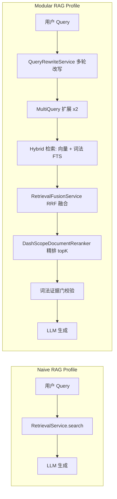
```mermaid
flowchart LR
    subgraph naive [Naive RAG Profile]
        Q1[用户 Query] --> R1[RetrievalService.search]
        R1 --> G1[LLM 生成]
    end
    subgraph modular [Modular RAG Profile]
        Q2[用户 Query] --> CQT[QueryRewriteService 多轮改写]
        CQT --> MQE[MultiQuery 扩展 x2]
        MQE --> HR[Hybrid 检索: 向量 + 词法 FTS]
        HR --> RRF[RetrievalFusionService RRF 融合]
        RRF --> RK[DashScopeDocumentReranker 精排 topK]
        RK --> LEX[词法证据门校验]
        LEX --> G2[LLM 生成]
    end
```

> **⚠️ 实现说明（V1.1 现实化）：** 上图与本章的组件名（`RetrievalService` / `RetrievalFusionService` / `DashScopeDocumentReranker`）反映实际手写 service 编排。早期设计中的 Spring AI Advisor 组件名（`RetrievalAugmentationAdvisor`、`VectorStoreDocumentRetriever`、`DeduplicatingDocumentJoiner`、`ContextualQueryAugmenter`、`DocumentPostProcessor`）**未进入生产链路**，仅作 W1 Spike 验证。下文凡出现这些名称之处均视为历史设计叙事。

| 模式 | 适用 | MVP 默认 |
|------|------|----------|
| auto | **生产默认**：单轮 Naive、多轮 Modular | ✓ |
| Naive | 基线对比、低延迟单轮 | ✓ |
| Modular | 多轮追问、评测 A/B | ✓ |

### 7.2 文档解析与切块策略

#### 7.2.1 解析

- 使用 `TikaDocumentReader` 读取 PDF、DOCX、Markdown；
- 保留 `pageNumber`、`sourceFilename` metadata；
- Markdown 优先 `MarkdownDocumentReader` 按标题层级切分。

#### 7.2.2 Parent-Child 双层切块

| 参数 | 值 | 说明 |
|------|-----|------|
| parent chunkSize | 1200 **字符** | `SimpleTextChunker.PARENT_CHUNK_SIZE` |
| child chunkSize | 400 **字符** | `SimpleTextChunker.CHILD_CHUNK_SIZE` |
| overlap | **无**（相邻块 `start = end` 硬切） | 见下方说明 |
| 向量化对象 | 仅 child | 解析存 `chunk_children`；**发布时** embed 写入向量表 |
| parent 存储 | `chunk_parents` | 引用 snippet 回填来源 |

> **⚠️ 实现口径（V1.1 现实化）：** 早期设计要求自研 `OverlapTokenSplitter` 做 **token 级滑动窗口重叠**（parent overlap 200 / child overlap 80）。**实际代码 `SimpleTextChunker` 采用字符级语义切分，无 token 概念、无 overlap：**
>
> - 切块单位是**字符长度**而非 token（中文场景下 400 字符 ≈ 400–800 token）；
> - 相邻块边界为 `start = end`，**纯硬切无重叠**；
> - 但做了**语义感知切分**：`semanticUnits` 按段落、中英文标点（`。！？；`）切分，硬切时 `findBreakPoint` 优先找标点边界，表格/列表保留换行。这比朴素定长字符切分好，但不是 token overlap。
>
> **取舍说明：** 字符级语义切分是工程简化，能覆盖大部分中文制度文档场景。**token 级 overlap 列为后续增强**——若 golden set 显示跨块边界召回质量不足（如完整条款被切成两半），再补 overlap 实现，预期 Recall@5 提升 ≥3 个百分点。

#### 7.2.3 表格与 OCR 处理

- 检测结构化块 → 标记 `chunk_type=TABLE`；表格/列表切块保留换行结构；
- **本地 OCR（已实现，默认关闭）：** `LocalOcrService` 封装 tesseract，`PlainTextDocumentTextExtractor` 在 `localOcrService.enabled()` 时对图片/扫描页调用 OCR 提取文本；`ingest_tasks` 记录 `ocr_required_page_count` / `ocr_applied_page_count` 统计（V6 迁移）；
- 进阶（后续增强）：Tabula-java 结构化表格抽取、VL 多模态。

#### 7.2.4 参数调优方法

1. 从真实制度文档抽样 50 篇入库；
2. 准备 golden set，对比 chunkSize 256/400/512/1024；
3. 以 Context Recall@5 为指标选最优；
4. 记录于 `docs/eval/report.md`。

### 7.3 向量化与入库

#### 7.3.1 解析阶段（上传触发，不向量化）

| 环节 | 实现 |
|------|------|
| 解析 | Tika → Parent-Child 切块 |
| 持久化 | `chunk_parents` + `chunk_children`（含 `doc_version`） |
| `doc_version` 写入 | 首次上传写 `documents.version=1`；MVP 默认不开放已发布文档同 `docId` 直接重传。若需重传，必须先下架或走单独“替换文件”接口：解析成功后事务内 `documents.version + 1`，并让 `chunk_*` 的 `doc_version` 与新值一致 |
| 状态机 | PENDING → PARSING → READY / FAILED |
| 重试 | FAILED 可**手动** `retry`（`POST /api/documents/{docId}/ingest-task/retry`）。**自动重试未实现**——早期设计的 `@Retryable`（3 次指数退避 1s→2s→4s）+ Resilience4j `@Timeout(60s)` **未落地**，`@EnableRetry` 也未开启；解析失败直接 `markIngestFailed`，需人工触发重试（后续增强） |
| 并发 | `@Async("ingestExecutor")`；`ingestExecutor` 与 `chatExecutor` **线程池隔离** |
| 僵死回收 | **未实现**——早期设计承诺「`PARSING` > 30min → FAILED」的定时回收**在解析链路缺失**（仅 Outbox 索引侧有 `SYNCING` 僵死回收，§11.3.2）。若 `markIngestFailed` 自身异常，任务可能停在 PARSING（后续增强） |
| 质量报告 | 解析完成后写入 `ingest_tasks` 的 `page_count` / `empty_page_count` / `table_count` / `ocr_*` 等列 + `quality_report` JSONB（V6 迁移，已实现） |

**W2 第一阶段落地边界：**

为了尽快验证“知识库 → 文档 → ingest task → parent/child chunks”的业务闭环，当前工程允许先提供 JSON 入库接口：

```http
POST /api/kbs/{kbId}/documents
Content-Type: application/json

{
  "title": "Engineering Handbook",
  "content": "已经提取好的正文文本"
}
```

该阶段把 `content` 视为已完成解析的文本，`oss_key` 使用 `inline://{docId}` 占位，`file_type=TEXT`。这不改变最终架构：真实文件上传、OSS 原文保存、Tika/Markdown 解析和异步 ingest 仍是后续 W2 增强项。

#### 7.3.2 索引阶段（发布 Outbox 触发，向量化）

| 环节 | 实现 |
|------|------|
| 触发 | `document_publish_events` 消费（PUBLISH / REINDEX） |
| 数据源 | 从 `chunk_children` 按 `(doc_id, doc_version)` 读取，**不重新 Tika 解析**（除非 `REINDEX` 显式触发） |
| Embedding | `DashScopeEmbeddingGateway`（自研 HTTP 网关，`text-embedding-v3`），`embedInBatches` 手动分批 |
| 写入实现 | **`VectorIndexService`**（JdbcClient 手写 SQL）：`INSERT` 时把 `kb_id / doc_id / status / doc_version` 冗余列 + metadata 一并写入，命中 B-tree 索引（§6.4） |
| 幂等/安全 | `docId + docVersion`；**`delete(docId) + add` 包在同一 `transactionTemplate.execute` 事务内**——比早期设计（事务外 delete→add）更安全，避免 embedding 失败导致向量被清空却未重建 |
| 完成标记 | `index_status=SYNCED`，`vectors_synced_at=now()` |
| 重试 | 消费失败 `index_status=FAILED`；Outbox 事件保持 FAILED 可重投（含指数退避 + 僵死回收，§11.3.2，实现质量高） |

```java
// IndexEventConsumer：发布索引（唯一路径，实际实现）
void onPublishEvent() {
    // 1) 短事务：领取事件（FOR UPDATE SKIP LOCKED）并把文档标记为 SYNCING
    DocumentPublishEvent event = eventService.claimNextEvent();
    if (event == null) {
        return;
    }

    try {
        // 2) 读取切块 + 远程 Embedding（事务外，避免长事务持锁）
        List<ChunkChild> chunks = chunkChildRepository.findByDocIdAndDocVersion(
            event.docId(), event.docVersion());
        List<EmbeddedChunk> embedded = embeddingGateway.embedInBatches(chunks);

        // 3) VectorIndexService：delete + add 包在单事务内（比早期设计更安全）
        vectorIndexService.replaceDocumentVectors(event, embedded); // transactionTemplate.execute { delete + insert }

        // 4) 短事务：标记成功
        eventService.markSynced(event.id(), event.docId(), Instant.now());
    } catch (Exception ex) {
        // 5) 短事务：记录失败并按退避策略重试
        eventService.markFailed(event.id(), event.docId(), ex);
    }
}
```

**重新上传（同 docId 新版本文件）：** MVP 面试 Demo 不实现无中断替换。默认流程是「下架旧文档 → 上传/解析新版本 → 发布 → 等待 SYNCED」；如保留同 `docId` 替换文件接口，必须在解析成功时递增 `documents.version` 并重写新 `doc_version` 的 `chunk_children` / `chunk_parents`，发布时直接使用该版本号。

> **MVP 版本管理边界：** `chunk_*` 表通过 `doc_version` 与 Outbox / 向量对齐；MVP **不支持旧版本回滚 reindex**，也不承诺新版本发布期间旧版本持续可检索。如需无中断发布与回滚能力，需引入 `published_version / indexing_version` 双版本字段或 `chunk_version_history` 表（目标架构）。

### 7.4 检索策略

#### 7.4.1 MVP 检索链（Hybrid 默认）

```
[仅多轮] QueryRewriteService（历史 + 当前问题 → rewritten + retrievalQueries）
→ [Modular] MultiQuery 扩展（count=2）
→ 对每个 query 并行：
    · VectorSearchService.search（向量召回 topK=15）
    · LexicalRetriever（PG FTS，plainto_tsquery('simple', ...)，topK=15）
      —— 词法仅对首个 query 或 keyword-on-rewrites=true 时运行
→ RetrievalFusionService.fuse（RRF，k=60，融合 vector rank + lexical rank）
→ mergeAcrossQueries（跨 query 去重合并，限 candidate-top-k=15）
→ DashScopeDocumentReranker.rerank（精排至 topK，默认 5，失败降级）
→ hasLexicalEvidence 词法证据门（strong terms 重叠校验，§7.4.6）
→ 空上下文或证据门未过 → 拒答
```

**检索模式（`knowsource.retrieval.mode`，默认 `hybrid`）：**

| 模式 | 行为 |
|------|------|
| `vector` | 仅向量召回 → rerank |
| `lexical` | 仅 PG FTS 词法召回 → rerank |
| `hybrid`（默认） | 向量 + 词法并行召回 → RRF 融合 → rerank |

**auto 路由规则：**

| 条件 | 实际 Profile |
|------|----------------|
| `profile=naive` 或 `modular` | 强制指定 |
| `profile=auto` 且会话无 prior user 消息 | Naive（单次检索 + 生成） |
| `profile=auto` 且存在 prior user 消息 | Modular（多轮改写 + MultiQuery(2)） |

#### 7.4.2 检索过滤（检索层安全核心）

> **实现口径（V1.1 现实化）：** 早期设计计划用 `FilterExpressionBuilder` 构造 `(doc_id, doc_version)` OR 表达式，并由 `IndexQueryService`（带 Caffeine 缓存）预取 SYNCED 版本列表注入 Filter。**实际代码更简单也更稳**：`VectorSearchService` 与 `LexicalRetriever` 的检索 SQL 直接 **JOIN `documents` 表**，在 WHERE 子句中过滤，无需预取版本列表、无需缓存。

实际检索 SQL 的过滤条件（`VectorSearchService` / `LexicalRetriever` 均一致）：

```sql
-- 向量检索（VectorSearchService）示意
SELECT vs.*, vs.embedding <=> :queryVec AS distance
FROM vector_store vs
JOIN documents d ON d.id = vs.doc_id
WHERE vs.kb_id = :kbId
  AND vs.status = 'published'
  AND d.kb_id = :kbId
  AND d.status = 'PUBLISHED'
  AND d.index_status = 'SYNCED'
  AND d.version = vs.doc_version          -- (doc_id, doc_version) 精确对齐
ORDER BY distance
LIMIT :topK;
```

**为什么这样更稳：**

- `d.version = vs.doc_version` + `d.id = vs.doc_id` 在 SQL 层直接保证「只召回文档当前版本的向量」，天然避免旧版本或跨文档同版本号串召回；
- `d.status='PUBLISHED' AND d.index_status='SYNCED'` 由 JOIN 实时判定，无 30s 缓存滞后窗口；
- 大 KB 下避免了长 `(doc_id, doc_version) IN (...)` OR 表达式的 SQL 计划退化问题；
- `kbId` 来自 URL 路径参数并经 `ChatSession` 归属校验（§8.3），非请求体裸值。

> **说明：** `IndexQueryService` + Caffeine「SYNCED 版本白名单缓存」的设计（原 §7.4.2 代码示例）**未实现**，被上述 JOIN 方案取代。如果未来向量表规模极大导致 JOIN 成本上升，可再引入缓存作为优化（后续增强）。

#### 7.4.3 Query Embedding

检索时对用户 query 单独 embed，设置 `DashScopeEmbeddingOptions.textType("query")`。

**Embedding 缓存（MVP）：** Caffeine `LoadingCache<String, float[]>`，key=`hash(normalizedQuery)`，TTL 10min，最大 1000 条；避免 MultiQuery 子 query 重复 embed。

#### 7.4.4 轻量 Rerank（P0）

| 参数 | 值 |
|------|-----|
| 模型 | DashScope `qwen3-rerank`（`DashScopeDocumentReranker` 自研网关调用） |
| 输入 | 融合去重后 ≤15 chunks |
| 输出 | `top_n = min(topK, 候选数)` 送入 Prompt（`topK` 默认 5，请求可在 1..15 内调整） |
| 降级 | Rerank API 不可用或失败时，回退按融合/向量顺序截 topK（不调外部 API） |

> **说明（V1.1 现实化）：** 早期设计写「固定 top5」，实际 `topK` 是请求可调参数（`ChatRequest.topK`，范围 1..15，默认 5）。降级实现为 `DashScopeDocumentReranker` 内部 try-catch，失败时按已有排序截断，保证问答可用性；早期设计的 `DashscopeRerankPostProcessor` / `ScoreTopNPostProcessor` 两个 `DocumentPostProcessor` 封装类**未实现**（不走 Advisor PostProcessor 链）。

#### 7.4.5 混合检索（已实现，默认生产路径）

> **⚠️ 边界更正（V1.1 现实化）：** 混合检索早期列为 v1.1，**实际已落地并作为默认检索模式**（`knowsource.retrieval.mode=hybrid`，V8 迁移 `V8__hybrid_search_fts.sql`）。

| 能力 | 实现 |
|------|------|
| 词法检索 | `LexicalRetriever`：基于 `vector_store.content_tsv`（`tsvector` 生成列）+ `plainto_tsquery('simple', ...)` 做 PG 全文检索；GIN 索引加速 |
| 向量检索 | `VectorSearchService`：pgvector HNSW + COSINE 距离 |
| 融合 | `RetrievalFusionService`：RRF（Reciprocal Rank Fusion），`score += 1/(k + rank)` 分别累加 vector rank 与 lexical rank，`k=60`（`knowsource.retrieval.hybrid.rrf-k`） |
| MultiQuery | Modular 下 count=2；词法召回默认仅对首个 query 运行（`keyword-on-rewrites=false`） |

**FTS 支持列（V8 迁移，`vector_store` 表）：**

- `content_tokens TEXT`：分词后的可检索文本；
- `doc_title VARCHAR(256)`：文档标题冗余；
- `content_tsv tsvector`：`GENERATED ALWAYS AS (to_tsvector('simple', coalesce(content_tokens,''))) STORED` 生成列；
- GIN 索引 `idx_vector_store_content_tsv_gin` 及 published partial GIN 索引。

#### 7.4.6 词法证据门（拒答策略）

除「空上下文拒答」外，代码在向量/融合召回之后额外加了一层**词法证据门**（`ChatService.hasLexicalEvidence`）：要求改写后 query 的 strong terms 与召回 chunk 的 strong terms 至少有一个重叠，否则拒答。

| 作用 | 说明 |
|------|------|
| 正面 | 压制「公司股票代码是多少」这类高相似度但实际无关的向量误召回 |
| 代价 | 纯语义同义表达、短问题、代词型追问可能因 strong terms 不重叠而被误拒；hybrid/lexical 命中更易过门 |

> **后续增强：** 该证据门当前为硬编码逻辑，建议做成可配置开关/阈值，并在 golden set 增加同义改写用例监控其对 Recall@5 的影响。

### 7.5 生成与幻觉抑制

#### 7.5.1 四层防护

| 层级 | 措施 |
|------|------|
| 检索层 | `similarityThreshold` + **Rerank 精排** 过滤低相关 chunk |
| 空上下文 | `allowEmptyContext(false)` → 拒答 Prompt |
| Prompt 层 | 强制仅基于上下文、标注 [n]、不知道就说不知道 |
| 响应层 | `sources[]` 来自检索结果，非 LLM 生成 |

#### 7.5.2 Citation Prompt 模板（附录 C）

#### 7.5.3 响应结构

```java
public record ChatResponse(
    String answer,
    List<SourceCitation> sources,
    String qaTraceId
) {}

public record SourceCitation(
    int citationId,
    String docId,
    String docName,
    Integer pageNumber,
    String snippet,      // parent 回填后的段落
    Double score,
    String previewUrl,   // OSS 预签名 / 本地预览
    // —— 混合检索可解释性字段（V1.1，实际实现已扩展）——
    String retrievalSource,  // VECTOR / LEXICAL / HYBRID
    Integer vectorRank,
    Integer lexicalRank,
    Double vectorScore,
    Double lexicalScore,
    Double fusionScore
) {}
```

**`sources[]` 数据流（用 Spring AI 原生扩展点，不抄一份、不用 ThreadLocal）：**

> **⚠️ 实现口径（V1.1 现实化）：** 本小节（§7.5.3–7.5.4、§7.7）描述的 `SourceCapturePostProcessor` / `RagAdvisorFactory` / `AdvisorContext` / `Sinks.Many` 等 Advisor 框架组件是**早期设计叙事，未进入生产**。**实际实现**：`ChatService.streamContext()` 在检索+rerank 完成后、首个 token 之前直接 `emitter.send(event:sources)` 早推引用（`ChatService.toSource()` 组装，含 §9.2 的混合检索可解释性字段）；QaTrace 的 `retrieved_chunks` 同样由 `ChatService` 从检索结果直接序列化。早推 sources 的**目标已达成**（前端先渲染证据面板），只是落点从 Advisor PostProcessor 换成了 service 层。以下设计文字保留作思路参考。

```
RetrievalAugmentationAdvisor 内部流水线：
  queryTransformers → retriever → documentPostProcessors → queryAugmenter → chatModel
                                          ▲
                                          │ PostProcessor 在 queryAugmenter 和 chatModel 之前执行
                                          │ = 检索完成、LLM 首 token 之前的黄金位置
  SourceCapturePostProcessor.process(query, docs):
       · docs 即检索后最终 List<Document>（入参，无需读框架内部 context key）
       · context.put("knowsource.retrieved_docs", docs)   // 写一次，sources 和 QaTrace 共用
       · SourceCitation[] sources = sourceMapper.map(docs) // parent 回填 + OSS 预签名 + score
       · sseSink.tryEmitNext(sources)                      // 早推 SSE `sources` 事件，前端边渲染答案边出引用
       · return docs                                       // 原样返回给 queryAugmenter
  → LLM 流式生成 token ...
  → RagChatService 流结束后：
       · 从 AdvisorContext 取 "knowsource.retrieved_docs" → 序列化为 QaTrace.retrieved_chunks
       · 从 sseSink 缓冲取已早推的 sources → 组装 SSE `done` 事件
```

| 组件 | 职责 | 关键点 |
|------|------|--------|
| `SourceCapturePostProcessor` | 实现 `DocumentPostProcessor`，在检索后钩子里组装 + 早推 sources | docs 是 PostProcessor 入参，**不依赖框架内部 context key**；早推发生在 LLM 调用前，时序天然保证；避免流式 + `@Async` 下 ThreadLocal 串扰 |
| `SourceCitationMapper` | `Document → SourceCitation` 单一职责转换 | 见 §7.5.4 |
| `RagChatService` | 流结束后从 context 取 docs（→QaTrace）+ 从 sink 取 sources（→done） | sources 来自检索而非 LLM 生成，从源头杜绝幻觉引用 |

> **为何选 PostProcessor 而非薄 Advisor：** `DocumentPostProcessor` 是 Spring AI 为「检索后钩子」设计的扩展点，入参即最终 `List<Document>`，无需新建 Advisor 抄一份检索结果、也无需耦合框架内部 context key（非公开契约，升级可能改名）。面试可强调「用了正确的扩展点而非绕开框架」。
>
> **Advisor 作用域：** `sseSink` 是每次问答独立的 Reactor sink，**不能注入单例 Advisor**。`RagChatService` 每次问答通过工厂方法 `advisorFactory.create(sseSink)` 获取 Advisor 实例（`@Scope("prototype")` 或显式工厂），保证 sink 隔离。

#### 7.5.4 引用溯源组装（§7.5.3 细节展开）

`SourceCapturePostProcessor` 内部依赖 `SourceCitationMapper`，后者负责 `Document → SourceCitation` 的完整组装。本节固化三个易被忽略的实现细节。

**① Parent 回填（避免 N+1 查询）**

检索召回的是 child chunk（`chunkType=child`），snippet 应展示 parent 全文段落以提供完整上下文。

| 策略 | 实现 | 说明 |
|------|------|------|
| 批量回填 | `Map<String,ChunkParent> parents = chunkParentRepository.findByDocIdIn(parentChunkIds)` | 一次 SQL 拿回所有 parent，避免逐 chunk 查询 |
| 去重 | `parentChunkIds = docs.stream().map(d -> d.metadata("parentChunkId")).distinct()` | 同一 parent 的多个 child 只查一次 |
| 缺失容忍 | parent 不存在时 snippet 退化为 child content | 容忍脏数据，不阻断问答 |

**② OSS 预签名 URL 缓存**

每次 sources 组装都为每个 chunk 生成 OSS 预签名 URL 会产生签名计算开销 + OSS 调用。

| 策略 | 实现 | 说明 |
|------|------|------|
| Caffeine 缓存 | `Cache<String,String>`，key=`ossKey`，TTL 10min，最大 500 条 | 预签名 URL 有效期 15min（§6.5），缓存 10min 留 5min 安全余量 |
| key 维度 | 按 `ossKey`（含 docId+version）而非 docId | 不同文档/版本隔离；同文档同版本多 chunk 复用同一 URL |
| 失效 | 文档下架（ARCHIVE）时 `cache.invalidate(ossKey)` | 服务端停止新签发 + 缓存失效；**已签发的预签名 URL 在 OSS TTL 内仍有效**，无法服务端立即撤销，依赖短 TTL（§6.5、§8.6） |

**③ sources 与 QaTrace 的复用**

`SourceCitation[]` 与 `qa_traces.retrieved_chunks`（JSONB）源于同一份 `List<Document>`，避免组装两次。

| 字段 | sources[]（给前端） | retrieved_chunks（给运维） |
|------|---------------------|---------------------------|
| 数据来源 | `SourceCitationMapper.map(docs)` | `docs` 原始结构序列化 |
| 内容 | citationId/docName/snippet/previewUrl/score | docId/chunkId/score/rawContent（完整文本，用于复盘） |
| 生成时机 | PostProcessor 内（早推 SSE） | 流结束后 `RagChatService` 异步写 QaTrace |

> **复用实现：** PostProcessor 把 `docs` 写入一次 `AdvisorContext`（用项目自定义 key `knowsource.retrieved_docs`），`RagChatService` 流结束后从 context 取出做 QaTrace 序列化；sources 则在 PostProcessor 内即时组装。两者读同一份 `docs`，零重复检索。

### 7.6 多轮对话设计

| 组件 | 职责 |
|------|------|
| 会话历史加载 | 加载最近若干条消息（`chat_messages`）供多轮改写 |
| `QueryRewriteService` | **仅 Modular 路径**；多轮历史 + 当前问题 → 独立检索 query（`rewritten` + `retrievalQueries`） |
| 检索 | 使用**改写后的 query** 召回，避免代词/指代污染 |
| 生成 | 历史 + 检索上下文 + 当前问题 |

> **⚠️ 已知缺口（V1.1 现实化）：** 多轮改写目前**只完整作用于检索**——`ChatService` 用 `rewriteResult.retrievalQueries()` 检索，但生成阶段 `answerGenerator.generate(context.question(), ...)` 传的是**原始问题**，改写后的 query 与会话历史都未注入生成 prompt。后果：检索能靠改写命中正确文档，但 LLM 可能仍看到「它的审批流程是什么？」这类缺指代对象的问题。修复方向：生成 prompt 使用 rewritten query，或注入最近会话历史（后续增强）。

### 7.7 Advisor 链组装

> **⚠️ 实现口径（V1.1 现实化）：** 本节整节为**早期 Advisor 设计叙事，未落地**。实际生产没有 Advisor 链、`RagAdvisorFactory` 或 `Sinks.Many`——`ChatService` 手写编排检索、rerank、SSE 推送与 QaTrace（§4.2、§7.4）。多轮改写由 `QueryRewriteService` 承担、首 token 耗时由 `ChatService` 直接计时。以下内容保留作设计思路参考，不代表当前代码结构。

**RagProfileRouter：** 在 `RagChatService` 根据 `RagProperties.profile` 与会话历史选择 naive 或 modular，调用 `RagAdvisorFactory.create(modular)` 获取本次问答的 Advisor 实例（含独立 SSE sink）。

> **Advisor 作用域：** `MessageChatMemoryAdvisor` / `FirstTokenStreamAroundAdvisor` / `SimpleLoggerAdvisor` 是无状态单例 `@Bean`，可全局复用；`RetrievalAugmentationAdvisor` 因携带每次问答独立的 `Sinks.Many`，由 `RagAdvisorFactory` 工厂方法创建（见下方代码），**不注册为单例 Bean**。组装时 `ChatClient.builder().defaultAdvisors(memoryAdvisor, ragAdvisor, firstTokenAdvisor, loggerAdvisor)` 传入。

**顺序（由外到内执行）：**

| 顺序 | Advisor | 职责 |
|------|---------|------|
| 1 | `MessageChatMemoryAdvisor` | 会话记忆 |
| 2 | `RetrievalAugmentationAdvisor`（Naive 或 Modular） | RAG 检索增强；其内 `documentPostProcessors` 链含 `SourceCapturePostProcessor`（§7.5.3，非独立 Advisor） |
| 3 | `FirstTokenStreamAroundAdvisor` | 首 token 耗时采集（§11.1.1） |
| 4 | `SimpleLoggerAdvisor` | 日志 |

> **说明：** `SourceCapturePostProcessor` 不是 Advisor 链节点，而是 `RetrievalAugmentationAdvisor.documentPostProcessors(...)` 的配置项，在检索后、`queryAugmenter` 和 `chatModel` 之前执行（§7.5.3）。因此 Advisor 链只列 4 个节点。

**`documentPostProcessors` 链内顺序（`RetrievalAugmentationAdvisor` 内部）：**

| 顺序 | PostProcessor | 职责 |
|------|---------------|------|
| 1 | `DashscopeRerankPostProcessor`（或降级 `ScoreTopNPostProcessor`） | 粗排 → 精排 topN |
| 2 | `SourceCapturePostProcessor` | sources 组装 + 早推 SSE `sources` 事件 + 写 `knowsource.retrieved_docs`（§7.5.4） |

> **顺序理由：** Rerank 必须在 SourceCapture 之前——sources 应反映精排后的最终 topN，而非粗排的 15 条。

```java
// RagAdvisorFactory：每次问答创建独立 Advisor + 独立 SSE sink（非单例，避免跨请求串扰）
@Component
public class RagAdvisorFactory {
    private final VectorStore vectorStore;
    private final ChatModel chatModel;
    private final RagProperties props;
    private final DashscopeReranker reranker;
    private final SourceCitationMapper sourceMapper;

    /** 由 RagChatService 调用：返回 Advisor + 本次问答专属的 sink（用于组装 done） */
    public AdvisorSession create(boolean modular) {
        Sinks.Many<SourceCitation[]> sseSink = Sinks.many().unicast().onBackpressureBuffer();
        RetrievalAugmentationAdvisor advisor = modular
            ? buildModular(sseSink) : buildNaive(sseSink);
        return new AdvisorSession(advisor, sseSink);
    }

    private List<DocumentPostProcessor> buildPostProcessors(Sinks.Many<SourceCitation[]> sseSink) {
        DocumentPostProcessor rerank = props.rerankEnabled()
            ? new DashscopeRerankPostProcessor(reranker, props.rerankTopN())
            : new ScoreTopNPostProcessor(props.rerankTopN());
        // 顺序：rerank 先（精排 topN），source capture 后（组装最终 sources）
        return List.of(rerank, new SourceCapturePostProcessor(sourceMapper, sseSink));
    }

    private RetrievalAugmentationAdvisor buildNaive(Sinks.Many<SourceCitation[]> sseSink) {
        var retriever = VectorStoreDocumentRetriever.builder()
            .vectorStore(vectorStore).topK(10).similarityThreshold(0.65).build();
        return RetrievalAugmentationAdvisor.builder()
            .documentRetriever(retriever)
            .documentPostProcessors(buildPostProcessors(sseSink))
            .queryAugmenter(ContextualQueryAugmenter.builder().allowEmptyContext(false).build())
            .build();
    }

    private RetrievalAugmentationAdvisor buildModular(Sinks.Many<SourceCitation[]> sseSink) {
        var transformers = List.<QueryTransformer>of(
            CompressionQueryTransformer.builder()
                .chatClientBuilder(ChatClient.builder(chatModel)).build(),
            MultiQueryExpander.builder()
                .chatClientBuilder(ChatClient.builder(chatModel))
                .numberOfQueries(props.multiQueryCount()).build()); // 默认 2
        var retriever = VectorStoreDocumentRetriever.builder()
            .vectorStore(vectorStore).topK(15).similarityThreshold(0.65).build();
        return RetrievalAugmentationAdvisor.builder()
            .queryTransformers(transformers)
            .documentRetriever(retriever)
            .documentJoiner(new DeduplicatingDocumentJoiner()) // 多路 MultiQuery 按 chunkId 去重
            .documentPostProcessors(buildPostProcessors(sseSink))
            .queryAugmenter(ContextualQueryAugmenter.builder().allowEmptyContext(false).build())
            .build();
    }

    public record AdvisorSession(
        RetrievalAugmentationAdvisor advisor,
        Sinks.Many<SourceCitation[]> sourcesSink   // RagChatService 流结束后取 sources 组装 done
    ) {}
}
```

> **为何用工厂而非 `@Bean`：** `@Bean` 是单例，但 `Sinks.Many` 必须每次问答独立（否则不同请求的 sources 会串扰）。`RagChatService` 每次调用 `factory.create(modular)` 拿到独立的 Advisor + sink。VectorStore / ChatModel / Reranker 等无状态依赖仍由工厂持有（单例）。

---

## 8. 安全设计

### 8.1 认证设计（JWT）

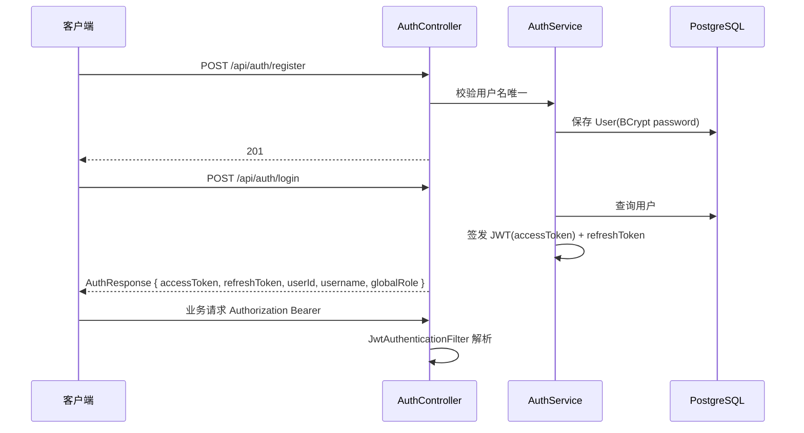
```mermaid
sequenceDiagram
    participant C as 客户端
    participant API as AuthController
    participant S as AuthService
    participant DB as PostgreSQL

    C->>API: POST /api/auth/register
    API->>S: 校验用户名唯一
    S->>DB: 保存 User(BCrypt password)
    API-->>C: 201

    C->>API: POST /api/auth/login
    S->>DB: 查询用户
    S->>S: 签发 JWT(accessToken) + refreshToken
    API-->>C: AuthResponse { accessToken, refreshToken, userId, username, globalRole }

    C->>API: 业务请求 Authorization Bearer
    API->>API: JwtAuthenticationFilter 解析
```

**JWT Payload：**

```json
{
  "sub": "userId",
  "username": "viewer01",
  "roles": ["ROLE_VIEWER"],
  "tv": 1,
  "exp": 1735689600
}
```

> `tv` = `users.token_version`，改密/禁用时递增，用于 JWT 失效（§8.6.2）。

### 8.2 授权设计（RBAC）

#### 8.2.1 全局角色与库内角色权限矩阵

| 资源 / 操作 | 全局 ADMIN | 全局 EDITOR | 知识库 OWNER | 知识库 EDITOR | 知识库 VIEWER / 全局 VIEWER |
|-------------|------------|-------------|--------------|---------------|-----------------------------|
| 用户管理 / 角色变更 | ✓ | ✗ | ✗ | ✗ | ✗ |
| 创建知识库 | ✓（创建后成为 OWNER） | ✓（创建后成为 OWNER） | ✗ | ✗ | ✗ |
| 知识库成员管理 | ✓ | ✗ | ✓ | ✗ | ✗ |
| 上传文档 | ✓ | — | ✓ | ✓ | ✗ |
| 发布 / 下架文档 | ✓ | — | ✓ | ✓ | ✗ |
| 查看草稿 | ✓ | — | ✓ | ✓ | ✗ |
| 问答（已发布库） | ✓ | — | ✓ | ✓ | ✓（成员） |
| 查看 QaTrace | ✓ | — | ✓（本库） | ✓（本库） | ✓（本库） |

> **说明（V1.1 现实化）：**
> - **全局 EDITOR** 的全局特权仅「创建知识库」；创建后以库内 OWNER 身份管理该库。对**其他**知识库，全局 EDITOR 与普通用户一样需通过 `kb_members` 成员身份访问（表中「—」表示取决于其在该库的成员角色）。
> - 库内操作（上传/发布/问答/QaTrace）由 `kb_members.role` 决定，与全局角色正交。
> - 降级用户为 VIEWER 时，若其仍是某库 OWNER/EDITOR，`requireNoKbManagementRole` 会拒绝降级（防孤儿管理角色）。

#### 8.2.2 知识库成员校验

- 除 ADMIN 外，用户必须是 `kb_members` 成员才能访问该知识库 API；
- 实现：`KnowledgeBaseService` 手写校验 `requireKbMember(kbId, userId)` / `requireKbOwnerOrAdmin(...)`；
- **采用手写 service 层校验**（非 `@PreAuthorize` 声明式注解），与项目整体 SQL-first 风格一致。

### 8.3 检索层安全（与 RBAC 分工）

| 层次 | 职责 | 实现 |
|------|------|------|
| API 层 RBAC | 谁能调哪个接口、访问哪个知识库 | 手写 service 校验 + KbMember |
| Service 层 kbId 绑定 | 检索作用域不可被客户端篡改 | `kbId` 取自 **URL 路径参数** `/api/kbs/{kbId}/chat/...`；`ChatRequest` **不含** `kbId` 字段；新会话用路径 kbId 创建，已有会话要求 `session_id + user_id + kb_id` 三者匹配 |
| 检索层 Filter | 只召回已发布且索引已同步的版本向量 | `VectorSearchService` / `LexicalRetriever` 检索 SQL **JOIN documents** 过滤 `kb_id + status=published + d.status=PUBLISHED + d.index_status=SYNCED + d.version=vs.doc_version`（§7.4.2） |
| 物理隔离 | 草稿永不写入向量表 | 延迟向量化（§6.2、ADR-005） |

> **实现口径（V1.1 现实化）：** 早期设计说「`kbId` 从 `ChatSession.kbId` 取，请求体 `kbId` 仅做一致性校验」。实际代码的安全模型是「**路径 kbId + membership 校验 + session 归属校验**」——请求体根本没有 `kbId` 字段，从源头杜绝了篡改。这与早期表述不同，但安全性等价甚至更清晰（kbId 进路径天然绑定资源）。

**未发布文档问答：** VIEWER 问草稿相关内容 → 向量表无记录 → 检索无结果 → 拒答（**非** metadata 过滤，而是物理不存在）。

**索引同步窗口：** `PUBLISHED` 但 `index_status!=SYNCED` 时，行为同未发布——检索无结果，前端提示「索引同步中」。

### 8.4 目标架构：部门 / 密级扩展（MVP 不实现）

metadata 预留字段：

- `deptId`、`allowedDeptIds`
- `visibility`：PUBLIC / DEPT / PRIVATE
- `classification`：INTERNAL / CONFIDENTIAL

演进：动态 `FilterExpressionBuilder` 根据 `UserContext` 构建 ACL 表达式。

### 8.5 数据安全

| 项 | 措施 |
|----|------|
| API Key | 环境变量 `AI_DASHSCOPE_API_KEY`，禁止提交 Git |
| OSS 密钥 | 环境变量，`.env` 不入库 |
| JWT Secret | 环境变量，长度 ≥ 256 bit |
| 日志脱敏 | 不打印 token、密码、完整 API Key |
| 生产 | HTTPS、OSS 私有桶 + 预签名 |

### 8.6 上传与令牌治理（P0）

#### 8.6.1 管理员初始化

| 项 | 措施 |
|----|------|
| 首个 ADMIN | Flyway seed 或环境变量 `BOOTSTRAP_ADMIN_*`（**仅首次启动**、生产必改密码） |
| 后续 ADMIN | 已有 ADMIN 通过 `PUT /api/auth/users/{userId}/role` 提升；禁止开放注册即 ADMIN |
| Demo 用户 | 通过 `@ConditionalOnProperty`（**默认关闭**）可预置 demo 用户（BCrypt 存储）；实际种子用户为 `demo/demo`（角色 ADMIN，**禁止用于生产**）。默认关闭比早期设计的「dev profile 自动启用」更安全 |

#### 8.6.2 Token 策略

| 项 | 措施 |
|----|------|
| Access Token | JWT，TTL 默认 **900s（15min）**，可配置 `knowsource.auth.access-token-ttl-seconds` |
| Refresh Token | TTL 默认 **7 天**（`knowsource.auth.refresh-token-ttl-days`）；`POST /api/auth/refresh` 校验 `refresh_tokens.token_hash`（SHA-256），**实现完整 rotation**：`FOR UPDATE` 锁旧 token → 作废旧 token（`revoked_at=NOW()`）→ 签发新 access + 新 refresh |
| 失效策略 | 用户改密 / ADMIN 禁用账号时，递增 `users.token_version` 并拒绝旧 JWT（payload 含 `tv` 字段）；`revoked_at=NOW()` 使 refreshToken 作废 |
| 登出 | `POST /api/auth/logout` 置 `revoked_at=now()`；accessToken 自然过期（MVP 不做 access 黑名单） |

> **实现口径（V1.1 现实化）：**
> - 早期文档写 Access TTL=24h，**代码已是 15min**（更安全），文档更新为准；
> - refresh **完整轮换**（旧 token 作废 + 发新 refresh）是代码优于早期设计之处；
> - **已知竞态：** refresh 用 `FOR UPDATE` 单行锁 + `revoked_at IS NULL` 校验，同一用户并发 refresh（多标签页/重试）第二个可能失配返回失败。前端已用共享 Promise 去重缓解（§10.3），服务端幂等处理列为后续增强。

#### 8.6.3 上传限制

| 项 | 措施 |
|----|------|
| 文件大小 | `spring.servlet.multipart.max-file-size=50MB`（可配置）；业务层二次校验，超限返回 `413` |
| 扩展名白名单 | `.pdf`、`.docx`、`.doc`、`.md`、`.txt`（与 F-03 一致） |
| MIME 校验 | 扩展名 + Tika `detect()` 双重校验；不匹配拒绝并记审计日志 |
| 单库并发上传 | `ingestExecutor` 队列 + CallerRunsPolicy（§11.5），防止解析打满内存 |

#### 8.6.4 Tika 解析防护

| 项 | 措施 |
|----|------|
| 解析超时 | Resilience4j `@Timeout(60s)`（§7.3.1） |
| 流大小上限 | `TikaInputStream` + 最大读取字节（如 50MB），超限 FAILED |
| 压缩包 | MVP **不接受** `.zip` / `.rar` 等压缩包上传；v1.1 若支持需限制解压深度与嵌套层数 |
| 内存 | 解析在 `ingestExecutor` 隔离线程池，单任务异常不影响问答线程池 |

#### 8.6.5 OSS 预签名语义

| 项 | 说明 |
|----|------|
| 签发 | 仅知识库成员调用预览 / sources 组装时按需签发，TTL **15min**（§6.5） |
| 缓存 | Caffeine 缓存 10min（§7.5.4），下架时 `invalidate` |
| **限制** | OSS 预签名 URL **一旦签发，在 TTL 过期前无法服务端撤销**；下架后只能停止新签发 + 失效缓存，已发出链接需等待 TTL 自然失效 |
| 敏感文档 | 可缩短 TTL 至 5min；预览 API 在下架后返回 403，即使旧 URL 未过期也不应再暴露新业务入口 |

---

## 9. 接口设计

### 9.1 API 规范

**Base URL：** `http://localhost:8080/api`

**统一响应：**

```json
{
  "code": 0,
  "message": "success",
  "data": { },
  "timestamp": 1735689600
}
```

**错误码：**

| code | 含义 |
|------|------|
| 0 | 成功 |
| 40001 | 参数错误 |
| 40100 | 未认证 |
| 40300 | 无权限 |
| 40400 | 资源不存在 |
| 50001 | 入库失败 |
| 50002 | AI 服务超时 |
| 50003 | 向量检索失败 |

**认证 Header：** `Authorization: Bearer <accessToken>`

**API 文档：** Knife4j UI → `http://localhost:8080/doc.html`

### 9.2 接口清单

> **⚠️ 全面更正（V1.1 现实化）：** 早期 §9.2 的路由（`/kb`、`/chat/stream`、`/traces/{id}` 等）与代码不符，已按实际 Controller 重写。核心变化：统一 `/api` 前缀、知识库资源用 `/api/kbs`、chat 与 qa-traces 嵌套在 `/api/kbs/{kbId}/...` 下（kbId 进路径天然绑定资源）。

#### 认证模块（`/api/auth`）

| 方法 | 路径 | 说明 | 权限 |
|------|------|------|------|
| POST | `/api/auth/register` | 注册（201） | 公开 |
| POST | `/api/auth/login` | 登录，返回 accessToken + refreshToken | 公开 |
| POST | `/api/auth/refresh` | 用 refreshToken 换取新 token（完整 rotation） | 公开（需有效 refreshToken） |
| POST | `/api/auth/logout` | 作废 refreshToken（204） | 登录 |
| GET | `/api/auth/users` | 用户列表 | ADMIN |
| POST | `/api/auth/users` | 创建用户（201） | ADMIN |
| PUT | `/api/auth/users/{userId}/role` | 变更全局角色 | ADMIN |

**注册请求：**

```json
{ "username": "editor01", "password": "xxx", "email": "a@b.com" }
```

**登录响应（`AuthResponse`）：**

```json
{
  "accessToken": "eyJ...",
  "refreshToken": "rt_...",
  "userId": 1,
  "username": "editor01",
  "globalRole": "VIEWER"
}
```

> **字段口径（V1.1 现实化）：** 实际 `AuthResponse` 字段为 `accessToken / refreshToken / userId / username / globalRole`。与早期文档差异：字段名是 `userId`（非 `id`）、`globalRole`（非 `role`）、多了 `username`、**无 `expiresIn`**。前端无法从响应得知过期时间，靠 401 触发 refresh（§10.3）。前端 Axios 拦截器注入 `Authorization: Bearer ${accessToken}`。

#### 知识库模块（`/api/kbs`）

| 方法 | 路径 | 说明 | 权限 |
|------|------|------|------|
| POST | `/api/kbs` | 创建知识库（201，创建后成为 OWNER） | ADMIN / 全局 EDITOR |
| GET | `/api/kbs` | 我加入的知识库列表 | 登录 |
| GET | `/api/kbs/manageable` | 我能管理的知识库（ADMIN 全部 / EDITOR 的 OWNER+EDITOR 库 / VIEWER 空） | 登录 |
| GET | `/api/kbs/{kbId}` | 详情 | 成员 |
| PUT | `/api/kbs/{kbId}` | 更新 | OWNER/ADMIN |
| DELETE | `/api/kbs/{kbId}` | 删除（204） | OWNER/ADMIN |
| GET | `/api/kbs/{kbId}/members` | 成员列表 | 成员 |
| POST | `/api/kbs/{kbId}/members` | 添加成员（201） | OWNER/ADMIN |
| PUT | `/api/kbs/{kbId}/members/{userId}` | 变更成员角色 | OWNER/ADMIN |
| DELETE | `/api/kbs/{kbId}/members/{userId}` | 移除成员（204） | OWNER/ADMIN |

#### 文档模块

| 方法 | 路径 | 说明 | 权限 |
|------|------|------|------|
| POST | `/api/kbs/{kbId}/documents` | JSON 入库（title+content，201） | OWNER/EDITOR/ADMIN |
| POST | `/api/kbs/{kbId}/documents/upload` | 文件上传（multipart，201） | OWNER/EDITOR/ADMIN |
| GET | `/api/kbs/{kbId}/documents` | 文档列表 | 成员 |
| GET | `/api/documents/{docId}` | 文档详情 | 成员 |
| GET | `/api/documents/{docId}/chunks` | 切块预览 | 成员 |
| PUT | `/api/documents/{docId}` | 替换内容（JSON，202） | OWNER/EDITOR/ADMIN |
| POST | `/api/documents/{docId}/replace-upload` | 替换文件（multipart，202） | OWNER/EDITOR/ADMIN |
| GET | `/api/documents/{docId}/ingest-task` | 入库任务状态 | 成员 |
| POST | `/api/documents/{docId}/ingest-task/retry` | 手动重试解析（202） | OWNER/EDITOR/ADMIN |
| POST | `/api/documents/{docId}/publish` | 发布（触发 Outbox 索引，202） | OWNER/EDITOR/ADMIN |
| POST | `/api/documents/{docId}/archive` | 下架（同步删向量，202） | OWNER/EDITOR/ADMIN |
| DELETE | `/api/documents/{docId}` | 删除（204） | OWNER/EDITOR/ADMIN |
| GET | `/api/documents/{docId}/preview` | 原文预览（可选 `?pageNumber=`） | 成员 |
| GET | `/api/documents/source-preview?sourceKey=` | 按 sourceKey 预览原文件 | 成员（service 内 JOIN kb_members 校验） |
| POST | `/api/documents/{docId}/index-events/{eventId}/requeue` | 重投指定 Outbox 事件（202） | OWNER/EDITOR/ADMIN |
| POST | `/api/documents/{docId}/index/retry` | 重试索引（202） | OWNER/EDITOR/ADMIN |

**发布响应：**

```json
{
  "docId": "doc-uuid",
  "status": "PUBLISHED",
  "version": 2,
  "indexStatus": "PENDING",
  "message": "发布成功，检索索引同步中"
}
```

#### 问答模块（`/api/kbs/{kbId}/chat`）

| 方法 | 路径 | 说明 | 权限 |
|------|------|------|------|
| POST | `/api/kbs/{kbId}/chat` | 非流式问答 | VIEWER+ 成员 |
| POST | `/api/kbs/{kbId}/chat/stream` | SSE 流式问答 | VIEWER+ 成员 |
| GET | `/api/kbs/{kbId}/chat/sessions` | 会话列表（可选 `?limit=`） | 成员 |
| GET | `/api/kbs/{kbId}/chat/sessions/{sessionId}` | 会话历史消息 | 会话所有者 |
| DELETE | `/api/kbs/{kbId}/chat/sessions/{sessionId}` | 删除会话 | 会话所有者 |

**问答请求（`ChatRequest`）：**

```json
{
  "sessionId": "session-uuid",
  "question": "员工年假有多少天？",
  "profile": "auto",
  "topK": 5,
  "retrievalMode": "hybrid"
}
```

> **说明（V1.1 现实化）：** `kbId` **不在请求体**，从 URL 路径 `/api/kbs/{kbId}/...` 取得（§8.3 检索层安全）。`profile`（auto/naive/modular）、`topK`（1..15，默认 5）、`retrievalMode`（vector/lexical/hybrid，默认 hybrid）均为可选参数。

**ChatResponse（SSE `done` 事件携带）：**

```json
{
  "answer": "根据规定，工作满1年享有5天年假[1]。",
  "sources": [
    {
      "citationId": 1,
      "docId": "doc-uuid",
      "docName": "请假制度.pdf",
      "pageNumber": 3,
      "snippet": "工作满1年...",
      "score": 0.89,
      "previewUrl": "https://oss...?sign=..."
    }
  ],
  "qaTraceId": "trace-uuid"
}
```

#### 追踪模块（`/api/kbs/{kbId}/qa-traces`）

| 方法 | 路径 | 说明 | 权限 |
|------|------|------|------|
| GET | `/api/kbs/{kbId}/qa-traces` | 分页列表（可选 `?limit=`，默认 20） | 本库成员 |
| GET | `/api/kbs/{kbId}/qa-traces/{traceId}` | 问答全链路详情 | 本库成员 |

#### 评测模块（`/api/eval`）

| 方法 | 路径 | 说明 | 权限 |
|------|------|------|------|
| POST | `/api/eval/golden-set/run` | 运行 golden set 评测 | ADMIN |
| GET | `/api/eval/golden-set/report` | 获取评测报告 | ADMIN |

> **权限口径（V1.1 现实化）：** QaTrace 从早期设计的「仅 ADMIN 全局查询 `/traces/{id}`」改为「**本库成员**可查本库 trace」，嵌套在 `/api/kbs/{kbId}/` 下。评测接口权限在 `EvalRunnerService.requireAdmin()` 手写校验（非注解）。

### 9.3 SSE 流式协议

**Content-Type：** `text/event-stream`

| 事件 event | data 内容 | 说明 |
|------------|-----------|------|
| `sources` | `SourceCitation[]` | 检索完成后的引用列表，**在首个 token 之前早推**（前端可先渲染证据面板） |
| `token` | `{"content":"根据"}` | LLM 增量 token |
| `done` | `ChatResponse` | 流结束，含 qaTraceId |
| `error` | `{"code":50002,"message":"..."}` | 错误（如 AI provider 不可用） |

> **⚠️ 已知缺口（前端）：** 后端会在生成器不可用时发送 `event:error` 并正常 `complete()`，但前端 `chatStream.ts` 当前只处理 `sources / token / done` 三种事件，**丢弃 `error` 事件**——LLM 未配置时助手气泡可能卡在「正在生成...」。修复方向：前端补 `onError` 分支；后端可在 error 后补发 `done(refused=true)` 简化客户端状态机（后续增强）。

**前端消费（fetch + ReadableStream）：**

```javascript
const res = await fetch(`/api/kbs/${kbId}/chat/stream`, {
  method: 'POST',
  headers: { Authorization: `Bearer ${token}`, 'Content-Type': 'application/json' },
  body: JSON.stringify({ sessionId, question, profile, topK, retrievalMode })
});
const reader = res.body.getReader();
// 解析 SSE 帧，按 event 类型更新 UI（注意补 error 分支）
```

---

## 10. 前端设计（Vue 3 + Element Plus）

### 10.1 页面结构

| 路由 | 页面 | 角色 |
|------|------|------|
| `/login` | 登录 | 公开 |
| `/register` | 注册 | 公开 |
| 知识库列表 | 我的知识库 | 登录 |
| 工作台（文档 / 对话 / 追踪 / 评测 Tab） | 知识库工作区 | 成员 |
| `/admin/users` | 用户管理（列表 / 创建 / 改角色） | ADMIN |

> **说明（V1.1 现实化）：** 实际前端采用**工作台 + Tab** 组织（DocumentsTab / ChatTab / QaTrace / EvaluationTab），而非早期设计的独立路由页。管理员用户管理已实现（组件文件仍名为 `AdminUsersPlaceholder.vue`，功能非占位，建议重命名为 `AdminUsersView.vue`）。Evaluation 面板（运行 golden set + 展示报告）为新增，早期设计未列。

### 10.2 布局与组件

- **布局：** Element Plus `el-container` 侧边栏 + 主内容；
- **上传：** `el-upload` + 轮询 `ingest/tasks/{taskId}` 进度（READY=可发布）；
- **发布：** 点击发布后轮询 `index-status`，`SYNCED` 后提示「可被问答检索」；
- **对话：** 左侧消息列表，右侧 `el-card` 展示 sources；
- **流式：** 逐字渲染 answer，`sources` 事件到达后渲染引用卡片；
- **发布：** 文档列表 `el-tag` 显示状态，知识库 OWNER/EDITOR 或 ADMIN 显示「发布」按钮。

### 10.3 前后端交互要点

| 项 | 实现 |
|----|------|
| JWT | `localStorage` 存 `accessToken` / `refreshToken`；Axios 拦截器注入 Header；401 时先调 `/api/auth/refresh` |
| refresh 并发去重 | `auth.ts` 用共享 `refreshRequest` Promise，避免多个 401 同时触发 refresh（缓解服务端 refresh rotation 并发竞态，§8.6.2）✅ |
| 401 | refresh 失败则跳转登录页 |
| SSE | 独立 `fetch` POST 流式（带 Bearer token，避开 EventSource 不能加 header 的限制）；401 先 refresh 再重试 |
| SSE error 处理 | ⚠️ **缺口**：`chatStream.ts` 未处理 `event:error`，后端错误时助手气泡可能卡住（§9.3，后续增强） |
| 调参控件 | ⚠️ **缺失**：后端支持 `profile/topK/retrievalMode`，前端类型已声明但 `ChatTab` 写死 `profile=auto`，未暴露选择器（面试 demo 无法现场切 naive/hybrid/topK，后续增强） |
| 原文预览 | 点击 source 打开 `previewUrl` |
| 路由守卫 | 未登录 → 登录页；ADMIN 页校验角色 |

### 10.4 技术栈

- Vue 3 + Composition API
- Element Plus
- Pinia（用户状态、token）
- Vue Router
- Axios + 原生 fetch（SSE）
- Vite

---

## 11. 工程化与可观测性

### 11.1 QaTrace 全链路追踪

**写入时机：** 问答完成后 `@Async` 写入，不阻塞 SSE。

**记录内容：**

| 字段 | 用途 |
|------|------|
| query | 用户原始问题 |
| rewrittenQuery | CompressionQuery 输出 |
| retrievedChunks | JSON：docId、chunkId、score、snippet |
| answer | 最终答案 |
| retrievalMs / llmMs / totalMs | 分阶段耗时 |
| rewriteLlmMs / generationFirstTokenMs | 改写与首 token（P0 SLA 拆分） |
| tokenUsage | **预留字段，当前固定写 `{}`**（token 统计未接入，见下方说明） |
| ragProfile | naive / modular / auto→实际值 |

> **⚠️ token_usage 缺口（V1.1 现实化）：** `QaTraceService.record()` 目前把 `token_usage` 固定写为 `{}`，`ChatService` 无 token 统计来源。耗时（retrieval/llm/total/first-token）与 sources 已落地，但 token 维度是空壳。兑现方向：非流式从 provider response 的 usage 取值，SSE 从最终 chunk 或 provider 统计补（后续增强）。

**面试价值：** 用户反馈「答案不对」→ 用 `qaTraceId` 定位是改写、召回还是生成问题。

#### 11.1.1 首 Token 耗时采集

> **实现口径（V1.1 现实化）：** 早期设计用 `FirstTokenStreamAroundAdvisor`（`StreamAroundAdvisor`）插入 Advisor 链采集首 token 耗时。**实际无 Advisor 链**，由 `ChatService` 在 SSE 流式回调中直接记录首个 token 到达时间戳，连同其他分阶段耗时写入 `QaTrace`。以下代码为早期设计参考。

**实现方式：** 自定义 `FirstTokenStreamAroundAdvisor`（`StreamAroundAdvisor`），插入 Advisor 链末尾（LLM 之后）：

```java
public class FirstTokenStreamAroundAdvisor implements StreamAroundAdvisor {
    @Override
    public StreamResponse aroundStream(StreamAroundAdvisorChain chain, StreamRequest request) {
        long startTime = System.currentTimeMillis();
        AtomicInteger firstTokenMs = new AtomicInteger(-1);
        return chain.nextAroundStream(request)
            .doOnNext(token -> {
                if (firstTokenMs.get() < 0) {
                    firstTokenMs.set((int)(System.currentTimeMillis() - startTime));
                }
            })
            .doOnComplete(() -> {
                // 将 firstTokenMs 写入 AdvisorContext
                request.context().put("generation_first_token_ms", firstTokenMs.get());
            });
    }
}
```

**数据流：** `FirstTokenStreamAroundAdvisor` → 写入 `AdvisorContext` → `RagChatService` 流结束后从 context 取出 → 连同其他耗时写入 `QaTrace`。

### 11.2 Micrometer 指标

| 指标名 | 类型 | 说明 |
|--------|------|------|
| `knowsource.rag.retrieval` | Timer | 检索耗时 |
| `knowsource.rag.rewrite` | Timer | Compression/MultiQuery 耗时 |
| `knowsource.rag.generation_first_token` | Timer | 首 token 延迟 |
| `knowsource.rag.llm` | Timer | LLM 生成耗时 |
| `knowsource.rag.chunks.count` | DistributionSummary | 召回 chunk 数 |
| `knowsource.ingest.parse.success` | Counter | 解析成功数 |
| `knowsource.ingest.index.success` | Counter | 发布索引成功数 |
| `knowsource.ingest.failure` | Counter | 解析/索引失败数 |

**暴露：** Spring Boot Actuator `/actuator/metrics`、`/actuator/prometheus`。

### 11.3 任务状态机

#### 11.3.1 解析任务（`ingest_tasks`）

```java
public enum IngestStatus {
    PENDING, PARSING, READY, FAILED  // 无 EMBEDDING：向量化不在解析阶段
}
```

| 规则 | 说明 |
|------|------|
| 幂等键 | `docId` + `doc_version`（首次上传为 1；替换文件接口解析成功后递增） |
| 并发 | 同一 docId 乐观锁，防止重复解析 |
| 僵死回收 | `PARSING` > 30min → FAILED；启动时扫描恢复 |
| 重试 | FAILED 可手动 `retry` |

#### 11.3.2 索引任务（`documents.index_status` + Outbox）

```java
public enum IndexStatus {
    NONE, PENDING, SYNCING, SYNCED, FAILED
}
```

| 规则 | 说明 |
|------|------|
| 触发 | 仅 `document_publish_events` 消费 |
| 调度 | `status=PENDING` **或** `(status=FAILED AND next_retry_at <= now())`；`ORDER BY created_at`；`FOR UPDATE SKIP LOCKED` |
| 锁定 | 拉取时写 `locked_at=now()`、`locked_by=instanceId`、`updated_at=now()` |
| 成功 | `status=PROCESSED`、`processed_at=now()`、清空 `locked_*` |
| 失败 | `status=FAILED`、`attempt_count++`、`next_retry_at=now()+backoff(attempt_count)`（指数退避，上限 1h）、`error_message` |
| 僵死回收 | `locked_at < now()-10min` 且仍为 PENDING/FAILED → 清空 `locked_*`，`attempt_count++`，重置 `next_retry_at` |
| 幂等 | `docId + docVersion` |
| 僵死索引 | `SYNCING` > 30min → `index_status=FAILED`，对应 Outbox 事件重置为 FAILED 并设置 `next_retry_at` |
| 启动恢复 | `IndexEventRecoveryRunner` 执行僵死回收 + 重新调度 |
| 清理 | 索引前 `VectorIndexService` 在单事务内 `delete + insert`；下架为**事务内同步删向量**（非 Outbox ARCHIVE，§6.2.1） |

### 11.4 配置外部化

```java
@ConfigurationProperties(prefix = "knowsource.rag")
public record RagProperties(
    String profile,           // auto | naive | modular
    int topK,
    int topN,
    double similarityThreshold,
    int multiQueryCount,      // 默认 2
    int maxMemoryMessages,
    boolean rerankEnabled,
    int rerankTopN
) {}
```

**配置分层：**

- `application.yml`：默认值；
- `application-{profile}.yaml`：naive/modular；
- 环境变量：覆盖密钥与连接串。

### 11.5 日志规范

- 使用 SLF4J 结构化日志：`log.info("ingest complete docId={} chunks={}", docId, count)`；
- 禁止记录：完整 JWT、密码、API Key、用户问答敏感内容（生产可采样）；
- QaTrace 存 DB，日志只记 `qaTraceId` 关联。

### 11.6 并发与限流配置

#### 11.6.1 线程池隔离

| 线程池 Bean | 用途 | 核心数 | 最大数 | 队列容量 | 拒绝策略 |
|-------------|------|--------|--------|----------|----------|
| `ingestExecutor` | 文档解析（Tika + 切块） | 2 | 4 | 10 | **默认 AbortPolicy**（见下方说明） |
| `indexExecutor` | 发布索引（Embedding + 写向量） | 2 | 4 | 5 | **默认 AbortPolicy** |
| `chatExecutor` | 问答（LLM 流式） | 4 | 8 | 20 | **默认 AbortPolicy** |
| `traceExecutor` | QaTrace 异步写入 | 1 | 2 | 50 | **默认 AbortPolicy** |

> **⚠️ 实现口径（V1.1 现实化）：** 早期设计承诺所有线程池用 **CallerRunsPolicy**（队列满时由调用线程执行，实现排队/降级）。**实际 `AsyncConfig` 未调用 `setRejectedExecutionHandler`**，Spring `ThreadPoolTaskExecutor` 默认是 **`AbortPolicy`**——队列满时抛 `RejectedExecutionException` 而非排队。后果：
> - `ingestExecutor` 队列满 → 上传接口抛异常（而非降级同步执行）；
> - `chatExecutor` 队列满 → 问答请求被拒（`ChatService.stream()` 的 `execute()` 未 catch `TaskRejectedException`，高负载时可能悬空连接或 500，而非结构化 error）。
>
> 修复方向：显式 `setRejectedExecutionHandler(new CallerRunsPolicy())` 或在 yml 暴露拒绝策略枚举；SSE 提交外层 catch 拒绝异常并发 `event:error`（后续增强）。上表核心数/队列容量为设计目标值，实际以 `AsyncConfig` 与 `application.yml` 的 `knowsource.executor.*` 为准。

#### 11.6.2 DashScope API 限流

MVP 依赖 DashScope 云端 API（chat / embedding / rerank），需在应用层做限流保护：

| 调用链 | Resilience4j 注解 | 超时 | 重试 | 并发信号量 | 降级策略 |
|--------|-------------------|------|------|------------|----------|
| LLM Chat（流式） | `@RateLimiter` | 60s | 不重试（流式） | 10 permits | 返回 50002「AI 服务繁忙」 |
| Embedding（批量） | `@Retry` + `@RateLimiter` | 30s | 2 次，指数退避 | 5 permits | 标记 index_status=FAILED |
| Rerank | `@Retry` + `@RateLimiter` | 10s | 2 次 | 5 permits | 回退 ScoreTopNPostProcessor(5) |

**限流配置（实际用自研 `knowsource.ai.resilience.*` 配置树，非原生 resilience4j 命名空间）：**

```yaml
knowsource:
  ai:
    resilience:
      chat:
        limit-for-period: 10        # 默认 10
        limit-refresh-period: 1s
      embedding:
        limit-for-period: 5         # 默认 5（早期文档写 20，代码为 5）
        limit-refresh-period: 1s
      rerank:
        limit-for-period: 10        # 默认 10
```

> **面试要点：** 线程池隔离防止入库阻塞问答；限流防止 DashScope QPS 超限导致级联失败；Rerank 失败降级为按已有排序截断是优雅降级而非中断。

---

## 12. RAG 效果评估方案

### 12.1 评估目标与指标

| 层级 | 指标 | 目标 | 自动化 |
|------|------|------|--------|
| 检索 | Context Recall@5 | ≥ 75% | ✓ EvalRunner |
| 检索 | MRR | ≥ 0.6 | ✓ |
| 检索 | Context Precision@5 | ≥ 60% | ✓ |
| 安全 | 拒答率（库外） | 100% | ✓ |
| 安全 | 未发布文档不可检索 | 100% | ✓ |
| 生成 | Faithfulness | ≥ 80% | 人工抽检 |
| 生成 | Citation Accuracy | ≥ 85% | 人工抽检 |
| 性能 | P95 Latency（Naive） | < 5s | QaTrace |
| 性能 | P95 Latency（Modular） | < 10s | QaTrace |
| 性能 | 首 token（Naive） | < 2.5s | `generation_first_token_ms` |

### 12.2 Golden Set 设计

**文件路径：** `docs/eval/golden-set.json`

**30 条分布：**

| 类别 | 数量 | 说明 |
|------|------|------|
| FACTUAL | 15 | 事实型问答 |
| OUT_OF_SCOPE | 5 | 库外问题，应拒答 |
| MULTI_TURN | 5 | 多轮 + preMessages |
| UNPUBLISHED | 5 | 仅草稿中有，发布后应能答 / 未发布应检索不到 |

**用例示例：**

```json
{
  "id": "KB-001",
  "kbId": "kb-hr",
  "question": "员工年假有多少天？",
  "expectedDocIds": ["doc-leave-v2"],
  "expectedKeywords": ["年假", "5天"],
  "category": "FACTUAL",
  "shouldAnswer": true
},
{
  "id": "KB-OUT-01",
  "kbId": "kb-hr",
  "question": "公司股票代码是多少？",
  "expectedDocIds": [],
  "category": "OUT_OF_SCOPE",
  "shouldAnswer": false
},
{
  "id": "KB-UNPUB-01",
  "kbId": "kb-hr",
  "question": "试运行考勤制度几点上班？",
  "expectedDocIds": ["doc-attendance-draft"],
  "category": "UNPUBLISHED",
  "shouldAnswer": false,
  "note": "文档为 DRAFT 时向量表无记录；PUBLISHED 但 index_status!=SYNCED 时同样不可检索"
}
```

### 12.3 EvalRunner 自动化

**测试类：** `EvalRunnerTest`（`@SpringBootTest`）

**输出：**

- Console 表格；
- `docs/eval/report.md` 自动生成（可选）；
- CI 中 `mvn test -Dtest=EvalRunnerTest`。

**核心逻辑：** 对 FACTUAL 统计命中率；对 OUT_OF_SCOPE / UNPUBLISHED 统计拒答率。

> **⚠️ 指标口径（V1.1 现实化）：** 当前 `EvalRunnerService` 的「Recall@5」实际是 **`ExpectedDocHit@5`**——只判定 `sourceTitles.contains(expectedDocTitle)`（召回来源的文档标题是否包含期望文档），并把同一值同时填给 `recallAt5` 和 `citationHitRate`。`GoldenCase.expectedKeywords` 已定义但**未参与通过判定**。因此报告中的 `Recall@5=100%` 不是严格的「期望 chunk 出现在 top5」或「答案含关键词」。
>
> 严格化方向（后续增强）：要么把指标改名为 `ExpectedDocHit@5`（诚实口径），要么在 golden case 增加 expected chunk/section/keyword，并检查 retrieved chunk id 或 snippet，再分别计算 Recall 与 citation hit。面试叙事建议采用改名口径避免被质疑。

> **⚠️ 评测副作用（V1.1 现实化）：** `runGoldenSet()` 每次运行都**新建一个 KB + seed 文档 + publish**，不清理。前端 Evaluation 面板反复运行会累积「评测知识库」、文档、向量、QaTrace 污染演示数据。建议固定复用一个 `EVAL` KB 或运行前清理上一轮（后续增强）。报告写入路径 `docs/eval/report.md` 为硬编码仓库路径，容器/jar 环境可能不可写，建议配置化 `knowsource.eval.report-path`。

### 12.4 A/B 对比实验

| 实验组 | 配置 |
|--------|------|
| A Naive | 单次检索 topK=10 + Rerank topN=5 |
| B Modular | MultiQuery(2) + topK=15 + Rerank + published Filter |
| C Modular+Compression | B + 多轮子集（auto 路由多轮） |
| D auto（生产默认） | 单轮=A 路径，多轮=B+C 路径 |

**报告模板：**

```markdown
| Profile | Recall@5 | Reject Rate | Faithfulness | P95 (单轮) | P95 (多轮) |
|---------|----------|-------------|--------------|------------|------------|
| Naive   | 62%      | 100%        | 72%          | 3.8s       | — |
| auto    | 76%      | 100%        | 84%          | 4.0s       | 7.5s |
| Modular | 78%      | 100%        | 85%          | —          | 8.2s |
```

### 12.5 人工抽检流程

1. 从 golden set 随机抽 10 条 FACTUAL；
2. 人工判断 Faithfulness：答案中每个事实是否出现在 sources 中；
3. 检查 Citation：`[n]` 是否与 sources 编号一致；
4. 填写评分表（附录），计入报告。

### 12.6 持续评测流程

| 阶段 | 动作 |
|------|------|
| 开发期 | 改 RAG 参数后跑 EvalRunner，指标下降则回滚 |
| 发版前 | 全量 30 条 + 人工 10 条 |
| 线上（设计） | 抽样 5% QaTrace 人工标注 |
| v2 CI 门禁 | Recall@5 不得低于 70% |

---

## 13. 部署与运维

### 13.1 Docker Compose（仅数据库）

> **⚠️ 部署口径（V1.1 现实化）：** 早期设计的 compose 含 `postgres + app` 两个服务、宣称「一键部署」。**实际 `docker-compose.yml` 只有 `postgres` 服务**（容器 5432 映射到宿主 **15432**）。应用与前端需本地启动。「一键部署完整环境」当前不成立。

```yaml
# docker-compose.yml 实际结构
services:
  postgres:
    image: pgvector/pgvector:pg16
    ports:
      - "15432:5432"          # 宿主 15432 → 容器 5432
    environment:
      POSTGRES_DB: knowsource
      POSTGRES_USER: knowsource
      POSTGRES_PASSWORD: ${DB_PASSWORD:-knowsource}
    volumes:
      - pgdata:/var/lib/postgresql/data

volumes:
  pgdata:
```

> **补齐方向（后续增强）：** 若要真正一键部署，需补 app 服务（多阶段 Dockerfile）+ frontend 构建/静态服务 + healthcheck + `depends_on: postgres`。

### 13.2 启动步骤（当前：两进程本地启动）

```bash
# 1) 起数据库
cp .env.example .env   # 填写 AI_DASHSCOPE_API_KEY、JWT_SECRET 等
docker compose up -d    # 仅启动 postgres（宿主 15432）

# 2) 起后端（本地 Maven）
mvn spring-boot:run

# 3) 起前端（本地 Vite）
cd frontend && npm install && npm run dev

# 访问：前端 Vite dev server；后端 API http://localhost:8080/api；Knife4j http://localhost:8080/doc.html
```

### 13.3 Flyway 与 pgvector 初始化

**当前工程迁移顺序：**

- `V1__vector_store.sql`：完整建表 `vector_store`（含冗余列、HNSW 索引、B-tree 索引）。
- `V2__business_tables.sql`：业务表（见附录 D 的字段草案，当前工程已按实际落地脚本调整）。

> 说明：早期草案中曾写作 `V1__init_business.sql` + `V2__vector_store.sql`。当前工程先落 `vector_store`、再落业务表，功能上不影响外键关系，因为两组表没有互相引用；后续新增迁移应基于现有 V1/V2 顺序继续追加 V3+，不要重命名已执行迁移。

> **⚠️ 时序说明（重要）：** 必须关闭 PgVectorStore 的 `initialize-schema`（`spring.ai.vectorstore.pgvector.initialize-schema=false`）。原因：Flyway 在 Spring context refresh 早期执行，而 `initialize-schema=true` 的建表发生在 PgVectorStore bean 初始化阶段，**晚于 Flyway**——若用 `ALTER TABLE`，会在表不存在时报错启动失败。因此把 `vector_store` 的完整 DDL 收归 Flyway，由 `VectorIndexService` / `VectorSearchService`（§6.4）手写 SQL 直接读写。

```sql
-- V1__vector_store.sql：完整建表（不依赖 initialize-schema）
CREATE EXTENSION IF NOT EXISTS vector;

CREATE TABLE IF NOT EXISTS vector_store (
    id          UUID PRIMARY KEY,
    content     TEXT,
    metadata    JSONB,
    embedding   vector(1024),                       -- text-embedding-v3 维度
    kb_id       VARCHAR(36),                        -- 冗余列：检索预过滤
    doc_id      VARCHAR(36),                        -- 冗余列：文档 ID，用于版本精确匹配
    status      VARCHAR(16),                        -- 冗余列：固定 'published'
    doc_version INT                                 -- 冗余列：与 documents.version 对齐
);

-- B-tree 复合索引：kb_id / status / doc_id / doc_version 预过滤
CREATE INDEX IF NOT EXISTS idx_vector_kb_status_doc_ver
    ON vector_store (kb_id, status, doc_id, doc_version);

-- HNSW 向量索引：COSINE 距离
CREATE INDEX IF NOT EXISTS idx_vector_embedding_hnsw
    ON vector_store USING hnsw (embedding vector_cosine_ops);

-- 可选 partial index（chunk 量 > 10 万时启用）
-- CREATE INDEX IF NOT EXISTS idx_vector_published
--     ON vector_store (kb_id, doc_id, doc_version) WHERE status = 'published';
```

**配套配置：**

```yaml
spring:
  flyway:
    enabled: true
  ai:
    vectorstore:
      pgvector:
        initialize-schema: false   # 关闭！DDL 全部由 Flyway 掌控
        index-type: HNSW
        distance-type: COSINE_DISTANCE
```

> **升级提示：** Spring AI 版本升级时，需对照官方 `PgVectorStore` 的建表语句，检查 `V1__vector_store.sql` 以及后续追加迁移是否需要同步更新（如新增默认列、字段类型变更）。

### 13.4 运维手册摘要

| 场景 | 操作 |
|------|------|
| 查看日志 | `docker compose logs -f app` |
| 入库失败 | 查 `ingest_tasks.error_message`；OSS 是否可访问 |
| 发布不可检索 | 查 `index_status` 是否 SYNCED；`document_publish_events` 是否 FAILED |
| 问答超时 | 查 QaTrace `rewrite_llm_ms` vs `retrieval_ms`；单轮应走 auto→Naive |
| DashScope 限流 | Resilience4j 熔断 + 前端友好提示 |
| 数据备份 | `pg_dump` 备份 PostgreSQL（含向量） |

---

## 14. 开发计划与里程碑

### 14.1 12 周计划摘要

| 周 | 主题 | 核心交付 | 验收 |
|----|------|----------|------|
| W1 | 基础设施 + **技术 Spike** | 最小 Spring Boot 工程验证 Spring AI **1.1.2** BOM；Docker + PGVector | **Spike 门禁**（见 §14.1.1）通过后再大规模编码 |
| W2 | 入库流水线 | OSS + Tika + 解析状态机 + chunk_children（含 `doc_version`） | 3 PDF READY（未向量化） |
| W3 | 问答 + 流式 | Naive RAG + SSE + auto 路由骨架 | **端到端 Demo** |
| W4 | 切块 + 溯源 + 发布 | Parent-Child + Outbox 索引 + sources | 发布 SYNCED 后可引用 |
| W5 | Modular RAG | MultiQuery(2) + Rerank + Profile auto | 10 条 golden 优于 Naive |
| W6 | RBAC + JWT | 注册登录 + kbId 绑定 + 延迟向量化 | 草稿物理不可检索 |
| W7 | 多轮对话 | JDBC Memory + CompressionQuery | 多轮 Demo |
| W8 | 可观测 + 评测 | QaTrace + EvalRunner | 指标可查询 |
| W9 | 前端 + 部署 | Vue3 + compose 交付 | 15 分钟跑起来 |
| W10 | 评测报告 | report.md 数据 | Recall@5≥75% |
| W11 | 面试材料 | 架构图 + 叙事稿 | 2 分钟 Demo 流畅 |
| W12 | 缓冲打磨 | v1.0.0 | 连续 3 次 Demo 无故障 |

#### 14.1.1 W1 技术 Spike（编码门禁）

> **目的：** Spring AI 版本与 Advisor API 历史上有破坏性变更（如 2.0 中 `StreamAroundAdvisor` → `StreamAdvisor`）。W1 **第一件事**是建最小工程，**锁定依赖版本并编译跑通**后再进入 W2+ 业务开发。

**锁定版本：** `spring-ai-bom` **1.1.2**（与 §4 BOM 一致；升级 2.x 需另开 ADR，不在 MVP 范围）。

**Spike 验收清单（全部通过方可进入 W2）：**

> **说明（V1.1 现实化）：** 下表是 W1 Spike 的**历史验证清单**，记录当初为锁定 Spring AI 1.1.2 而验证的接口。其中第 3、5、7 项（`KnowSourceVectorStore`、`RetrievalAugmentationAdvisor`、`StreamAroundAdvisor`）在 Spike 中验证可行，但**生产实现最终未采用**（改为手写 service 编排 + `VectorIndexService` 直写 SQL，见 §4.2、§6.4、§7.4）。清单作为技术决策历史保留。

| # | 验证项 | 说明 | 生产是否采用 |
|---|--------|------|--------------|
| 1 | BOM 解析 | `spring-ai-bom:1.1.2` 版本兼容 | ✓ |
| 2 | pgvector 建表 | Flyway 建表 + `initialize-schema=false`；embed + search 单测 | ✓ |
| 3 | KnowSourceVectorStore 占位 | `doAdd` / `doSearch` 重写签名验证 | ✗ 改用 `VectorIndexService` 手写 SQL |
| 4 | FilterExpression | `(doc_id, doc_version)` 过滤表达 | ✗ 改用 SQL JOIN 过滤（§7.4.2） |
| 5 | RetrievalAugmentationAdvisor | Naive 路径 Advisor 链接 | ✗ 改用 `RetrievalService` 编排 |
| 6 | ChatModel + SSE | 流式 `stream()` → `SseEmitter` token 流 | ✓ |
| 7 | StreamAroundAdvisor | 首 token 耗时采集 | ✗ 改用 `ChatService` 直接计时 |
| 8 | DashScope | Embedding 维度与 `vector(1024)` DDL 一致 | ✓ |

**产出：** 独立 `spike/` 模块或分支 + `docs/spike/SPIKE.md`（记录锁定版本、已验证类名/方法签名、已知坑）。

### 14.2 里程碑

| 时间 | 里程碑 |
|------|--------|
| 第 1 周末 | W1 Spike 通过（§14.1.1） |
| 第 3 周末 | 首次端到端 Demo |
| 第 6 周末 | RBAC + 未发布不可检索可演示 |
| 第 8 周末 | EvalRunner 可跑 |
| 第 10 周末 | 评测报告有数据 |
| 第 12 周末 | 可投递状态 |

### 14.3 风险与应对

| 风险 | 应对 |
|------|------|
| DashScope API 不稳定 | `@Retryable`、超时配置、友好错误码 |
| Tika 解析质量差 | `chunkType` 标记、golden set 排除差文档 |
| 进度延误 | 砍前端动效，保 W3/W6/W10 里程碑 |
| 发布索引慢 | 展示 index_status；DashScope 批处理调优 |
| Outbox 消费失败 | 启动恢复 + 管理端重投事件 |
| Spring AI API 变更 | W1 Spike 锁定 BOM **1.1.2** 并验证 Advisor/Filter 签名；升级前跑全量测试 + 对照 [Upgrade Notes](https://docs.spring.io/spring-ai/reference/upgrade-notes.html) |

---

## 15. 未来演进规划

### 15.1 Graph RAG

- **场景：** 跨文档实体关系推理；
- **路径：** 入库 LLM 抽实体 → Neo4j → `GraphAugmentedDocumentRetriever` 插拔进 Advisor；
- **工作量：** 2–3 周。

### 15.2 多模态支持

- **场景：** 扫描件 PDF、盖章合同；
- **路径：** OCR 预处理路由 → 统一 `Document` 管道；VL Embedding + `qwen3-vl-rerank`；
- **工作量：** OCR 1 周 + 多模态 1–2 周。

### 15.3 Agent 工具调用

- **场景：** 查制度 + 生成审批单、对比两文档；
- **路径：** `@Tool` 封装 `searchKnowledgeBase`；RAG 作为 Tool 而非强制每轮检索；
- **工作量：** 1–2 周。

### 15.4 部门 / 密级 ACL 升级

- **场景：** 多部门制度隔离、密级文档；
- **路径：** metadata 增加 `deptId`、`visibility`；动态 `FilterExpression`；与 LDAP 同步；
- **前提：** 当前 MVP 已预留 metadata 字段。

### 15.5 高可用集群

- **场景：** 数百人并发；
- **路径：** K8s 多副本、RocketMQ 入库、PG 读写分离、Resilience4j 限流熔断；
- **MVP：** 单实例 + `@Async` 足够。

---

## 16. 附录

### 附录 A：RAG 故障排查表

| 现象 | 可能原因 | 对策 |
|------|----------|------|
| 答案无关 | 召回差 / chunk 过大 | MultiQuery、缩小 chunk、调 threshold |
| 答案编造 | 空上下文未拦截 | `allowEmptyContext(false)`、提高 threshold |
| 找不到新制度 | index 未 SYNCED / Outbox 失败 / 向量写入失败 | 查 `index_status`、`docVersion`、`document_publish_events.error_message`；重投 Outbox |
| 多轮对话退化 | 单轮误走 Modular 或改写失败 | 确认 `profile=auto`；查 `rewrite_llm_ms` |
| 草稿被搜到 | 不应发生（延迟向量化） | 查向量表是否误写入；确认无 draft 行 |
| 专有名词搜不到 | 纯向量弱于关键词 | 已默认启用混合检索（向量 + FTS + RRF，§7.4.5）；可查词法证据门是否误拒 |
| 表格内容错误 | Tika 表格解析差 | chunkType=TABLE、OCR/Tabula |

### 附录 B：高频面试追问（精选）

**Q：为什么 PGVector 不选 Milvus？**  
百万级 chunk、低 QPS；向量与业务同库，运维简单；`VectorIndexService` / `VectorSearchService` 手写 SQL 收敛迁移改动面（改这两个 service 即可换库，§6.4）。

**Q：怎么保证不胡说？**  
四层：threshold + 拒答 + Prompt + sources 来自检索；Faithfulness 评测。

**Q：怎么保证草稿不泄露？**  
草稿只存 `chunk_children`，**不写向量表**；发布走 Outbox 全量索引；下架物理删除向量。

**Q：MVP 为什么不做部门隔离？**  
聚焦 RAG 核心；kbId 服务端绑定 + 延迟向量化已覆盖 MVP 安全演示；metadata 已预留扩展。

**Q：Modular 会不会太慢？**  
`profile=auto` 单轮走 Naive；多轮才启用 Compression+MultiQuery(2)；SLA 分档统计。

**Q：怎么评估效果？**  
golden set + EvalRunner 自动化 Recall@5；人工抽检 Faithfulness。

### 附录 C：Prompt 模板

#### C.1 Citation 问答模板

```
你是一个企业知识库问答助手。请严格基于以下上下文回答问题。

规则：
1. 仅使用上下文中出现的信息，不要编造。
2. 若上下文不足以回答，请明确说：「知识库中未找到相关信息」。
3. 每个事实后标注引用编号，格式为 [1]、[2]。
4. 不要引用上下文中不存在的内容。

上下文：
{context}

用户问题：{query}
```

#### C.2 空上下文拒答模板（allowEmptyContext=false 时由框架注入）

```
知识库中未检索到与用户问题相关的内容。请礼貌告知用户当前知识库中没有相关信息，不要编造答案。
```

#### C.3 CompressionQuery（框架内置，可自定义 system prompt）

```
Given the following conversation history and a follow-up question, rephrase the follow-up question to be a standalone question.
```

### 附录 D：Flyway DDL 草案（业务表，对应 `V2__business_tables.sql`）

> **说明（V1.1 现实化）：** 本附录为业务表 DDL **草案**，对应实际迁移 `V2__business_tables.sql`（早期标题误写作 `V1__init_business.sql`）。实际脚本以工程 `src/main/resources/db/migration/` 为准，且后续 V3–V9 迁移追加了 chat 表、chunk metadata、qa_trace_id、质量报告列、FTS 列与 global_role 约束变更（见 §6.3.12）。向量表 `vector_store` 由 `V1__vector_store.sql` 建（§13.3）。

```sql
-- 扩展由单独脚本或 compose 初始化
-- CREATE EXTENSION IF NOT EXISTS vector;

CREATE TABLE users (
    id BIGSERIAL PRIMARY KEY,
    username VARCHAR(64) NOT NULL UNIQUE,
    password_hash VARCHAR(128) NOT NULL,
    email VARCHAR(128),
    global_role VARCHAR(16) NOT NULL DEFAULT 'VIEWER',
    token_version INT NOT NULL DEFAULT 1,
    created_at TIMESTAMP NOT NULL DEFAULT NOW()
);

CREATE TABLE refresh_tokens (
    id VARCHAR(36) PRIMARY KEY,
    user_id BIGINT NOT NULL REFERENCES users(id),
    token_hash VARCHAR(128) NOT NULL UNIQUE,
    expires_at TIMESTAMP NOT NULL,
    revoked_at TIMESTAMP,
    created_at TIMESTAMP NOT NULL DEFAULT NOW()
);

CREATE INDEX idx_refresh_tokens_user ON refresh_tokens(user_id);

CREATE TABLE knowledge_bases (
    id VARCHAR(36) PRIMARY KEY,
    name VARCHAR(128) NOT NULL,
    description TEXT,
    owner_id BIGINT NOT NULL REFERENCES users(id),
    created_at TIMESTAMP NOT NULL DEFAULT NOW()
);

CREATE TABLE kb_members (
    id BIGSERIAL PRIMARY KEY,
    kb_id VARCHAR(36) NOT NULL REFERENCES knowledge_bases(id),
    user_id BIGINT NOT NULL REFERENCES users(id),
    role VARCHAR(16) NOT NULL,
    UNIQUE(kb_id, user_id)
);

CREATE TABLE documents (
    id VARCHAR(36) PRIMARY KEY,
    kb_id VARCHAR(36) NOT NULL REFERENCES knowledge_bases(id),
    title VARCHAR(256) NOT NULL,
    status VARCHAR(16) NOT NULL DEFAULT 'DRAFT',
    index_status VARCHAR(16) NOT NULL DEFAULT 'NONE',
    oss_key VARCHAR(512) NOT NULL,
    version INT NOT NULL DEFAULT 1,
    file_type VARCHAR(16),
    created_by BIGINT NOT NULL REFERENCES users(id),
    published_at TIMESTAMP,
    vectors_synced_at TIMESTAMP,
    created_at TIMESTAMP NOT NULL DEFAULT NOW()
);

CREATE INDEX idx_documents_kb_status_index ON documents(kb_id, status, index_status);

CREATE TABLE ingest_tasks (
    id VARCHAR(36) PRIMARY KEY,
    doc_id VARCHAR(36) NOT NULL REFERENCES documents(id),
    status VARCHAR(16) NOT NULL,
    error_message TEXT,
    started_at TIMESTAMP,
    finished_at TIMESTAMP,
    created_at TIMESTAMP NOT NULL DEFAULT NOW()
);

CREATE TABLE chunk_children (
    id VARCHAR(64) PRIMARY KEY,
    doc_id VARCHAR(36) NOT NULL REFERENCES documents(id),
    doc_version INT NOT NULL DEFAULT 1,
    parent_chunk_id VARCHAR(64) NOT NULL,
    content TEXT NOT NULL,
    chunk_index INT NOT NULL,
    page_number INT,
    chunk_type VARCHAR(16) NOT NULL DEFAULT 'TEXT'
);

CREATE INDEX idx_chunk_children_doc_ver ON chunk_children(doc_id, doc_version);

CREATE TABLE document_publish_events (
    id VARCHAR(36) PRIMARY KEY,
    doc_id VARCHAR(36) NOT NULL REFERENCES documents(id),
    kb_id VARCHAR(36) NOT NULL,
    doc_version INT NOT NULL,
    event_type VARCHAR(16) NOT NULL,
    status VARCHAR(16) NOT NULL DEFAULT 'PENDING',
    error_message TEXT,
    attempt_count INT NOT NULL DEFAULT 0,
    next_retry_at TIMESTAMP,
    locked_at TIMESTAMP,
    locked_by VARCHAR(64),
    created_at TIMESTAMP NOT NULL DEFAULT NOW(),
    updated_at TIMESTAMP NOT NULL DEFAULT NOW(),
    processed_at TIMESTAMP
);

CREATE INDEX idx_publish_events_sched ON document_publish_events(status, next_retry_at, created_at)
    WHERE status IN ('PENDING', 'FAILED');

CREATE TABLE chunk_parents (
    id VARCHAR(64) PRIMARY KEY,
    doc_id VARCHAR(36) NOT NULL REFERENCES documents(id),
    doc_version INT NOT NULL DEFAULT 1,
    content TEXT NOT NULL,
    page_number INT
);

CREATE INDEX idx_chunk_parents_doc_ver ON chunk_parents(doc_id, doc_version);

CREATE TABLE chat_sessions (
    id VARCHAR(36) PRIMARY KEY,
    user_id BIGINT NOT NULL REFERENCES users(id),
    kb_id VARCHAR(36) NOT NULL REFERENCES knowledge_bases(id),
    title VARCHAR(256),
    created_at TIMESTAMP NOT NULL DEFAULT NOW()
);

CREATE TABLE chat_messages (
    id BIGSERIAL PRIMARY KEY,
    session_id VARCHAR(36) NOT NULL REFERENCES chat_sessions(id),
    role VARCHAR(16) NOT NULL,
    content TEXT NOT NULL,
    token_count INT,
    created_at TIMESTAMP NOT NULL DEFAULT NOW()
);

CREATE TABLE qa_traces (
    id VARCHAR(36) PRIMARY KEY,
    session_id VARCHAR(36),
    user_id BIGINT NOT NULL REFERENCES users(id),
    kb_id VARCHAR(36) NOT NULL,
    query TEXT NOT NULL,
    rewritten_query TEXT,
    retrieved_chunks JSONB,
    answer TEXT,
    retrieval_ms INT,
    llm_ms INT,
    rewrite_llm_ms INT,
    generation_first_token_ms INT,
    total_ms INT,
    token_usage JSONB,
    rag_profile VARCHAR(16),
    created_at TIMESTAMP NOT NULL DEFAULT NOW()
);

CREATE INDEX idx_documents_kb_status ON documents(kb_id, status);
CREATE INDEX idx_qa_traces_kb_created ON qa_traces(kb_id, created_at);
```

### 附录 E：3 分钟 Demo 操作脚本

| 步骤 | 操作 | 讲解要点 |
|------|------|----------|
| 1 | 打开系统；使用 bootstrap ADMIN 登录或注册 VIEWER 并登录 | JWT + RBAC + 管理员初始化（§8.6.1） |
| 2 | 创建知识库「HR 制度库」 | 知识库成员模型 |
| 3 | 上传《请假制度.pdf》，观察解析进度 READY | 异步解析状态机（未向量化） |
| 4 | 说明：草稿 + 未发布；VIEWER 问答 → 拒答 | 向量表无记录 |
| 5 | 知识库 OWNER 发布，轮询 index_status → SYNCED | Outbox 索引 + 生命周期 |
| 6 | VIEWER 问「年假有多少天」→ 流式答案 + 侧栏引用 | auto 单轮 Naive + Rerank + 溯源 |
| 7 | 问「公司股票代码」→ 明确拒答 | 幻觉抑制 |
| 8 | 多轮：「请假制度是什么」→「它的审批流程」 | auto 多轮 → Modular + CompressionQuery |
| 9 | （可选）ADMIN 打开 qaTraceId 复盘 | 工程化 QaTrace |

---

**文档结束**

*KnowSource — 企业知识，有据可查。*


